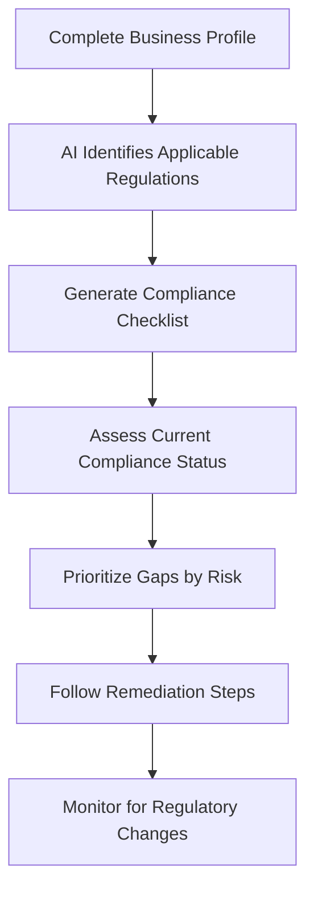

# ComplianceCheck AI

## What It Does

ComplianceCheck AI helps small businesses and solo operators understand which regulations apply to them and whether they are currently in compliance. Answer a series of questions about your business (industry, location, size, data handling, customer types), and the AI generates a personalized compliance checklist with specific requirements, deadlines, and remediation steps for each applicable regulation.

The target user is the small business owner who knows compliance matters but cannot afford a compliance consultant: restaurants needing health and safety compliance, e-commerce stores handling customer data under state privacy laws, healthcare practitioners managing HIPAA requirements, or financial advisors navigating SEC and FINRA rules. ComplianceCheck AI monitors regulatory changes in your applicable jurisdictions and alerts you when new requirements affect your business -- before a violation, not after.

## Key Features

- **Compliance Profile Builder** -- Guided questionnaire that identifies all applicable regulations based on your business type, location, size, and operations.
- **Personalized Checklist** -- Specific, actionable compliance requirements with due dates, responsible parties, and step-by-step remediation guidance.
- **Regulatory Change Monitoring** -- Continuous monitoring of federal, state, and local regulatory changes with alerts when new rules affect your compliance profile.
- **Gap Analysis** -- Compares your current compliance posture against requirements and prioritizes gaps by risk severity and enforcement likelihood.
- **Document Templates** -- Pre-built compliance document templates (privacy policies, data processing agreements, safety plans) customized to your jurisdiction.
- **Compliance Score** -- Overall 0-100 compliance score with category breakdowns, trending over time to show improvement or degradation.

## User Workflow

## Pricing

| Tier | Price | Includes |
|------|-------|----------|
| Free | $0/month | Basic profile, top 5 regulations identified |
| Starter | $14.99/month | Full checklist, gap analysis, document templates |
| Business | $24.99/month | Regulatory monitoring, compliance score, multi-location |
| Professional | $29.99/month | Industry-specific deep dives, audit prep mode, team access |

## Upgrade Path

ComplianceCheck AI is the most direct consumer-to-enterprise pipeline in the FrankMax ecosystem. Business-tier users outgrowing the consumer tool are offered AuditReady Pro ($69.99/month) for deeper audit preparation, then the full enterprise compliance platform with Smart Contract Governance, Mandate State Ledger integration, and automated compliance enforcement at $20,000+/month. The upgrade pitch: "You are tracking compliance manually. The enterprise platform enforces it automatically."

## Data Flow

Compliance profile and gap data feed the Kitchen layer with anonymized insights: which regulations are most commonly applicable by NAICS sector, where compliance gaps cluster, regulatory change velocity by jurisdiction, and remediation completion rates by requirement type. This data directly powers the Mandate State Ledger's regulatory intelligence, improves enterprise compliance models across the marketplace, and builds the most comprehensive small-business compliance landscape dataset in the market. No business-specific details are retained -- only regulatory applicability patterns and compliance statistics.
