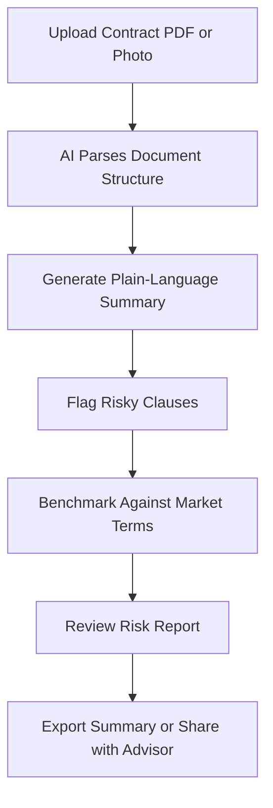

# ContractReader AI

## What It Does

ContractReader AI translates dense legal contracts into plain-language summaries, highlights risky clauses, and compares terms against market benchmarks. Upload a lease, employment agreement, SaaS terms of service, or any legal document, and within 60 seconds you receive a plain-English summary of what you are agreeing to, what is unusual, and what you should negotiate.

The target user is anyone signing a contract without a lawyer on retainer: renters reviewing leases, employees evaluating offer letters, freelancers reviewing client agreements, or small business owners signing vendor contracts. ContractReader AI does not replace legal counsel for high-stakes transactions, but it ensures you understand what you are signing and know which clauses deserve professional review. It turns a 40-page lease into a 2-minute read with risk flags.

## Key Features

- **Plain-Language Summary** -- Converts legal jargon into clear, readable summaries organized by topic (payment terms, termination, liability, intellectual property).
- **Risk Flag System** -- Identifies clauses that are unusual, one-sided, or potentially harmful, with severity ratings (Low, Medium, High, Critical).
- **Market Benchmark Comparison** -- Compares key terms (payment terms, liability caps, non-compete scope) against typical terms for the same contract type.
- **Clause-by-Clause Analysis** -- Every clause gets a plain-language explanation, risk rating, and negotiation suggestion.
- **Multi-Contract Comparison** -- Compare two contracts side-by-side to identify differences (e.g., comparing two job offers or vendor proposals).
- **Key Date Extraction** -- Pulls all deadlines, renewal dates, notice periods, and option windows into a calendar view.
- **Amendment Tracker** -- Track changes across contract versions, highlighting what changed and whether changes favor you or the counterparty.

## User Workflow

## Pricing

| Tier | Price | Includes |
|------|-------|----------|
| Free | $0/month | 1 contract/month, basic summary only |
| Personal | $14.99/month | 5 contracts/month, risk flags, key date extraction |
| Professional | $24.99/month | Unlimited contracts, benchmarking, multi-contract comparison |
| Business | $29.99/month | Team sharing, amendment tracking, priority processing |

## Upgrade Path

ContractReader AI users who process contracts at volume are offered LegalPlain AI for broader legal document analysis. Business-tier users receive targeted offers for the enterprise Contract Lifecycle Management platform with workflow automation, approval chains, and compliance integration at $8,000+/month. Legal departments that discover ContractReader AI through individual users are engaged for enterprise licensing with Smart Contract Governance integration.

## Data Flow

Contract analysis generates Kitchen layer data on clause patterns, risk distributions, and market benchmark evolution. Anonymized clause structures and term frequencies feed the marketplace's legal AI models. The system learns which clause patterns are standard vs. unusual for each contract type, building an industry-leading contract intelligence dataset. This data powers both consumer contract analysis and enterprise governance products. No contract text is retained -- only structural patterns, clause classifications, and statistical benchmarks.
