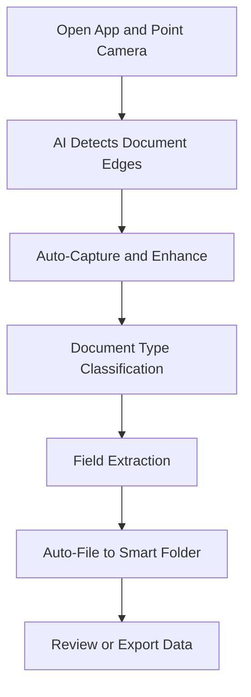

# DocuScan AI

## What It Does

DocuScan AI turns any paper document into structured, searchable, and actionable digital data using your phone camera. Point, shoot, and the AI extracts text, identifies document type (receipt, contract, medical record, tax form), and organizes everything into tagged folders. No more lost receipts at tax time, no more manually typing data from paper forms.

The target user is anyone drowning in paper: freelancers tracking expenses, parents managing school forms, small business owners filing receipts, or individuals organizing medical records. DocuScan AI handles 40+ document types out of the box, learns your filing patterns over time, and can extract specific fields (dates, amounts, names, account numbers) for export to spreadsheets or other apps. It is the simplest on-ramp into the FrankMax ecosystem -- a utility that pays for itself in the first week.

## Key Features

- **Instant Document Recognition** -- AI identifies document type (receipt, invoice, contract, medical form, ID, tax document) within 2 seconds of capture.
- **Smart Field Extraction** -- Pulls key data fields (amounts, dates, names, addresses, account numbers) automatically based on document type.
- **Auto-Organization** -- Documents are tagged, categorized, and filed into smart folders based on content, with custom folder rules.
- **Multi-Page Assembly** -- Scan multi-page documents and the AI assembles them in correct order, even if pages are scanned out of sequence.
- **OCR in 25 Languages** -- Full text extraction with support for 25 languages, including mixed-language documents.
- **Export Anywhere** -- One-tap export to PDF, CSV, Google Sheets, QuickBooks, or email with extracted data pre-formatted.
- **Offline Mode** -- Core scanning and OCR works without internet; cloud AI features sync when connectivity returns.

## User Workflow

## Pricing

| Tier | Price | Includes |
|------|-------|----------|
| Free | $0/month | 20 scans/month, basic OCR, 3 folders |
| Personal | $9.99/month | Unlimited scans, smart extraction, unlimited folders, export to CSV |
| Family | $14.99/month | Up to 5 users, shared folders, 50GB cloud storage |
| Business | $29.99/month | Priority processing, QuickBooks integration, bulk scan mode |

## Upgrade Path

DocuScan AI users who regularly scan invoices and receipts are prompted to try InvoiceSnap AI for automated invoice processing, or ContractReader AI for document analysis. Business-tier users scanning at volume receive targeted offers for the enterprise DocuFlow platform, which handles full document lifecycle management with governance, compliance tracking, and multi-department workflows at $2,500+/month.

## Data Flow

Every document scanned through DocuScan AI contributes anonymized metadata to the FrankMax Kitchen layer. Document type distribution, field extraction accuracy rates, language mix, and scan failure patterns feed the platform's document intelligence models. This data improves OCR accuracy across the marketplace, trains better document classifiers for enterprise products, and builds an industry ontology of document types and field schemas. Users who opt into the data contribution program receive a 10% discount on their subscription.
