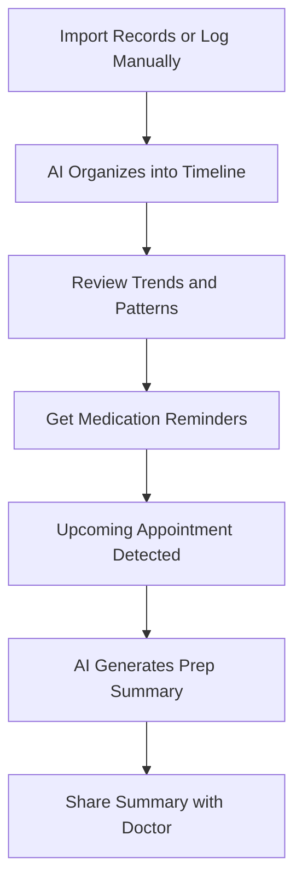

# HealthLog AI

## What It Does

HealthLog AI helps individuals organize, understand, and act on their personal health data. It aggregates information from doctor visits, lab results, medication lists, symptom diaries, and wearable devices into a single timeline, then uses AI to spot trends, flag potential concerns, and prepare you for medical appointments with relevant questions and context.

The target user is anyone managing their health or a family member's health: patients with chronic conditions tracking symptoms and medications, parents managing children's vaccination schedules and pediatric records, caregivers coordinating care for elderly parents, or health-conscious individuals wanting a complete picture of their wellness data. HealthLog AI does not diagnose or prescribe -- it organizes and contextualizes, so you walk into every doctor's appointment with a clear, complete health picture rather than a stack of disconnected papers and foggy memories.

## Key Features

- **Unified Health Timeline** -- All medical events (visits, labs, prescriptions, symptoms, vitals) displayed on a single chronological timeline with filtering and search.
- **Lab Result Interpreter** -- Explains lab values in plain language, shows trends over time, and highlights values outside normal ranges with context.
- **Medication Tracker** -- Manages current medications with dosage reminders, interaction warnings, and refill alerts.
- **Symptom Diary** -- Log symptoms with severity, duration, and potential triggers; AI identifies patterns and correlations over time.
- **Appointment Prep** -- Generates a summary of recent health events, current medications, and suggested questions for your next doctor visit.
- **Family Health Hub** -- Manage health records for family members (children, elderly parents) with role-based access and care coordination.
- **Wearable Integration** -- Imports data from Apple Health, Google Fit, Fitbit, and Garmin to add activity, sleep, and heart rate to your health timeline.

## User Workflow

## Pricing

| Tier | Price | Includes |
|------|-------|----------|
| Free | $0/month | Basic timeline, 1 profile, manual entry only |
| Personal | $9.99/month | Lab interpreter, medication tracker, wearable integration |
| Family | $19.99/month | Up to 6 profiles, family health hub, care coordination |
| Caregiver | $29.99/month | Multi-patient management, provider sharing, document scanning |

## Upgrade Path

HealthLog AI users in healthcare roles (nurses, care coordinators, clinic managers) are offered HRAssist Pro or directed to enterprise healthcare workforce tools. Healthcare organizations that learn about HealthLog AI through patient adoption receive outreach for enterprise patient engagement platforms and clinical decision support tools available in the FrankMax healthcare AI catalog. The consumer health experience builds trust in AI-assisted healthcare that translates to institutional adoption.

## Data Flow

Anonymized health pattern data feeds the Kitchen layer: symptom-condition correlations, medication adherence patterns, wearable data trends by demographic, and healthcare utilization patterns. This data -- fully de-identified and HIPAA-compliant in its anonymized form -- improves marketplace healthcare AI models, enhances clinical decision support tools for enterprise clients, and contributes to a population health intelligence layer. No protected health information is retained in the Kitchen -- only aggregate statistical patterns.
