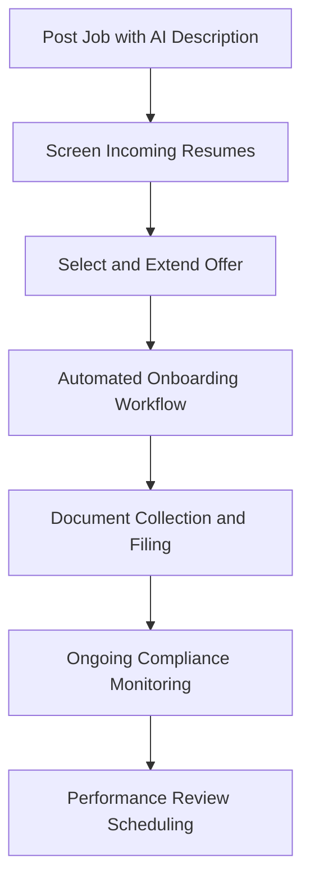

# HRAssist Pro

## What It Does

HRAssist Pro provides AI-powered human resources support for small businesses that cannot justify a full HR department. It handles the tasks that keep small business owners up at night: screening resumes, generating compliant job descriptions, tracking employee documents, managing onboarding checklists, and answering "is this legal?" questions about employment practices in their state.

The target user is the business owner, office manager, or first HR hire at a company with 5-200 employees: the person who handles HR alongside three other job functions. HRAssist Pro knows federal and state employment law across all 50 states and adapts its guidance to your specific location, company size, and industry. It does not replace an employment attorney for complex situations, but it handles the 80% of HR questions that are routine but critical to get right.

## Key Features

- **Resume Screening** -- AI ranks applicant resumes against your job requirements, highlighting top candidates and flagging experience gaps, while ensuring bias-free evaluation.
- **Compliant Job Descriptions** -- Generate job descriptions that are legally compliant, ADA-accessible, and optimized for your target candidate pool.
- **Onboarding Workflow** -- Automated new-hire checklists with document collection, policy acknowledgments, and training assignments customized by role and state.
- **Employee Document Management** -- Centralized storage for I-9s, W-4s, offer letters, and performance reviews with retention schedule enforcement.
- **Employment Law Q&A** -- Ask plain-language questions about employment practices and receive state-specific guidance with regulatory citations.
- **Policy Template Library** -- Pre-built, state-compliant policy templates (handbook, PTO, harassment, remote work, social media) customized to your company.
- **Compliance Calendar** -- Tracks federal and state employment compliance deadlines (EEO-1, ACA, OSHA, state-specific filings) with reminders.

## User Workflow

## Pricing

| Tier | Price | Includes |
|------|-------|----------|
| Starter | $49.99/month | Up to 25 employees, resume screening, basic templates |
| Business | $79.99/month | Up to 100 employees, onboarding workflows, compliance calendar, law Q&A |
| Professional | $99.99/month | Up to 200 employees, full document management, policy library, 3 HR users |

## Upgrade Path

HRAssist Pro Professional-tier users growing beyond 200 employees or needing advanced capabilities (benefits administration, payroll integration, workforce analytics) are offered the enterprise HR AI platform with full ATS integration, predictive workforce planning, and compliance automation at $15,000+/month. Organizations using HRAssist Pro across multiple locations receive outreach for multi-entity HR management with the ORF protocol ensuring compliance obligations are tracked across every jurisdiction.

## Data Flow

HR operations data feeds the Kitchen layer with anonymized insights: which employment law questions are asked most by state, resume screening effectiveness metrics, onboarding completion rates by industry, and compliance deadline patterns. This data improves marketplace workforce AI models, enhances enterprise HR tools' compliance accuracy, and builds an employment practices intelligence dataset. No employee personal data, resumes, or company-specific information are retained -- only aggregate HR operations patterns and compliance statistics.
