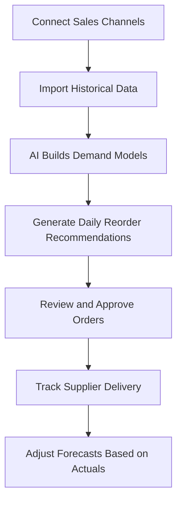

# InventoryAI Pro

## What It Does

InventoryAI Pro gives small and mid-size businesses AI-powered inventory management that was previously only available to enterprises with six-figure software budgets. It predicts demand, optimizes reorder points, identifies dead stock, and prevents stockouts using the same machine learning techniques that power major retail supply chains -- but packaged for businesses managing 100 to 50,000 SKUs.

The target user is the operations manager, warehouse lead, or business owner at a company where inventory management still runs on spreadsheets, gut feel, or basic accounting software: e-commerce sellers, retail shops, distributors, light manufacturers, and food service operations. InventoryAI Pro connects to your sales channels (Shopify, Amazon, Square, QuickBooks) and learns your demand patterns, supplier lead times, and seasonal fluctuations to generate specific reorder recommendations daily.

## Key Features

- **Demand Forecasting** -- AI predicts demand per SKU for the next 30/60/90 days using historical sales, seasonality, trends, and external signals (weather, events, holidays).
- **Smart Reorder Points** -- Dynamic reorder points that adjust based on forecast demand, supplier lead time variability, and desired service level.
- **Dead Stock Detection** -- Identifies inventory that has not moved in configurable periods and suggests markdown, bundle, or liquidation strategies.
- **Stockout Prevention** -- Early warning alerts when current inventory plus incoming orders will not cover forecasted demand, with recommended actions.
- **Multi-Channel Sync** -- Unified inventory view across Shopify, Amazon, eBay, Square POS, and manual channels with automatic reconciliation.
- **Supplier Performance Tracking** -- Tracks on-time delivery, quality, and lead time variability by supplier to inform sourcing decisions.
- **ABC Analysis** -- Automatic classification of SKUs by revenue contribution and velocity, focusing management attention on high-impact items.

## User Workflow

## Pricing

| Tier | Price | Includes |
|------|-------|----------|
| Starter | $49.99/month | Up to 500 SKUs, basic forecasting, 1 sales channel |
| Growth | $79.99/month | Up to 5,000 SKUs, multi-channel sync, supplier tracking, 3 users |
| Scale | $99.99/month | Up to 50,000 SKUs, advanced forecasting, ABC analysis, 10 users |

## Upgrade Path

InventoryAI Pro Scale-tier users managing complex multi-warehouse operations or exceeding 50,000 SKUs are offered the enterprise supply chain optimization platform with IoT sensor integration (Sensor Data Ingestion Pipeline), digital twin modeling for warehouse optimization, and AI-powered supply chain planning at $30,000+/month. The message: "You optimized single-location inventory. Now optimize your entire supply chain with the same AI."

## Data Flow

Inventory management data feeds the Kitchen layer with anonymized patterns: demand seasonality curves by product category and geography, supplier reliability distributions, stockout frequency correlations, and forecasting accuracy by model type. This data improves supply chain AI models across the marketplace, enhances the enterprise inventory optimization tools, and builds a demand intelligence dataset that sharpens forecasts for all users. No product details, pricing, or business-specific data are retained -- only statistical demand patterns and performance distributions.
