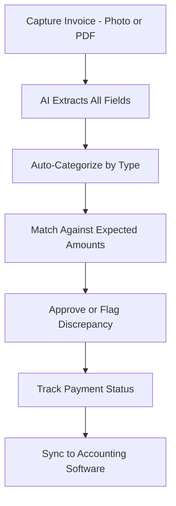

# InvoiceSnap AI

## What It Does

InvoiceSnap AI automates invoice processing for freelancers, contractors, and small businesses. Snap a photo of a received invoice or create a professional invoice from scratch, and the AI handles data extraction, categorization, payment tracking, and accounting system synchronization. It eliminates the shoebox-of-invoices problem and the end-of-month scramble to reconcile what has been paid and what is outstanding.

The target user is anyone who sends or receives invoices without a full accounting department: freelancers tracking client payments, contractors managing subcontractor invoices, small business owners reconciling vendor bills, or side-hustle operators who need professional invoicing without professional pricing. InvoiceSnap AI learns your vendor and client patterns, auto-fills recurring invoice data, and flags discrepancies between quoted amounts and invoiced amounts before you pay.

## Key Features

- **Instant Invoice Capture** -- Photograph a paper invoice or import a PDF; AI extracts vendor, amount, line items, tax, due date, and payment terms in under 5 seconds.
- **Smart Categorization** -- Invoices are automatically categorized by expense type, project, client, or custom tags based on learned patterns.
- **Invoice Creation** -- Generate professional branded invoices with your logo, payment terms, and itemized line items. Send directly via email or shareable link.
- **Payment Status Tracking** -- Track which invoices are paid, pending, or overdue with automated reminder emails for outstanding receivables.
- **Discrepancy Detection** -- AI compares invoice amounts against purchase orders, quotes, or expected amounts and flags mismatches before payment.
- **Accounting Sync** -- One-tap sync to QuickBooks, Xero, FreshBooks, and Wave with automatic category mapping.

## User Workflow

## Pricing

| Tier | Price | Includes |
|------|-------|----------|
| Free | $0/month | 10 invoices/month, basic capture and categorization |
| Freelancer | $9.99/month | 50 invoices/month, invoice creation, payment tracking |
| Business | $19.99/month | Unlimited invoices, discrepancy detection, accounting sync |
| Team | $29.99/month | Multi-user access, approval workflows, bulk processing |

## Upgrade Path

InvoiceSnap AI Business and Team tier users processing high invoice volumes are the primary pipeline for the enterprise Billing Leakage Detector, which applies AI to detect systematic billing errors, duplicate payments, and contract non-compliance at scale ($15,000+/month). The upgrade message is direct: "You found $X in discrepancies this month with InvoiceSnap. The enterprise platform finds 10-50x more across your entire AP/AR operation." DocuFlow enterprise platform is also offered for full document lifecycle management.

## Data Flow

Invoice processing data feeds the Kitchen layer with anonymized patterns: common invoice formats by industry, discrepancy rates by vendor category, payment timing distributions, and seasonal invoicing patterns. This data directly improves the Billing Leakage Detector's pattern recognition, enhances the marketplace's financial document AI models, and builds an invoice intelligence dataset that identifies billing anomalies with increasing accuracy. No invoice amounts, vendor names, or financial details are retained -- only structural patterns and statistical distributions.
