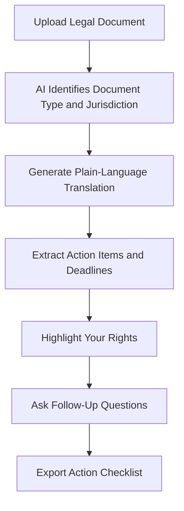

# LegalPlain AI

## What It Does

LegalPlain AI translates any legal document -- court filings, regulations, policies, terms of service, government notices -- into plain language that non-lawyers can understand. It goes beyond simple summarization: it explains legal implications, identifies what actions you need to take, and highlights deadlines you cannot miss. Think of it as having a patient paralegal who never bills by the hour.

The target user is anyone who encounters legal language in daily life: individuals dealing with court proceedings, tenants receiving legal notices from landlords, employees reviewing company policies, small business owners navigating regulatory requirements, or anyone trying to understand what government agencies are actually telling them. LegalPlain AI covers federal and state regulations, court documents, corporate policies, and consumer legal notices across all 50 states.

## Key Features

- **Plain Language Translation** -- Converts dense legal text into clear, readable explanations at a configurable reading level (8th grade default, adjustable up or down).
- **Action Item Extraction** -- Identifies specific actions you need to take (file by date X, respond within Y days, submit form Z) and creates a checklist.
- **Deadline Calendar** -- All legal deadlines extracted and added to a calendar view with configurable advance reminders.
- **Jurisdiction Detection** -- Automatically identifies which state and federal laws apply and adjusts explanations for jurisdictional differences.
- **Legal Term Glossary** -- Tap any legal term for a plain-language definition with examples relevant to your document context.
- **Document Q&A** -- Ask specific questions about your legal document and receive answers grounded in the document text, not generic legal information.
- **Rights Identifier** -- Highlights your legal rights mentioned in the document that you may not be aware of (tenant rights, employee protections, consumer rights).

## User Workflow

## Pricing

| Tier | Price | Includes |
|------|-------|----------|
| Free | $0/month | 2 documents/month, basic translation |
| Personal | $9.99/month | 10 documents/month, action items, deadline calendar |
| Unlimited | $19.99/month | Unlimited documents, document Q&A, rights identifier |
| Business | $29.99/month | Team access, regulatory monitoring, priority processing |

## Upgrade Path

LegalPlain AI Business-tier users are natural candidates for ComplianceCheck AI (regulatory compliance monitoring) and ContractReader AI (contract-specific analysis). Enterprise legal departments discovering LegalPlain AI through employee use receive outreach for the full legal AI suite: Smart Contract Governance for automated contract enforcement, the Mandate State Ledger for regulatory tracking, and enterprise compliance platforms at $15,000+/month.

## Data Flow

Legal document analysis feeds the Kitchen layer with anonymized data on document complexity patterns, jurisdiction-specific terminology variations, common legal misunderstandings, and action item completion rates. This data improves legal AI models across the marketplace, enhances enterprise compliance tools' ability to parse regulatory language, and builds a legal complexity index by document type and jurisdiction. No document content is retained -- only structural patterns, complexity metrics, and anonymized classification data.
