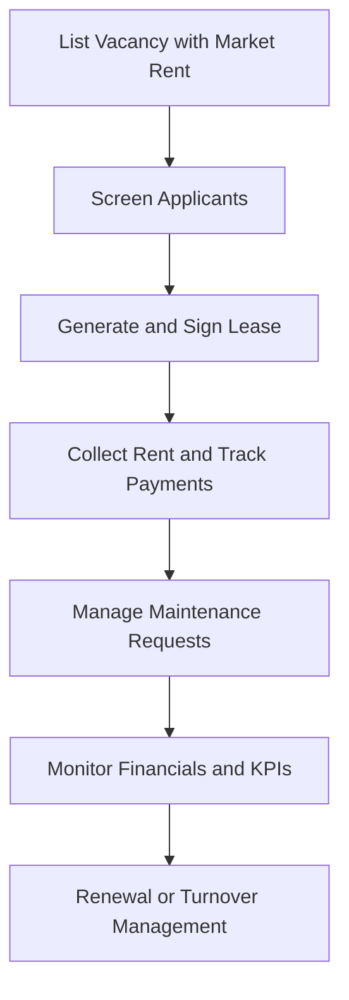

# PropertyManager Pro

## What It Does

PropertyManager Pro gives independent landlords and small property management companies AI-powered tools to manage residential and commercial properties. It handles tenant screening, lease management, maintenance request triage, rent collection tracking, and financial reporting for portfolios of 1-500 units -- the range where enterprise property management software is overkill and spreadsheets are dangerously inadequate.

The target user is the individual landlord with 1-20 units managing properties as a side business, the small property management company with 20-200 units, or the real estate investor scaling a portfolio. PropertyManager Pro automates the repetitive work (chasing rent, scheduling maintenance, renewing leases) while providing AI-driven insights on market rents, maintenance cost optimization, and tenant retention risk. It treats property management as a data problem, not just a task list.

## Key Features

- **AI Tenant Screening** -- Evaluates applications using credit, background, income verification, and rental history with fair housing compliance built in.
- **Lease Management** -- Generate, send, and track leases with e-signature, automatic renewal reminders, and state-specific legal compliance.
- **Maintenance Request Triage** -- Tenants submit requests via app; AI categorizes by urgency, suggests vendor assignment, and estimates cost.
- **Rent Collection Dashboard** -- Track payments, automate late notices, and identify tenants at risk of non-payment based on historical patterns.
- **Market Rent Analysis** -- AI-powered comparable rent analysis for each unit based on location, features, and current market conditions.
- **Financial Reporting** -- Per-property and portfolio-level P&L, cash flow, and tax reporting with expense categorization.
- **Tenant Retention Scoring** -- Predicts which tenants are at risk of not renewing, with suggested retention actions (maintenance attention, rent adjustment).

## User Workflow

## Pricing

| Tier | Price | Includes |
|------|-------|----------|
| Landlord | $49.99/month | Up to 10 units, tenant screening, lease management, rent tracking |
| Manager | $79.99/month | Up to 100 units, maintenance triage, market analysis, financial reports |
| Portfolio | $99.99/month | Up to 500 units, retention scoring, multi-owner reporting, 5 users |

## Upgrade Path

PropertyManager Pro Portfolio-tier users managing larger portfolios or commercial properties are offered the enterprise real estate AI platform with IoT building management integration (Sensor Data Ingestion Pipeline), predictive maintenance powered by anomaly detection, digital twin building models, and multi-entity compliance management at $20,000+/month. The Sustainability and Circularity Optimizer is positioned for portfolio-level energy optimization and ESG compliance reporting.

## Data Flow

Property management data feeds the Kitchen layer with anonymized insights: rental market pricing trends by geography, maintenance cost distributions by property type and age, tenant retention predictors, and seasonal vacancy patterns. This data improves real estate AI models across the marketplace, enhances enterprise property analytics, and builds a residential and commercial real estate intelligence dataset. No tenant personal data, property addresses, or financial specifics are retained -- only aggregate market patterns and operational performance distributions.
