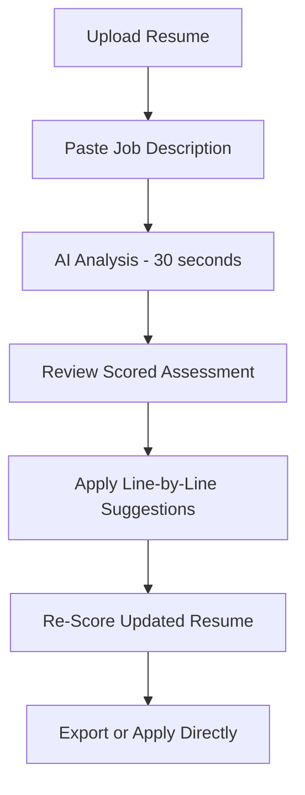

# ResumeReview AI

## What It Does

ResumeReview AI analyzes your resume against job descriptions and provides specific, actionable feedback on content, formatting, keyword optimization, and competitive positioning. It does not generate generic advice -- it compares your resume to successful resumes in the same role and industry, identifies gaps, and tells you exactly what to change and why.

The target user is any job seeker: recent graduates, career changers, laid-off professionals, or anyone who has not updated their resume in years. Upload your resume and paste a job description, and within 30 seconds you receive a scored assessment with line-by-line recommendations. The AI knows what ATS (Applicant Tracking Systems) filter for, what hiring managers in specific industries prioritize, and how to quantify achievements that currently read as vague responsibilities. It is the career coach most people cannot afford, available at $9.99/month.

## Key Features

- **ATS Compatibility Score** -- Rates your resume 0-100 for Applicant Tracking System compatibility, identifying formatting and keyword issues that cause automatic rejection.
- **Job Description Matching** -- Side-by-side comparison of your resume against a specific job posting, highlighting missing keywords, skills, and qualifications.
- **Industry Benchmarking** -- Compares your resume structure and content against successful resumes in the same role and NAICS sector.
- **Achievement Quantifier** -- Identifies vague responsibility statements and suggests specific, quantified achievement rewrites.
- **Format Optimizer** -- Recommends layout, section ordering, and formatting changes based on industry norms and ATS requirements.
- **Cover Letter Generator** -- Produces tailored cover letters that complement your resume for each job application.
- **Interview Prep** -- Generates likely interview questions based on resume gaps and job description requirements.

## User Workflow

## Pricing

| Tier | Price | Includes |
|------|-------|----------|
| Free | $0/month | 1 resume review/month, basic ATS score |
| Job Seeker | $9.99/month | Unlimited reviews, job matching, achievement rewriting |
| Career Pro | $19.99/month | Industry benchmarking, cover letters, interview prep |
| Executive | $29.99/month | Executive resume formatting, LinkedIn optimization, recruiter insights |

## Upgrade Path

ResumeReview AI users in HR roles or recruiting are offered HRAssist Pro for enterprise-grade resume screening and candidate evaluation at $79.99/month. Companies that discover the tool through employee use receive targeted outreach for the full HRAssist enterprise platform with multi-seat licensing, compliance tracking, and ATS integration at $5,000+/month. The path from "fix my resume" to "fix my hiring pipeline" is a natural progression.

## Data Flow

Resume analysis data feeds the Kitchen layer with anonymized insights: which skills are trending by industry, what job description patterns correlate with successful placements, and which resume formats perform best across ATS systems. This data powers the marketplace's workforce analytics models, improves HRAssist Pro's screening algorithms, and builds the industry's most comprehensive resume effectiveness dataset. All personal data is stripped -- only structural patterns, keyword frequencies, and outcome correlations are retained.
