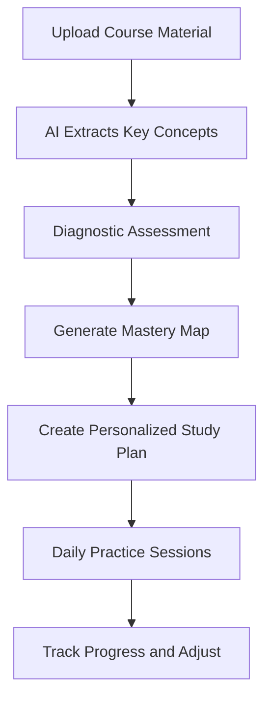

# StudyCoach AI

## What It Does

StudyCoach AI creates personalized study plans, generates practice questions, and adapts to each student's learning pace and weak spots. It does not just quiz you -- it figures out what you actually know vs. what you only think you know, then focuses your study time where it will have the most impact. Upload your course syllabus, textbook chapters, or lecture notes, and the AI builds a mastery map of the material.

The target user is any student or lifelong learner: high school students preparing for SAT/ACT, college students tackling difficult coursework, professionals studying for certification exams (CPA, PMP, AWS, bar exam), or anyone learning a new subject independently. StudyCoach AI uses spaced repetition algorithms enhanced by AI to schedule reviews at the optimal moment before you forget, turning cramming into genuine long-term retention. It tracks your actual knowledge state, not just hours spent.

## Key Features

- **Mastery Mapping** -- AI assesses your knowledge of each topic through diagnostic questions, creating a visual map of strong vs. weak areas.
- **Adaptive Practice Questions** -- Generates questions at the right difficulty level, focusing on weak areas and periodically reinforcing strong ones.
- **Spaced Repetition Scheduling** -- AI-optimized review intervals ensure you review material just before the forgetting curve drops, maximizing retention per minute studied.
- **Course Material Processing** -- Upload syllabi, textbook PDFs, or lecture notes and the AI extracts key concepts, definitions, and testable material automatically.
- **Exam Simulation** -- Timed practice exams that match the format, difficulty, and question distribution of target tests (SAT, GRE, CPA, PMP, etc.).
- **Study Time Optimizer** -- Recommends how to allocate limited study time across subjects for maximum overall grade improvement.

## User Workflow

## Pricing

| Tier | Price | Includes |
|------|-------|----------|
| Free | $0/month | 1 subject, basic flashcards, limited questions |
| Student | $9.99/month | 5 subjects, adaptive questions, mastery mapping |
| Exam Prep | $19.99/month | Unlimited subjects, exam simulations, spaced repetition |
| Professional | $29.99/month | Certification exam libraries (CPA, PMP, AWS, etc.), study analytics |

## Upgrade Path

StudyCoach AI users in corporate training roles are natural candidates for enterprise learning management and workforce development tools in the FrankMax marketplace. Organizations that discover StudyCoach AI through employee certification study are offered bulk licensing and custom content integration. Educational institutions are targeted for campus-wide deployments with LMS integration and instructor analytics dashboards.

## Data Flow

Anonymized learning pattern data feeds the Kitchen layer: which concepts are hardest to master by subject area, optimal spaced repetition intervals by content type, study time vs. outcome correlations, and exam readiness prediction accuracy. This data improves the marketplace's educational AI models, enhances enterprise training effectiveness tools, and builds a learning science dataset that makes the adaptive algorithms more accurate with every student. No personal academic records are retained -- only learning pattern statistics.
