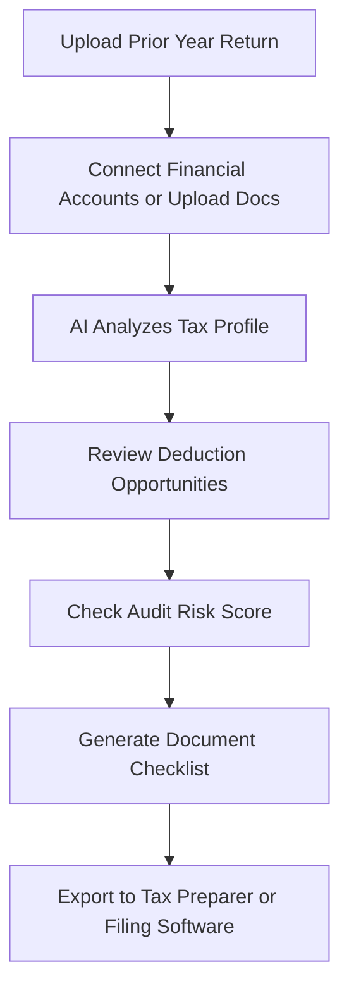

# TaxHelper AI

## What It Does

TaxHelper AI guides individuals and freelancers through tax preparation by analyzing their financial documents, identifying deductions they are likely missing, and flagging potential audit risks before filing. It is not tax filing software -- it is an AI advisor that sits between you and your tax preparer (or DIY software), making sure you do not leave money on the table or trigger unnecessary red flags.

The target user is anyone who files taxes: W-2 employees who want to maximize deductions, freelancers and gig workers with complex 1099 situations, small landlords with rental income, or anyone who suspects their current tax approach is leaving money behind. Upload your prior year returns and current financial documents, and TaxHelper AI produces a personalized deduction checklist, audit risk score, and estimated refund range. It pays for itself if it finds even one missed deduction.

## Key Features

- **Deduction Finder** -- AI scans your financial profile and identifies deductions you are eligible for but likely not claiming, with estimated dollar impact.
- **Audit Risk Score** -- Rates your return 0-100 for audit probability based on IRS selection criteria, flagging specific line items that increase risk.
- **Document Checklist** -- Generates a personalized list of documents you need to gather, based on your income sources and life changes.
- **Year-Round Tracking** -- Track deductible expenses throughout the year, not just at tax time, with receipt scanning powered by DocuScan AI technology.
- **Freelancer Mode** -- Specialized support for 1099 income, quarterly estimated payments, home office deductions, and business expense categorization.
- **State Tax Guidance** -- Covers all 50 states plus multi-state filing scenarios for remote workers and multi-state income.

## User Workflow

## Pricing

| Tier | Price | Includes |
|------|-------|----------|
| Free | $0/month | Basic deduction scan, estimated refund range |
| Individual | $14.99/month | Full deduction finder, audit risk score, document checklist |
| Freelancer | $24.99/month | 1099 support, quarterly estimates, expense tracking |
| Landlord | $29.99/month | Rental income analysis, depreciation optimization, multi-property support |

## Upgrade Path

TaxHelper AI users with business income or multiple properties are natural candidates for the enterprise AI Cost Optimization Engine, which applies the same deduction-finding logic to business tax strategy at $10,000+/month. Accounting firms that discover TaxHelper AI through their clients receive outreach for bulk licensing and white-label options. The consumer tax experience demonstrates AI accuracy that builds trust for enterprise financial AI products.

## Data Flow

Anonymized tax pattern data feeds the Kitchen layer: which deductions are most commonly missed by NAICS sector, what income profiles correlate with audit selection, and which state tax rules create the most confusion. This data improves the marketplace's financial compliance models, enhances the Billing Leakage Detector's pattern recognition, and builds a tax optimization knowledge base that grows more accurate with each filing season. No personal financial data is retained -- only structural patterns and statistical distributions.
