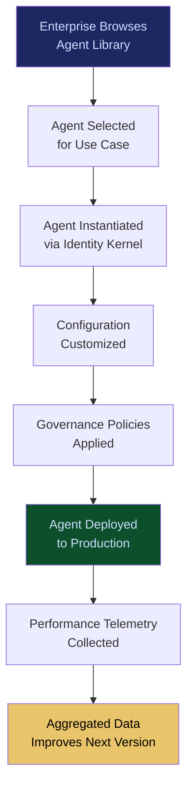

# 200+ Specialized Agent Library

**Layer 2 -- Cognition & Agent**

---

## Purpose

The 200+ Specialized Agent Library is the catalog of pre-built, governed, domain-specific AI agents available for deployment across the FrankMax platform. Each agent is purpose-built for a specific task -- invoice processing, contract clause extraction, medical coding validation, fraud signal detection, regulatory change monitoring -- and ships with pre-configured governance policies, performance benchmarks, and integration connectors.

This library is the "app store" of the agent ecosystem. Instead of enterprises spending 3-6 months building and validating a custom agent, they deploy a library agent in hours, customize its configuration, and begin generating value immediately. Every library agent runs inside the [Agent Runtime & Identity Kernel](/platform/core-systems/agent-runtime-identity-kernel), executes through the [Governed AI Execution Engine](/platform/core-systems/governed-ai-execution-engine), and generates telemetry that feeds the [Failure Pattern Library](/platform/core-systems/failure-pattern-library) and [Enterprise Mortality Tables](/platform/core-systems/enterprise-mortality-tables). Library breadth is a compounding advantage: more agents means more use cases served, more telemetry generated, and more switching cost accumulated.

---

## Architecture

Layer 2 handles cognition and agent management. The Agent Library is the supply side of the agent ecosystem. Agents from the library are instantiated through the [Agent Runtime & Identity Kernel](/platform/core-systems/agent-runtime-identity-kernel), orchestrated by the [Enterprise Agent Orchestration OS](/platform/core-systems/enterprise-agent-orchestration-os), and composed into vertical solutions by the [Verticalized Autonomous Operator Stack](/platform/core-systems/verticalized-autonomous-operator-stack). The [Agent Marketplace](/platform/core-systems/agent-marketplace) handles distribution and commercial transactions.

---

## Core Capabilities

- **Domain-Specific Pre-Training** -- Each agent is fine-tuned or prompt-engineered for its specific task, with domain ontologies and terminology baked in.
- **Governance-Ready Deployment** -- Every agent ships with pre-configured governance policies (approval thresholds, escalation rules, data access scopes) aligned to its domain.
- **Performance Benchmarks** -- Published accuracy, latency, and throughput benchmarks for each agent, measured against standardized test datasets.
- **Configuration-Driven Customization** -- Agents are customized through configuration (thresholds, routing rules, output formats) without code changes.
- **Continuous Improvement Pipeline** -- Agent performance across all deployments feeds back into the library, with updated versions released on a regular cadence.
- **Composability** -- Agents are designed to be composed into multi-agent workflows via the [Enterprise Agent Orchestration OS](/platform/core-systems/enterprise-agent-orchestration-os).
- **Versioned Lifecycle** -- Each agent maintains a full version history with migration guides between versions and rollback capability.

---

## BPMN Workflow

---

## Integration Points

| System | Integration | Data Flow |
|---|---|---|
| [Agent Runtime & Identity Kernel](/platform/core-systems/agent-runtime-identity-kernel) | Lifecycle | Library agents are instantiated and governed through the kernel |
| [Enterprise Agent Orchestration OS](/platform/core-systems/enterprise-agent-orchestration-os) | Composition | Library agents are composed into multi-agent workflows |
| [Agent Marketplace](/platform/core-systems/agent-marketplace) | Distribution | Library agents are listed, priced, and transacted through the marketplace |
| [Governed AI Execution Engine](/platform/core-systems/governed-ai-execution-engine) | Governance | All agent actions execute through the governance layer |
| [Failure Pattern Library](/platform/core-systems/failure-pattern-library) | Intelligence | Agent failure data feeds the library; failure patterns inform agent updates |
| [Enterprise Mortality Tables](/platform/core-systems/enterprise-mortality-tables) | Risk | Agent reliability data contributes to mortality table calculations |

---

## Data Model

- **AgentTemplate** -- Template ID, domain, task type, model requirements, default configuration, governance policy set, version.
- **AgentBenchmark** -- Template ID, version, accuracy, latency (p50/p95/p99), throughput, test dataset reference.
- **AgentDeployment** -- Deployment ID, template version, tenant ID, custom configuration, deployment timestamp, status.
- **AgentFeedback** -- Deployment ID, performance metrics, user ratings, error reports, improvement suggestions.

---

## Deployment Model

Cloud-native SaaS. Library agents are deployed as managed instances within the tenant's [Sovereign AI Pod](/platform/core-systems/sovereign-ai-pods). Agent templates are stored in a central registry and versioned independently. Deployment is API-driven or through the marketplace UI. On-premises deployment packages available for air-gapped environments, with manual update distribution.

---

## Revenue Contribution

Per-agent deployment fee (included in [Agent Runtime & Identity Kernel](/platform/core-systems/agent-runtime-identity-kernel) per-agent pricing) plus premium agent licensing ($99--$999/month for specialized vertical agents). The library drives platform adoption -- enterprises that deploy 1 agent expand to 10-50 agents within a year. Library breadth is a competitive moat: every deployed agent generates domain-specific telemetry that improves future versions, creating a flywheel that accelerates with scale.
