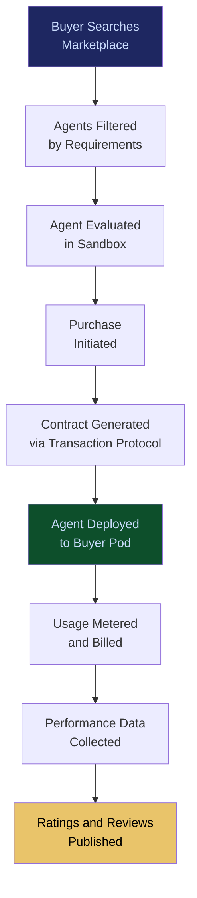

# Agent Marketplace

**Layer 5 -- Economic & Transaction**

---

## Purpose

The Agent Marketplace is the distribution and commerce platform where enterprises discover, evaluate, purchase, and deploy AI agents. It is the storefront of the FrankMax ecosystem -- the "AppSumo of Institutional AI" -- where the [200+ Specialized Agent Library](/platform/core-systems/200-specialized-agent-library) and third-party agent developers list their offerings for enterprise buyers. Every agent sold through the marketplace runs inside the [Agent Runtime & Identity Kernel](/platform/core-systems/agent-runtime-identity-kernel) and executes through the [Governed AI Execution Engine](/platform/core-systems/governed-ai-execution-engine).

The marketplace creates a two-sided network effect. More buyers attract more agent developers; more agents attract more buyers. Each transaction flows through the [AI Contract & Transaction Protocol](/platform/core-systems/ai-contract-transaction-protocol), ensuring standardized terms, usage metering, and dispute resolution. Every marketplace interaction generates telemetry that feeds the [Failure Pattern Library](/platform/core-systems/failure-pattern-library) and [Enterprise Mortality Tables](/platform/core-systems/enterprise-mortality-tables), compounding the Kitchen moat with demand data and agent performance benchmarks.

---

## Architecture

Layer 5 handles economic and transaction systems. The Agent Marketplace is the commercial interface between agent supply (developers, FrankMax library) and agent demand (enterprise buyers). It sits atop the [AI Contract & Transaction Protocol](/platform/core-systems/ai-contract-transaction-protocol) for commerce, integrates with the [Reputation & Trust Graph](/platform/core-systems/reputation-trust-graph) for seller credibility, and connects to the [Autonomous Budget Optimization](/platform/core-systems/autonomous-budget-optimization) for buyer spend management.

---

## Core Capabilities

- **Agent Discovery and Search** -- Faceted search by vertical, task type, model backing, compliance certification, performance benchmarks, pricing, and trust score.
- **Trial and Evaluation** -- Sandbox environments where buyers can test agents with sample data before committing to purchase.
- **Performance Benchmarks** -- Standardized benchmarks (accuracy, latency, throughput, error rate) published for every listed agent, verified by the platform.
- **Developer Portal** -- Third-party agent developers publish, version, price, and manage their agents through a self-service developer portal.
- **Revenue Sharing** -- Configurable revenue splits between agent developers, FrankMax (platform fee), and referring partners.
- **Compliance Pre-Screening** -- Every agent listed on the marketplace undergoes governance pre-screening to ensure it is compatible with the [Governed AI Execution Engine](/platform/core-systems/governed-ai-execution-engine).
- **Automated Deployment** -- One-click deployment from marketplace listing to production environment within the buyer's [Sovereign AI Pod](/platform/core-systems/sovereign-ai-pods).

---

## BPMN Workflow

---

## Integration Points

| System | Integration | Data Flow |
|---|---|---|
| [200+ Specialized Agent Library](/platform/core-systems/200-specialized-agent-library) | Supply | Library agents are listed as marketplace offerings |
| [AI Contract & Transaction Protocol](/platform/core-systems/ai-contract-transaction-protocol) | Commerce | All purchases and billing flow through the transaction protocol |
| [Agent Runtime & Identity Kernel](/platform/core-systems/agent-runtime-identity-kernel) | Deployment | Purchased agents are instantiated through the kernel |
| [Reputation & Trust Graph](/platform/core-systems/reputation-trust-graph) | Trust | Seller and agent trust scores displayed in marketplace listings |
| [Autonomous Budget Optimization](/platform/core-systems/autonomous-budget-optimization) | Spend | Budget optimizer recommends cost-effective agent selections |
| [Governed AI Execution Engine](/platform/core-systems/governed-ai-execution-engine) | Compliance | Governance pre-screening validates agent compatibility |

---

## Data Model

- **MarketplaceListing** -- Listing ID, agent template ID, seller ID, pricing model, description, benchmarks, compliance certifications, status.
- **MarketplaceTransaction** -- Transaction ID, listing ID, buyer ID, contract reference, deployment reference, timestamp.
- **SellerProfile** -- Seller ID, organization, trust score, agent count, total transactions, revenue earned, status.
- **AgentReview** -- Review ID, listing ID, buyer ID, rating (1-5), review text, deployment duration at time of review.

---

## Deployment Model

Cloud-native SaaS. The marketplace frontend is a web application with API access for programmatic procurement. The backend runs as a microservices architecture with separate services for search/discovery, listing management, transaction processing, and deployment orchestration. Search is powered by an Elasticsearch index optimized for faceted queries. The marketplace is globally available with CDN-backed asset delivery.

---

## Revenue Contribution

Platform commission (15-30% of agent transaction value) plus listing fees for premium placement ($499--$2,499/month for featured listings). The marketplace is the primary Burger-layer distribution channel -- it is where the 80%-below-provider-pricing promise meets enterprise buyers. Network effects compound value: more agents listed means more buyer visits, more transactions, more telemetry, and more Kitchen moat data. At scale, the marketplace becomes the default procurement channel for enterprise AI agents, creating structural lock-in through catalog breadth and buyer workflow integration.
