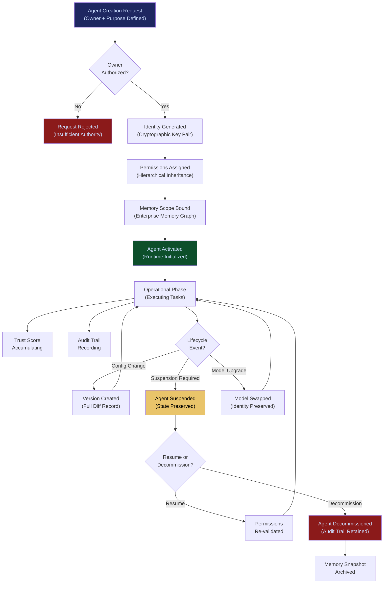

# Agent Runtime & Identity Kernel

**Layer 2 -- Cognition & Agent** | Build Complexity: 8/10 | Time to Revenue: 6--9 months

---

## Strategic Position

The Agent Runtime & Identity Kernel is **Kubernetes for AI agents**. It is the execution environment where agents are instantiated, identified, permissioned, monitored, and decommissioned. Every agent in the FrankMax ecosystem -- whether built in-house, deployed from the [Agent Marketplace](/platform/core-systems/agent-marketplace), or brought by the customer -- runs inside this kernel.

Identity is the lock-in mechanism. Once an agent's identity, permissions, memory bindings, and audit trail are rooted in this kernel, migrating to another runtime means abandoning the agent's operational history, trust score, and compliance record. That history becomes more valuable over time. After 6 months of operation, the switching cost is prohibitive.

This is a strategic choke point: Agent Runtime + [Enterprise Memory Graph](/platform/core-systems/enterprise-memory-graph) + [Governed AI Execution Engine](/platform/core-systems/governed-ai-execution-engine) combined = structural capture.

| Attribute | Detail |
|---|---|
| **Revenue Model** | Per-agent runtime fee |
| **Buyer** | Enterprise IT, VP of AI/ML, Platform Engineering |
| **Build Complexity** | 8/10 |
| **Time to Revenue** | 6--9 months |
| **Gross Margin** | 75--85% |
| **Capital Intensity** | Low |
| **Regulatory Risk** | Medium |
| **Strategic Value** | Identity = lock-in; strategic choke point |

---

## What It Does

The kernel provides five foundational services for every agent:

1. **Identity**: Every agent has a unique, cryptographically verifiable identity. The identity persists across sessions, model changes, and infrastructure migrations. An agent's identity is not its model -- it is its operational record.

2. **Permissions**: Fine-grained permission model defining what an agent can do, what data it can access, which systems it can interact with, and under what conditions. Permissions are inherited from the organizational authority chain and enforced at runtime.

3. **Lifecycle Management**: Agents are created, versioned, suspended, resumed, and decommissioned through governed workflows. No agent runs without an owner. No agent persists without a purpose. No agent is decommissioned without an audit trail.

4. **Memory Binding**: Each agent's memory is bound to its identity. When an agent accesses the [Enterprise Memory Graph](/platform/core-systems/enterprise-memory-graph), the query is scoped by the agent's permissions. Agents cannot access memory outside their authorization boundary.

5. **Audit Trail**: Every action an agent takes, every permission change, every lifecycle event is recorded immutably. The agent's audit trail is its compliance record -- the evidence that the agent operated within its authorized scope.

---

## Core Features

### 1. Cryptographic Agent Identity
Each agent receives a unique identity rooted in a cryptographic key pair. The identity is bound to the agent's configuration, permissions, and operational history. Identity verification is required for every action the agent takes through the [Governed AI Execution Engine](/platform/core-systems/governed-ai-execution-engine).

### 2. Hierarchical Permission Model
Permissions are organized in a hierarchy: organization, department, team, workflow, and task. An agent granted access to a workflow inherits the permissions defined at the workflow level but cannot exceed the permissions of its owning department. Permissions are evaluated at runtime, not at configuration time -- a permission revoked mid-session takes effect immediately.

### 3. Agent Lifecycle Governance
Every lifecycle transition is governed:
- **Creation**: Requires an authorized owner and a defined purpose
- **Activation**: Permissions must be validated before the agent can execute
- **Versioning**: Model upgrades, prompt changes, and configuration updates create a new version with a full diff record
- **Suspension**: Immediate halt of all agent activity with state preservation
- **Decommission**: Permanent shutdown with retention of audit trail and memory snapshots

### 4. Memory Scope Enforcement
When an agent queries the [Enterprise Memory Graph](/platform/core-systems/enterprise-memory-graph), the kernel enforces scope boundaries. An agent with "finance department" permissions cannot access "HR department" memory, even if the underlying graph contains both. Scope violations are logged and alert the agent's owner.

### 5. Trust Scoring
Each agent accumulates a trust score based on its operational history: task completion rate, policy compliance, escalation frequency, error rate, and human override frequency. Trust scores influence the [Governed AI Execution Engine](/platform/core-systems/governed-ai-execution-engine)'s risk assessment -- high-trust agents face fewer escalations; low-trust agents face stricter review.

### 6. Multi-Model Agent Support
An agent's identity is independent of the underlying model. An agent can be backed by Claude today, GPT-4o tomorrow, and a fine-tuned Llama variant next month -- its identity, permissions, memory, and audit trail persist across model changes. The [Multi-Model Orchestration Engine](/platform/core-systems/multi-model-orchestration-engine) handles the routing; the kernel handles the identity.

### 7. Agent-to-Agent Communication Protocol
Agents within the same organization can communicate through governed channels. Every inter-agent message is logged, permission-checked, and rate-limited. Agents cannot communicate across organizational boundaries without explicit cross-tenant authorization.

### 8. Resource Quota Management
Each agent is allocated compute, memory, and API call quotas. Quotas prevent runaway agents from consuming unbounded resources. Quota overages trigger automatic suspension and alert the agent's owner.

---

## Agent Lifecycle Flow

---

## Revenue Model

**Primary: Per-Agent Runtime Fee**

| Tier | Monthly Fee Per Agent | Includes |
|---|---|---|
| Standard | $29/agent/month | Identity, permissions, lifecycle, basic audit trail |
| Professional | $99/agent/month | + Trust scoring, memory binding, inter-agent communication |
| Enterprise | $249/agent/month | + Advanced quota management, cross-tenant authorization, forensic agent history |

**Volume Discounts:**

| Agent Count | Discount |
|---|---|
| 1--50 agents | Standard pricing |
| 51--200 agents | 15% discount |
| 201--1,000 agents | 25% discount |
| 1,000+ agents | Custom enterprise agreement |

**Revenue compounds with agent proliferation.** Enterprises that deploy 10 agents in month one typically run 50--100 agents by month twelve as they automate additional workflows. Each new agent increases the identity graph's value and the switching cost.

---

## Integration Points

| System | Integration Type | Data Flow |
|---|---|---|
| [Governed AI Execution Engine](/platform/core-systems/governed-ai-execution-engine) | Downstream | Agent identity and permissions are validated before every governed action |
| [Multi-Model Orchestration Engine](/platform/core-systems/multi-model-orchestration-engine) | Model Layer | The kernel manages identity while the orchestration engine manages model routing |
| [Enterprise Memory Graph](/platform/core-systems/enterprise-memory-graph) | Memory | Agent identity determines memory scope boundaries |
| [AI Audit & Verification Infrastructure](/platform/core-systems/ai-audit-verification-infrastructure) | Audit | Agent lifecycle events and actions are recorded in the immutable audit ledger |
| [Agent Marketplace](/platform/core-systems/agent-marketplace) | Distribution | Marketplace agents are instantiated through the kernel upon deployment |
| [Operator Certification System](/platform/core-systems/operator-certification-system) | Trust | Operator credentials influence agent deployment authorization |
| [Kill-Switch Infrastructure](/platform/core-systems/kill-switch-infrastructure) | Safety | Kill-switch activations trigger immediate agent suspension through the kernel |
| [Failure Pattern Library](/platform/core-systems/failure-pattern-library) | Intelligence | Agent failure patterns contribute to and draw from the library |

---

## The Identity Lock-In Mechanism

Identity creates the deepest form of platform lock-in because it is cumulative and irreproducible:

1. **Operational history is non-transferable.** An agent's 12 months of task completions, trust score accumulation, and compliance record cannot be exported to a competitor's runtime in a meaningful way.

2. **Permission graphs are organization-specific.** The hierarchical permission model maps to the organization's actual authority structure. Rebuilding it in another system requires re-mapping every department, team, and workflow.

3. **Memory bindings are kernel-dependent.** An agent's memory scope is enforced by the kernel. Migrating the agent without the kernel means losing the memory access controls that governance requires.

4. **Audit continuity is regulatory.** Regulators expect unbroken audit trails. Migrating agents mid-compliance-period creates a gap that auditors will flag.

---

## Build Considerations

| Consideration | Detail |
|---|---|
| **Identity Infrastructure** | PKI-based identity with hardware security module (HSM) backing for enterprise deployments. Key rotation without identity discontinuity. |
| **Permission Evaluation Latency** | Permission checks must complete in under 5ms. Pre-compiled permission graphs with incremental updates. |
| **Multi-Tenancy** | Complete tenant isolation at the identity layer. Cross-tenant agent communication requires explicit bilateral authorization. |
| **Scalability** | Must support 10,000+ concurrent agents per tenant. Stateless runtime with externalized state management. |
| **Disaster Recovery** | Agent state must survive infrastructure failures. Continuous replication of identity, permissions, and trust scores across availability zones. |
