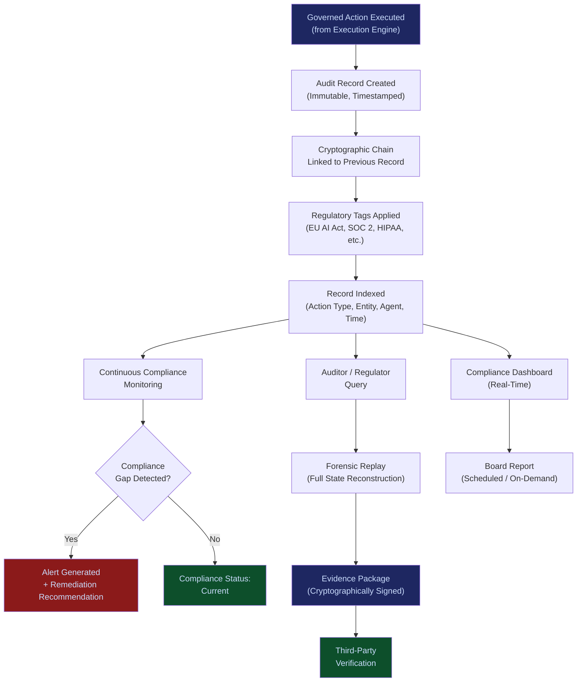

# AI Audit & Verification Infrastructure

**Layer 4 -- Execution & Governance** | Build Complexity: 5/10 | Time to Revenue: 2--4 months

---

## Strategic Position

The AI Audit & Verification Infrastructure is the immutable record of every AI action, decision, and outcome in the FrankMax ecosystem. It is the system that makes governance provable. Without it, compliance is a claim. With it, compliance is evidence.

This system creates **regulatory lock-in**. Once an organization's audit trail lives in this infrastructure, migration means abandoning the evidentiary record that regulators, insurers, and courts rely on. That record becomes more valuable over time -- it is the only system in the stack where historical data is irreplaceable.

Fear-driven budgets fund this system. Every regulatory action against AI, every insurer demanding governance proof, every board asking "can we prove we were careful?" creates a buyer.

| Attribute | Detail |
|---|---|
| **Revenue Model** | Compliance subscription + per-query access fees |
| **Buyer** | Internal Audit, Legal, Compliance Officers, CROs |
| **Build Complexity** | 5/10 |
| **Time to Revenue** | 2--4 months |
| **Gross Margin** | 85--95% |
| **Capital Intensity** | Low |
| **Day-1 Viability** | Immediate (once governance engine is operational) |
| **Strategic Value** | Regulatory lock-in; irreplaceable historical record |

---

## What It Does

Every AI action that passes through the [Governed AI Execution Engine](/platform/core-systems/governed-ai-execution-engine) produces an audit record. This infrastructure stores those records immutably, indexes them for retrieval, and provides the verification tools that auditors, regulators, and legal teams need to confirm that governance was enforced at the time of execution.

The system provides three capabilities:

1. **Traceability**: For any AI output, trace the complete chain -- which model produced it, what input it received, which policies were evaluated, who authorized it, and what the outcome was.
2. **Compliance Logging**: Structured, machine-readable logs that map to specific regulatory frameworks (EU AI Act, NIST AI RMF, SOC 2, ISO 42001, sector-specific requirements).
3. **Forensic Replay**: Reconstruct the exact state of the system at any point in time. When a regulator asks "what happened on March 14 at 2:37 PM?", the system produces the complete decision context, not a summary.

---

## Core Features

### 1. Immutable Audit Ledger
Append-only storage with cryptographic chaining. Every record is hashed and linked to the previous record. Tampering with any entry invalidates the chain from that point forward. Records cannot be modified, deleted, or backdated.

### 2. Regulatory Framework Mapping
Audit records are tagged against specific regulatory requirements. An organization subject to the EU AI Act, SOC 2, and HIPAA receives audit reports structured to each framework's requirements without duplicating the underlying data. When new regulations emerge, mapping templates are added and applied retroactively to existing records.

### 3. Forensic Replay Engine
Given a timestamp and an action identifier, the system reconstructs the complete decision context: the model input, the model output, the policy stack that was active, the authority chain that was traversed, the risk score that was computed, and the final execution decision. This is not a log viewer -- it is a complete state reconstruction.

### 4. Compliance Dashboards & Reporting
Real-time dashboards showing governance coverage (percentage of AI actions that passed through governed execution), policy violation rates, escalation frequencies, and audit trail completeness. Board-ready reports generated on demand or on a scheduled cadence.

### 5. Evidence Package Generator
When a regulator, insurer, or litigant requests evidence, the system generates a self-contained evidence package: a cryptographically signed bundle containing the relevant audit records, policy versions, authority chains, and model outputs. The package is verifiable by any third party without access to the FrankMax platform.

### 6. Continuous Compliance Monitoring
Automated scanning of audit records against compliance requirements. When a gap is detected (an action executed without proper authorization, a policy evaluation that was bypassed, a missing liability binding), the system generates an alert and a remediation recommendation.

### 7. Multi-Tenant Isolation with Cross-Entity Auditing
Full tenant isolation ensures one organization's records are never accessible by another. For multi-entity organizations (holding companies, government agencies with multiple departments), cross-entity audit views are configurable with explicit authorization.

### 8. Retention Policy Management
Configurable retention periods by jurisdiction, regulatory framework, and data sensitivity. Records in jurisdictions requiring 7-year retention are automatically managed. Records subject to litigation hold are flagged and excluded from expiry processing.

---

## Audit & Verification Flow

---

## Revenue Model

**Primary: Compliance Subscription**

| Tier | Monthly Fee | Coverage |
|---|---|---|
| Standard | $1,499/month | Up to 50,000 audit records/month, 1 regulatory framework, monthly reports |
| Professional | $4,999/month | Up to 500,000 records/month, 3 frameworks, weekly reports, forensic replay |
| Enterprise | $14,999/month | Unlimited records, all frameworks, real-time dashboards, evidence package generation |
| Regulated | Custom | Multi-jurisdiction, cross-entity auditing, dedicated compliance analyst, litigation hold management |

**Secondary: Per-Query Access Fees**

| Query Type | Fee |
|---|---|
| Standard audit record retrieval | Included in subscription |
| Forensic replay (full state reconstruction) | $25--$50 per replay |
| Evidence package generation | $250--$500 per package |
| Custom compliance report | $500--$2,000 per report |
| Expert witness support (litigation) | $5,000--$15,000 per engagement |

**Revenue trajectory**: Compliance subscriptions are sticky. Churn is near zero once regulatory requirements mandate the audit trail. Revenue compounds as organizations add workflows to governed execution, increasing audit record volume and subscription tier.

---

## Integration Points

| System | Integration Type | Data Flow |
|---|---|---|
| [Governed AI Execution Engine](/platform/core-systems/governed-ai-execution-engine) | Upstream | Every governed action produces an audit record consumed by this infrastructure |
| [ETLB Engine](/platform/core-systems/etlb-engine) | Binding Records | Liability binding events are stored as part of the audit trail |
| [MCO Generator & Validator](/platform/core-systems/mco-generator-validator) | Mortality Records | MCO lifecycle events (creation, expiry, termination) are logged immutably |
| [ORF Protocol](/protocols/orf) | Obligation Records | Obligation state transitions (created, fulfilled, expired, defaulted) are recorded |
| [Kill-Switch Infrastructure](/platform/core-systems/kill-switch-infrastructure) | Halt Records | Every kill-switch activation is recorded with the trigger condition and blast radius |
| [Agent Runtime & Identity Kernel](/platform/core-systems/agent-runtime-identity-kernel) | Identity Records | Agent lifecycle events (creation, permission changes, decommission) are logged |
| [PIAR](/platform/core-systems/pre-incident-accountability-review-piar) | Gap Analysis | PIAR identifies evidence infrastructure gaps; this system fills them |
| [AI Cost Optimization Engine](/platform/core-systems/ai-cost-optimization-engine) | Savings Records | Optimization savings are documented as audit records for compliance verification |

---

## The Regulatory Lock-In Mechanism

The audit infrastructure creates lock-in through three mechanisms:

1. **Historical irreplaceability.** An organization's 3-year audit trail cannot be recreated. Migrating to a competitor means starting the compliance clock from zero while regulators expect continuity.

2. **Regulatory dependency.** Once auditors and regulators are trained to consume FrankMax evidence packages, they resist format changes. The evidence package format becomes the de facto standard for AI audit evidence.

3. **Litigation anchor.** When an organization's audit trail is subpoenaed in litigation, the system and its evidence become part of the legal record. Migrating mid-litigation is practically impossible and legally risky.

---

## Build Considerations

| Consideration | Detail |
|---|---|
| **Storage Architecture** | Append-only with cryptographic chaining. Storage costs are predictable and grow linearly with governed action volume. Cold storage tiering for records past active retention period. |
| **Query Performance** | Forensic replay must return results within 10 seconds for any single action. Compliance dashboards must refresh within 30 seconds. |
| **Data Sovereignty** | Audit records must be stored in the jurisdiction they pertain to. Multi-region storage with jurisdiction-aware routing. |
| **Tamper Evidence** | Independent third-party can verify chain integrity without accessing record contents. Zero-knowledge proofs for sensitive sectors. |
| **Interoperability** | Export formats compatible with major GRC platforms (ServiceNow, Archer, OneTrust). API access for custom integrations. |
