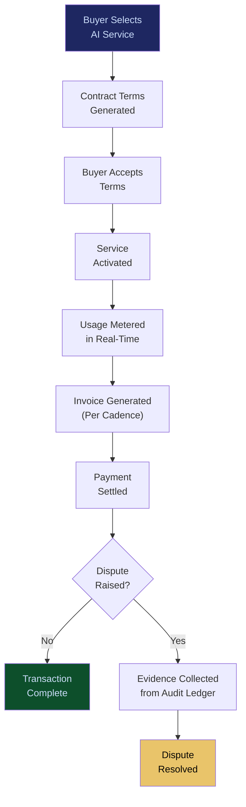

# AI Contract & Transaction Protocol

**Layer 5 -- Economic & Transaction**

---

## Purpose

The AI Contract & Transaction Protocol defines how AI services are procured, priced, contracted, delivered, and settled across the FrankMax marketplace. It is the commercial backbone of the platform -- every transaction between a buyer and a seller (whether that seller is FrankMax, a model provider, or a third-party agent developer) flows through this protocol. It handles contract formation, usage metering, billing, settlement, and dispute resolution.

The protocol standardizes AI procurement in the same way that payment networks standardized financial transactions. Before this protocol, every AI procurement is a custom negotiation with bespoke terms, manual billing, and no standardized dispute resolution. The protocol reduces procurement friction from weeks to minutes, enabling the volume-driven economics of the marketplace. Every transaction generates telemetry that feeds the [Failure Pattern Library](/platform/core-systems/failure-pattern-library) and [Enterprise Mortality Tables](/platform/core-systems/enterprise-mortality-tables).

---

## Architecture

Layer 5 handles economic and transaction systems. The AI Contract & Transaction Protocol is the foundational transaction layer, supporting the [Agent Marketplace](/platform/core-systems/agent-marketplace) (agent distribution), the [Decision Latency Arbitrage Network](/platform/core-systems/decision-latency-arbitrage-network) (latency trading), the [Autonomous Budget Optimization](/platform/core-systems/autonomous-budget-optimization) (spend management), and the [Liability Escrow Infrastructure](/platform/core-systems/liability-escrow-infrastructure) (financial reserves). It consumes governance data from Layer 4 to ensure transactions are compliant.

---

## Core Capabilities

- **Standardized AI Contracts** -- Template-based contract generation for AI service procurement with configurable terms (SLA, liability, data handling, termination) that comply with the ORF protocol.
- **Usage Metering** -- Real-time metering of AI service consumption (API calls, tokens, compute hours, agent runtime) with tamper-evident usage records.
- **Dynamic Pricing Engine** -- Supports fixed pricing, usage-based pricing, tiered pricing, auction pricing, and spot pricing for AI services.
- **Automated Settlement** -- Invoicing and settlement on configurable cadences (real-time micro-payments, daily, weekly, monthly) with multi-currency support.
- **Dispute Resolution Protocol** -- Structured dispute resolution process with evidence collection from the [AI Audit & Verification Infrastructure](/platform/core-systems/ai-audit-verification-infrastructure) and escalation to human arbitration when automated resolution fails.
- **Multi-Party Transactions** -- Supports transactions involving multiple parties (model provider + governance layer + agent developer + enterprise buyer) with revenue split management.

---

## BPMN Workflow

---

## Integration Points

| System | Integration | Data Flow |
|---|---|---|
| [Agent Marketplace](/platform/core-systems/agent-marketplace) | Commerce | All marketplace transactions flow through this protocol |
| [Autonomous Budget Optimization](/platform/core-systems/autonomous-budget-optimization) | Spend | Budget optimizer interacts with pricing engine for cost optimization |
| [Liability Escrow Infrastructure](/platform/core-systems/liability-escrow-infrastructure) | Escrow | Transaction-linked liability escrows are created per contract terms |
| [AI Audit & Verification Infrastructure](/platform/core-systems/ai-audit-verification-infrastructure) | Evidence | Audit data supports dispute resolution and compliance verification |
| [ETLB Engine](/platform/core-systems/etlb-engine) | Liability | Contract terms reference ETLB bindings for liability allocation |
| [AI Cost Optimization Engine](/platform/core-systems/ai-cost-optimization-engine) | Pricing | Cost optimization signals influence dynamic pricing decisions |

---

## Data Model

- **Contract** -- Contract ID, buyer ID, seller ID, service reference, terms (SLA, liability, data handling), pricing model, status, effective date, expiration date.
- **UsageRecord** -- Record ID, contract ID, metric type (calls/tokens/compute), quantity, timestamp, tamper-evidence hash.
- **Invoice** -- Invoice ID, contract ID, billing period, line items, total amount, currency, payment status.
- **Dispute** -- Dispute ID, contract ID, claimant, claim type, evidence references, resolution, resolution timestamp.

---

## Deployment Model

Cloud-native, multi-region. The transaction protocol runs as a highly available service with active-active deployment across regions. Usage metering runs as a distributed stream processing system for real-time accuracy. Settlement processing integrates with payment providers (Stripe, bank ACH, wire transfer) and supports multi-currency transactions. Financial data is encrypted at rest and in transit with PCI DSS Level 1 compliance for payment processing.

---

## Revenue Contribution

Transaction fees (1-3% of transaction value) plus platform subscription for access to the contract and settlement infrastructure. The protocol is the economic engine of the Burger layer -- it enables the 80%-below-provider-pricing model by standardizing procurement and reducing the per-transaction cost of AI service delivery. Transaction volume data compounds the Kitchen moat by revealing pricing elasticity, demand patterns, and buyer behavior that inform marketplace strategy.
