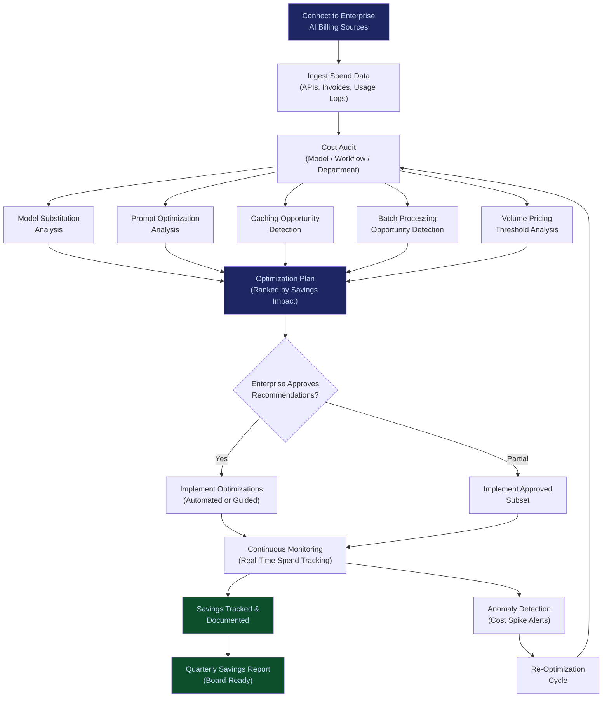

# AI Cost Optimization Engine

**Layer 1 -- Compute & Infrastructure** | Build Complexity: 5/10 | Time to Revenue: 1--3 months

---

## Strategic Position

The AI Cost Optimization Engine is the immediate ROI proof system. It answers the question every CFO and IT Director is already asking: **"Are we overpaying for AI, and by how much?"**

The answer is almost always yes. Enterprises running multi-model AI stacks routinely overpay by 30--60% due to suboptimal model selection, redundant inference calls, oversized context windows, and failure to exploit volume pricing. This engine quantifies the waste, implements the fix, and takes a percentage of the savings.

It is the fastest path to proving measurable value to a cost-conscious buyer -- and the natural upsell entry point into the [Multi-Model Orchestration Engine](/platform/core-systems/multi-model-orchestration-engine) and governance stack.

| Attribute | Detail |
|---|---|
| **Revenue Model** | Percentage of documented savings |
| **Buyer** | CFOs, IT Directors, VP of AI/ML, Procurement |
| **Build Complexity** | 5/10 |
| **Time to Revenue** | 1--3 months |
| **Gross Margin** | 70--85% |
| **Capital Intensity** | Low |
| **Strategic Value** | Immediate ROI proof; sells to anyone already paying for AI models |

---

## What It Does

The Cost Optimization Engine connects to an enterprise's existing AI spend (API invoices, cloud billing, internal usage logs) and produces three outputs:

1. **Cost Audit**: Where the money is going, broken down by model, provider, workflow, department, and task type.
2. **Optimization Plan**: Specific, implementable changes that reduce cost without reducing output quality -- model substitution, prompt compression, caching, batching, and right-sizing.
3. **Continuous Monitoring**: Ongoing tracking of AI spend with automated alerts when costs drift above optimized baselines.

The engine does not require the enterprise to migrate to FrankMax infrastructure. It works with their existing providers and generates savings recommendations regardless of platform. This lowers the adoption barrier to near zero.

---

## Core Features

### 1. AI Spend Audit & Visibility
Connects to provider billing APIs (OpenAI, Anthropic, Google Cloud, AWS Bedrock, Azure OpenAI) and internal usage logs. Produces a unified cost dashboard showing spend by model, workflow, department, user, and time period. Most enterprises have never seen their AI spend at this granularity.

### 2. Model Substitution Analysis
For each workflow, the engine identifies whether a cheaper model could deliver equivalent quality. A customer using GPT-4o for email summarization may achieve identical results with Claude Haiku at 90% lower cost. Each substitution recommendation includes a quality impact assessment and a savings estimate.

### 3. Prompt Optimization
Analyzes prompt patterns across workflows. Identifies oversized context windows, redundant system prompts, and inefficient instruction structures. Recommends compressed alternatives that produce equivalent outputs at lower token cost.

### 4. Inference Caching
Identifies repeated or near-identical inference requests. Implements semantic caching that returns cached results for requests within a configurable similarity threshold. In high-volume workflows (customer support, document classification), caching can reduce inference costs by 40--70%.

### 5. Batch Processing Optimization
Identifies workflows where real-time inference is unnecessary and recommends batch processing at off-peak rates. Many analytics, reporting, and back-office workflows tolerate 15--60 minute latency and can be batched for significant cost reduction.

### 6. Volume Pricing Negotiation Intelligence
Aggregates the enterprise's total spend across providers and identifies volume pricing thresholds they are not exploiting. Provides specific negotiation recommendations: "You are 12% below OpenAI's Tier 4 pricing threshold. Consolidating these three workflows would qualify you for a 20% rate reduction."

### 7. Cost Anomaly Detection
Real-time alerting when AI spend exceeds baseline thresholds. Detects runaway loops, misconfigured agents, and billing errors before they compound. Enterprises routinely discover 2--7% billing leakage through this feature alone.

### 8. Savings Tracking & Reporting
Documents every optimization implemented and tracks the realized savings over time. Produces board-ready reports showing cumulative savings, cost avoidance, and ROI. This reporting is what justifies the percentage-of-savings revenue model.

---

## Optimization Flow

---

## Revenue Model

**Primary: Percentage of Documented Savings**

| Savings Tier | FrankMax Take Rate | Example |
|---|---|---|
| First $50K in annual savings | 25% | Enterprise saves $50K, FrankMax earns $12.5K |
| $50K--$250K in annual savings | 20% | Enterprise saves $200K, FrankMax earns $40K |
| $250K--$1M in annual savings | 15% | Enterprise saves $750K, FrankMax earns $112.5K |
| $1M+ in annual savings | 10--12% (negotiated) | Enterprise saves $2M, FrankMax earns $200--$240K |

**Secondary: Monitoring Subscription**

| Tier | Monthly Fee | Coverage |
|---|---|---|
| Standard | $499/month | Cost dashboard, monthly anomaly alerts |
| Professional | $1,499/month | Real-time alerts, quarterly re-optimization, prompt analysis |
| Enterprise | $4,999/month | Dedicated optimization, volume negotiation support, board reporting |

**Revenue logic**: The percentage-of-savings model aligns incentives perfectly. The enterprise pays nothing until savings are documented. FrankMax is incentivized to find every dollar of waste. The monitoring subscription creates recurring revenue after the initial optimization.

---

## Integration Points

| System | Integration Type | Data Flow |
|---|---|---|
| [Multi-Model Orchestration Engine](/platform/core-systems/multi-model-orchestration-engine) | Sibling | Cost data informs orchestration routing; optimized routing reduces cost |
| [Governed AI Execution Engine](/platform/core-systems/governed-ai-execution-engine) | Downstream | Governance adds cost; optimization ensures governance overhead is offset by routing savings |
| [AI Audit & Verification Infrastructure](/platform/core-systems/ai-audit-verification-infrastructure) | Reporting | Savings documentation feeds audit records for compliance verification |
| [Enterprise Memory Graph](/platform/core-systems/enterprise-memory-graph) | Context | Historical usage patterns improve optimization recommendations |

---

## Buyer Psychology

The AI Cost Optimization Engine exploits a specific buyer condition: **AI budgets are growing faster than AI governance.** CFOs approved AI spending based on innovation promises but have limited visibility into actual utilization and cost efficiency. By the time they ask "are we getting value?", the waste is already compounding.

Key selling signals:

| Signal | Buyer | Urgency |
|---|---|---|
| AI spend increased 3x but outcomes are unclear | CFO | High |
| Multiple teams using different AI providers with no coordination | CTO / IT Director | Medium |
| Board asks for AI ROI metrics and no one has them | CFO / CEO | High |
| AI pilot succeeded but production costs are unsustainable | VP Engineering | Immediate |
| Billing anomalies discovered after budget cycle | Procurement | Immediate |

---

## Competitive Positioning

Most AI cost tools are dashboards that show spend. The FrankMax Cost Optimization Engine is different in three ways:

1. **It implements the fix, not just the diagnosis.** Model substitution, prompt compression, and caching are executed, not just recommended.
2. **It integrates with the governance stack.** Savings are not achieved by cutting governance corners. Optimizations are evaluated against compliance constraints before implementation.
3. **It is the gateway drug to the platform.** Enterprises that start with cost optimization see the value of orchestration, governance, and audit infrastructure. Conversion to the full stack runs at 40--60% within 12 months.
