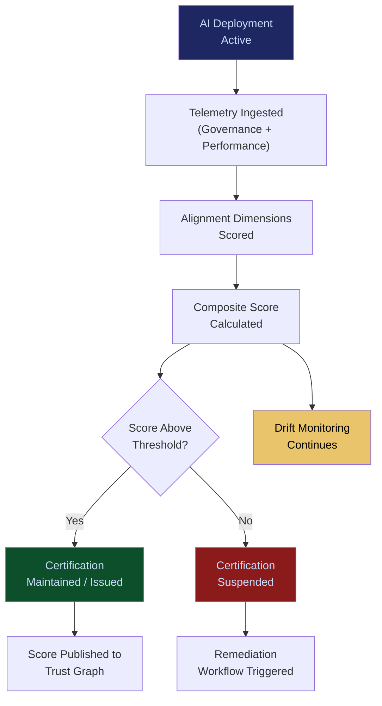

# Alignment Scoring & Certification

**Layer 6 -- Trust & Certification**

---

## Purpose

Alignment Scoring & Certification quantifies how well an AI deployment adheres to an organization's stated values, policies, regulatory obligations, and operational standards. It produces a numerical alignment score (0-100) for every agent, workflow, model, and operator, along with a certification status that indicates whether the deployment meets minimum compliance thresholds. Alignment is not a binary pass/fail -- it is a continuous measurement that tracks drift over time.

Enterprises need more than "is this AI compliant?" They need "how compliant is it, compared to what, and is it getting more or less compliant over time?" Alignment scoring answers these questions with data. The system ingests governance telemetry from the [Governed AI Execution Engine](/platform/core-systems/governed-ai-execution-engine), failure data from the [Failure Pattern Library](/platform/core-systems/failure-pattern-library), and mortality data from the [Enterprise Mortality Tables](/platform/core-systems/enterprise-mortality-tables) to compute multi-dimensional alignment scores. Certifications issued by this system are consumed by the [Reputation & Trust Graph](/platform/core-systems/reputation-trust-graph) and referenced in [Decision Defensibility Structuring](/platform/core-systems/decision-defensibility-structuring) packages.

---

## Architecture

Layer 6 handles trust and certification. Alignment Scoring & Certification sits alongside the [Skill Valuation & Credentialing](/platform/core-systems/skill-valuation-credentialing) (human capability assessment), the [Reputation & Trust Graph](/platform/core-systems/reputation-trust-graph) (trust network), and the [Operator Certification System](/platform/core-systems/operator-certification-system) (operator qualifications). It consumes data from Layers 3 and 4 and produces trust signals consumed by Layer 5 economic systems.

---

## Core Capabilities

- **Multi-Dimensional Alignment Scoring** -- Scores computed across dimensions: policy compliance, ethical alignment, accuracy, fairness, transparency, safety, and regulatory adherence.
- **Continuous Score Monitoring** -- Alignment scores are recalculated on a continuous basis using streaming telemetry, not periodic snapshots.
- **Drift Detection** -- Detects alignment score degradation over time and alerts stakeholders before scores drop below certification thresholds.
- **Certification Lifecycle** -- Issues, maintains, suspends, and revokes certifications based on sustained alignment performance. Certifications have explicit validity periods aligned with [MCO](/platform/core-systems/mco-generator-validator) timelines.
- **Benchmark Comparison** -- Compares an organization's alignment scores against anonymized cross-tenant benchmarks by industry and use case.
- **Regulatory Framework Mapping** -- Alignment dimensions map to specific regulatory requirements, making it clear which regulations a deployment satisfies or falls short on.

---

## BPMN Workflow

---

## Integration Points

| System | Integration | Data Flow |
|---|---|---|
| [Governed AI Execution Engine](/platform/core-systems/governed-ai-execution-engine) | Telemetry | Governance execution data is the primary scoring input |
| [Failure Pattern Library](/platform/core-systems/failure-pattern-library) | Risk | Failure patterns reduce alignment scores for affected deployments |
| [Enterprise Mortality Tables](/platform/core-systems/enterprise-mortality-tables) | Risk | Mortality risk data influences safety dimension scoring |
| [Reputation & Trust Graph](/platform/core-systems/reputation-trust-graph) | Trust | Alignment certifications feed the trust graph |
| [Decision Defensibility Structuring](/platform/core-systems/decision-defensibility-structuring) | Evidence | Alignment scores and certifications included in defensibility packages |
| [AI Audit & Verification Infrastructure](/platform/core-systems/ai-audit-verification-infrastructure) | Audit | Score calculations and certification decisions logged immutably |

---

## Data Model

- **AlignmentScore** -- Score ID, subject (agent/workflow/model), dimension scores (array), composite score, calculation timestamp, data sources referenced.
- **Certification** -- Certification ID, subject, certification type, issued date, expiry date, status (active/suspended/revoked), alignment threshold met.
- **DriftAlert** -- Alert ID, subject, dimension, previous score, current score, drift magnitude, direction, timestamp.
- **AlignmentBenchmark** -- NAICS code, use case type, median composite score, percentile distribution, sample size, period.

---

## Deployment Model

Cloud-native. Alignment scoring runs as a streaming computation service, continuously processing governance telemetry to update scores. Certification decisions are event-driven -- when a score crosses a threshold, the certification status is updated automatically. Score history is retained indefinitely for trend analysis and regulatory reporting. Multi-tenant isolation ensures one organization's scores are never visible to another.

---

## Revenue Contribution

Alignment scoring is bundled into governance subscription tiers. Certification issuance carries a per-certification fee ($500--$2,500 per certification depending on regulatory framework complexity). Benchmark comparison reports are sold as a premium data product ($5,000--$25,000/year). Alignment data compounds the Kitchen moat -- cross-tenant benchmarks become industry standards that only FrankMax can produce. Certifications create platform dependency because migrating means losing certification history and restarting the alignment measurement baseline.
