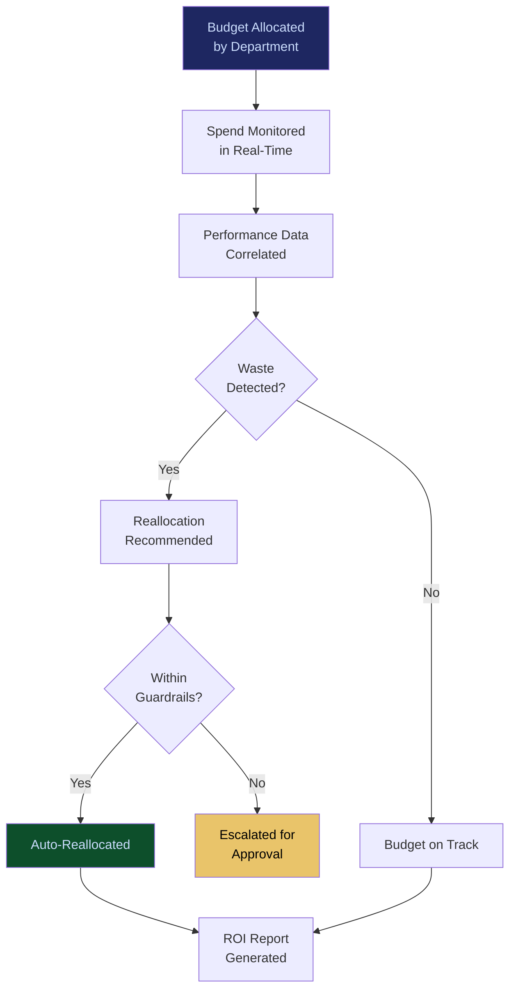

# Autonomous Budget Optimization

**Layer 5 -- Economic & Transaction**

---

## Purpose

Autonomous Budget Optimization manages the enterprise's total AI spend -- across models, agents, workflows, infrastructure, and governance services -- and continuously optimizes allocation to maximize ROI within defined budget constraints. It is the CFO's interface to AI economics, providing real-time visibility into AI spend, automated reallocation based on performance data, and predictive budget forecasting.

Most enterprises have no idea what they spend on AI or whether that spend is efficient. They over-provision expensive models for simple tasks, under-invest in governance for high-risk workflows, and lack the data to justify budget increases or cuts. Autonomous Budget Optimization solves this by treating AI spend as a portfolio to be actively managed, not a line item to be passively tracked. It consumes cost data from the [AI Cost Optimization Engine](/platform/core-systems/ai-cost-optimization-engine), transaction data from the [AI Contract & Transaction Protocol](/platform/core-systems/ai-contract-transaction-protocol), and performance data from across the platform to make continuous budget allocation decisions.

---

## Architecture

Layer 5 handles economic and transaction systems. Autonomous Budget Optimization sits alongside the [AI Contract & Transaction Protocol](/platform/core-systems/ai-contract-transaction-protocol), the [Agent Marketplace](/platform/core-systems/agent-marketplace), the [Decision Latency Arbitrage Network](/platform/core-systems/decision-latency-arbitrage-network), and the [Liability Escrow Infrastructure](/platform/core-systems/liability-escrow-infrastructure). It consumes cost signals from Layer 1's [AI Cost Optimization Engine](/platform/core-systems/ai-cost-optimization-engine) and exposes budget insights to the [Executive AI Co-Pilot](/platform/core-systems/executive-ai-co-pilot).

---

## Core Capabilities

- **Real-Time Spend Visibility** -- Dashboard showing AI spend by model, agent, workflow, department, and cost center, updated in real-time.
- **Automated Budget Reallocation** -- Shifts budget from underperforming AI investments to high-ROI workloads based on performance telemetry, within pre-approved guardrails.
- **Predictive Budget Forecasting** -- Machine learning models predict future AI spend based on usage trends, planned deployments, and seasonal patterns.
- **Budget Guardrails** -- Configurable spending limits by department, workflow, model, and time period with automatic enforcement and alerts on threshold approach.
- **ROI Attribution** -- Attributes revenue impact and cost savings to specific AI investments, enabling data-driven budget justification.
- **Waste Detection** -- Identifies idle agents, over-provisioned models, unused marketplace subscriptions, and redundant workflows that consume budget without generating value.
- **Scenario Budget Modeling** -- Models the budget impact of proposed changes (adding agents, switching models, expanding to new verticals) before committing spend.

---

## BPMN Workflow

---

## Integration Points

| System | Integration | Data Flow |
|---|---|---|
| [AI Cost Optimization Engine](/platform/core-systems/ai-cost-optimization-engine) | Cost | Model-level cost data consumed for budget tracking |
| [AI Contract & Transaction Protocol](/platform/core-systems/ai-contract-transaction-protocol) | Transactions | Transaction data provides actual spend figures |
| [Agent Marketplace](/platform/core-systems/agent-marketplace) | Procurement | Marketplace purchases tracked against budget allocations |
| [Executive AI Co-Pilot](/platform/core-systems/executive-ai-co-pilot) | Reporting | Budget summaries and ROI reports delivered to executives |
| [Enterprise Agent Orchestration OS](/platform/core-systems/enterprise-agent-orchestration-os) | Performance | Workflow performance data informs ROI attribution |
| [AI Audit & Verification Infrastructure](/platform/core-systems/ai-audit-verification-infrastructure) | Audit | Budget decisions and reallocations logged for compliance |

---

## Data Model

- **Budget** -- Budget ID, department, period, total allocation, spent to date, remaining, guardrails (array of limits).
- **SpendRecord** -- Record ID, budget ID, cost source (model/agent/infrastructure/governance), amount, timestamp.
- **ROIAttribution** -- Attribution ID, AI investment reference, revenue impact, cost savings, measurement period, confidence level.
- **WasteAlert** -- Alert ID, budget ID, waste type (idle/over-provisioned/unused), estimated monthly waste, recommendation.

---

## Deployment Model

Cloud-native SaaS. The budget optimization engine runs as a managed service with real-time spend tracking via streaming integration with all cost-generating platform components. Predictive models are retrained weekly on updated spend and performance data. Budget dashboards are delivered through the web interface with role-based access (CFO sees portfolio view, department head sees department view, workflow owner sees workflow view).

---

## Revenue Contribution

Platform subscription tier ($2,499--$9,999/month for budget optimization module). Revenue scales with enterprise AI spend -- as organizations deploy more AI, their need for budget optimization increases proportionally. The system directly justifies its own cost by identifying waste and optimizing allocation. Enterprises that achieve 20-30% efficiency gains through budget optimization attribute platform ROI to this system, making it a renewal anchor. Spend data compounds the Kitchen moat with cross-tenant benchmarks for AI cost efficiency by vertical and use case.
