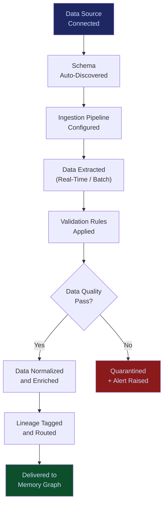

# Autonomous Data Ingestion Engine

**Layer 3 -- Memory & Data Control**

---

## Purpose

The Autonomous Data Ingestion Engine handles the acquisition, normalization, validation, and routing of enterprise data into the FrankMax platform. It connects to 200+ data sources -- ERP systems, CRMs, document repositories, APIs, databases, file shares, email archives, and streaming feeds -- and transforms raw enterprise data into the structured, governed, queryable formats that the [Enterprise Memory Graph](/platform/core-systems/enterprise-memory-graph) and other platform systems consume.

Data ingestion is the unglamorous foundation that determines whether AI produces useful outputs or hallucinated noise. The engine solves the "garbage in, garbage out" problem at scale by applying schema validation, deduplication, conflict resolution, and lineage tracking to every data element it processes. Every ingestion pipeline generates telemetry that feeds the [Failure Pattern Library](/platform/core-systems/failure-pattern-library) and [Enterprise Mortality Tables](/platform/core-systems/enterprise-mortality-tables) -- data quality failures are tracked and pattern-matched to prevent recurrence.

---

## Architecture

Layer 3 manages memory and data control. The Ingestion Engine sits at the entry point of Layer 3, feeding data into the [Enterprise Memory Graph](/platform/core-systems/enterprise-memory-graph), the [Failure Pattern Library](/platform/core-systems/failure-pattern-library), and the [Enterprise Mortality Tables](/platform/core-systems/enterprise-mortality-tables). It validates data before it enters the platform, ensuring downstream systems operate on clean, governed, lineage-tracked inputs.

---

## Core Capabilities

- **200+ Pre-Built Connectors** -- Native connectors for Salesforce, SAP, Oracle, Workday, ServiceNow, SharePoint, Google Workspace, AWS S3, Snowflake, and 190+ additional systems.
- **Schema Auto-Discovery** -- Automatically detects data schemas from connected sources and maps them to platform data models without manual configuration.
- **Real-Time and Batch Ingestion** -- Supports both streaming ingestion (sub-second latency for event-driven data) and batch ingestion (scheduled ETL for bulk data loads).
- **Data Quality Enforcement** -- Validates every record against schema rules, business rules, and statistical anomaly detection before it enters the platform.
- **Full Data Lineage** -- Every data element carries its lineage: source system, extraction timestamp, transformation steps applied, and quality score.
- **Conflict Resolution** -- When multiple sources provide conflicting data for the same entity, the engine applies configurable resolution rules (most recent wins, authoritative source wins, human review).
- **Incremental Sync** -- Change data capture (CDC) ensures only modified records are ingested, minimizing processing overhead and source system load.

---

## BPMN Workflow

---

## Integration Points

| System | Integration | Data Flow |
|---|---|---|
| [Enterprise Memory Graph](/platform/core-systems/enterprise-memory-graph) | Downstream | Ingested, validated data is stored in the memory graph |
| [Failure Pattern Library](/platform/core-systems/failure-pattern-library) | Intelligence | Data quality failures are cataloged as failure patterns |
| [Enterprise Mortality Tables](/platform/core-systems/enterprise-mortality-tables) | Risk | Data source reliability metrics feed mortality calculations |
| [AI Audit & Verification Infrastructure](/platform/core-systems/ai-audit-verification-infrastructure) | Audit | Every ingestion event is logged with full lineage |
| [Governed AI Execution Engine](/platform/core-systems/governed-ai-execution-engine) | Governance | Data access policies enforced during ingestion |
| [AI Cost Optimization Engine](/platform/core-systems/ai-cost-optimization-engine) | Cost | Ingestion pipeline costs tracked and optimized |

---

## Data Model

- **DataSource** -- Source ID, connector type, connection credentials (encrypted), schema snapshot, sync schedule, status.
- **IngestionPipeline** -- Pipeline ID, source ID, transformation rules, validation rules, destination, last run timestamp.
- **DataRecord** -- Record ID, source ID, pipeline ID, lineage chain, quality score, ingestion timestamp.
- **DataQuarantine** -- Record ID, failure reason, validation rule violated, remediation status, quarantine timestamp.

---

## Deployment Model

Cloud-native with optional on-premises gateway. The ingestion control plane runs in the cloud. For on-premises data sources behind firewalls, a lightweight gateway agent is deployed inside the enterprise network to handle extraction and encrypted transmission to the cloud. The gateway supports air-gapped environments via batch export. Horizontal scaling based on ingestion volume -- pipeline workers scale independently of the control plane.

---

## Revenue Contribution

Per-connector licensing ($199--$999/month per active connector) plus ingestion volume pricing ($0.01--$0.10 per 1,000 records). The ingestion engine is the entry point for platform adoption -- once enterprise data flows through the engine, switching costs escalate rapidly as lineage, quality baselines, and transformation rules accumulate. Data quality telemetry compounds the Kitchen moat, as every data quality failure cataloged improves the platform's ability to prevent similar failures across all tenants.
