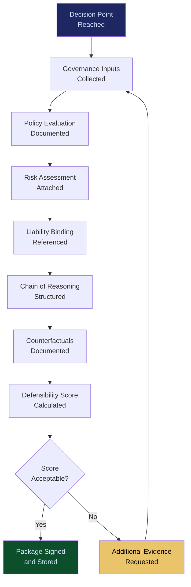

# Decision Defensibility Structuring

**Layer 4 -- Execution & Governance**

---

## Purpose

Decision Defensibility Structuring packages every AI-assisted decision into a structured, legally defensible evidence bundle that can withstand regulatory scrutiny, litigation discovery, and board-level review. It does not make decisions defensible after the fact -- it structures defensibility into the decision at the time it is made. When a regulator asks "why did your AI make this decision?" or a plaintiff's attorney demands "show me the basis for this action," the defensibility structure provides the complete answer.

The system aggregates inputs from across the governance stack: the policy evaluation from the [Governed AI Execution Engine](/platform/core-systems/governed-ai-execution-engine), the liability binding from the [ETLB Engine](/platform/core-systems/etlb-engine), the MCO status from the [MCO Generator & Validator](/platform/core-systems/mco-generator-validator), the risk assessment from the [Enterprise Mortality Tables](/platform/core-systems/enterprise-mortality-tables), and the pre-incident review from [PIAR](/platform/core-systems/pre-incident-accountability-review-piar). It compiles these into a single, cryptographically signed defensibility package that proves the decision was made with appropriate governance, risk awareness, and human oversight. Every package generates telemetry for the [Failure Pattern Library](/platform/core-systems/failure-pattern-library).

---

## Architecture

Layer 4 handles execution and governance. Decision Defensibility Structuring is the evidence synthesis layer within the governance stack. It consumes outputs from all other Layer 4 systems and produces the defensibility artifacts that legal, compliance, and audit teams use to demonstrate governance rigor. It is tightly integrated with the [AI Audit & Verification Infrastructure](/platform/core-systems/ai-audit-verification-infrastructure), which stores the defensibility packages immutably.

---

## Core Capabilities

- **Automated Evidence Assembly** -- At decision time, the system automatically collects all governance inputs (policy evaluation, risk score, liability binding, MCO status, authority chain) and packages them into a structured defensibility bundle.
- **Legal Framework Alignment** -- Defensibility packages are structured to align with specific legal and regulatory frameworks (EU AI Act Article 13 transparency requirements, FDA 21 CFR Part 11, SOX Section 404).
- **Chain of Reasoning Documentation** -- The system documents the complete chain of reasoning: input data, model inference, policy evaluation, risk assessment, human review (if applicable), and final decision rationale.
- **Counterfactual Documentation** -- Records what alternative actions were available and why they were not selected, preemptively addressing "why didn't you do X instead?" challenges.
- **Human Override Documentation** -- When a human overrides an AI recommendation, the override rationale, the human's authority, and the original AI recommendation are documented together.
- **Defensibility Scoring** -- Each package receives a defensibility score (0-100) based on evidence completeness, governance coverage, and regulatory alignment. Low-scoring packages trigger alerts for additional documentation.

---

## BPMN Workflow

---

## Integration Points

| System | Integration | Data Flow |
|---|---|---|
| [Governed AI Execution Engine](/platform/core-systems/governed-ai-execution-engine) | Policy | Policy evaluation results consumed for defensibility packaging |
| [ETLB Engine](/platform/core-systems/etlb-engine) | Liability | Liability bindings referenced in defensibility packages |
| [MCO Generator & Validator](/platform/core-systems/mco-generator-validator) | Compliance | MCO status included as compliance evidence |
| [PIAR](/platform/core-systems/pre-incident-accountability-review-piar) | Pre-Incident | PIAR assessment results included when applicable |
| [AI Audit & Verification Infrastructure](/platform/core-systems/ai-audit-verification-infrastructure) | Storage | Defensibility packages stored immutably in the audit ledger |
| [Enterprise Mortality Tables](/platform/core-systems/enterprise-mortality-tables) | Risk | Risk scores included in defensibility documentation |

---

## Data Model

- **DefensibilityPackage** -- Package ID, decision ID, governance inputs (array), chain of reasoning, counterfactuals, defensibility score, cryptographic signature, timestamp.
- **GovernanceInput** -- Input ID, source system, input type (policy/risk/liability/MCO/PIAR), content, timestamp.
- **HumanOverride** -- Override ID, package ID, original AI recommendation, override action, rationale, human authority reference.
- **DefensibilityScorecard** -- Package ID, evidence completeness (0-100), governance coverage (0-100), regulatory alignment (0-100), composite score.

---

## Deployment Model

Cloud-native, co-located with the [Governed AI Execution Engine](/platform/core-systems/governed-ai-execution-engine). Defensibility packages are generated synchronously with decision execution to ensure no temporal gap between the decision and its evidence. Packages are stored in the same immutable ledger as audit records. Retention follows the most stringent requirement applicable to the decision (regulatory, contractual, or organizational policy). Multi-region storage ensures jurisdiction-appropriate evidence retention.

---

## Revenue Contribution

Bundled into the governance subscription tier with per-package fees for premium features ($0.25--$1.00 per defensibility package for counterfactual documentation; $50--$200 per litigation-ready evidence export). Decision Defensibility Structuring is the system that directly prevents litigation losses -- a single defensibility package that withstands a regulatory challenge can save the enterprise millions. This positions it as high-value Fries-layer revenue (70-95% margin). Defensibility scoring data feeds the Kitchen moat by revealing which governance configurations produce the strongest evidence.
