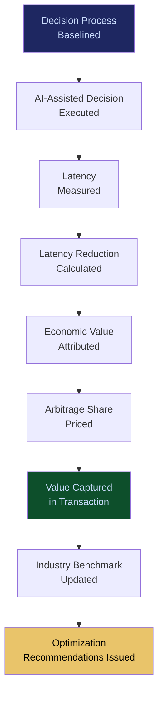

# Decision Latency Arbitrage Network

**Layer 5 -- Economic & Transaction**

---

## Purpose

The Decision Latency Arbitrage Network identifies and captures economic value from the time differential between AI-assisted decisions and traditional human-only decision processes. In industries where faster decisions translate directly to revenue (trading desks, insurance underwriting, procurement, real-time bidding, emergency response), the network quantifies the latency advantage of AI-assisted decision-making and captures a share of the value created by that speed.

This is not about making AI faster -- it is about monetizing the speed differential. When an AI-assisted underwriting decision takes 3 minutes instead of 3 days, the 2 days and 23 hours of latency reduction has measurable economic value: earlier policy binding, reduced applicant attrition, faster capital deployment. The network measures this value, attributes it to specific platform capabilities, and structures pricing to capture a percentage of the arbitrage. Every latency measurement generates telemetry that feeds the [Failure Pattern Library](/platform/core-systems/failure-pattern-library) and [Enterprise Mortality Tables](/platform/core-systems/enterprise-mortality-tables).

---

## Architecture

Layer 5 handles economic and transaction systems. The Decision Latency Arbitrage Network sits alongside the [AI Contract & Transaction Protocol](/platform/core-systems/ai-contract-transaction-protocol) (commerce), the [Agent Marketplace](/platform/core-systems/agent-marketplace) (distribution), the [Autonomous Budget Optimization](/platform/core-systems/autonomous-budget-optimization) (spend management), and the [Liability Escrow Infrastructure](/platform/core-systems/liability-escrow-infrastructure) (reserves). It consumes execution telemetry from Layer 4 and performance data from Layer 2 agents to calculate latency advantages.

---

## Core Capabilities

- **Latency Baseline Measurement** -- Establishes the baseline decision latency for each enterprise process before AI assistance, creating the reference point for arbitrage calculation.
- **Real-Time Latency Tracking** -- Measures actual decision latency for every AI-assisted decision and calculates the latency reduction compared to baseline.
- **Economic Value Attribution** -- Maps latency reduction to economic value using industry-specific models (revenue per hour of faster decision, cost of delay, opportunity cost of slow execution).
- **Arbitrage Pricing Engine** -- Calculates the platform's share of the latency arbitrage value and incorporates it into transaction pricing.
- **Industry Latency Benchmarks** -- Cross-tenant latency data (anonymized) creates industry benchmarks that enterprises use to assess their competitive position.
- **Latency Optimization Recommendations** -- Identifies bottlenecks in decision workflows and recommends changes to maximize latency advantage.

---

## BPMN Workflow

---

## Integration Points

| System | Integration | Data Flow |
|---|---|---|
| [AI Contract & Transaction Protocol](/platform/core-systems/ai-contract-transaction-protocol) | Pricing | Arbitrage value is incorporated into transaction pricing |
| [Enterprise Agent Orchestration OS](/platform/core-systems/enterprise-agent-orchestration-os) | Measurement | Workflow execution times measured for latency calculation |
| [AI Cost Optimization Engine](/platform/core-systems/ai-cost-optimization-engine) | Optimization | Latency and cost optimization are co-optimized |
| [AI Audit & Verification Infrastructure](/platform/core-systems/ai-audit-verification-infrastructure) | Audit | Latency measurements and arbitrage calculations logged |
| [Failure Pattern Library](/platform/core-systems/failure-pattern-library) | Intelligence | Latency anomalies feed failure pattern detection |
| [Executive AI Co-Pilot](/platform/core-systems/executive-ai-co-pilot) | Reporting | Latency arbitrage value reported in executive briefings |

---

## Data Model

- **LatencyBaseline** -- Baseline ID, process type, tenant ID, measurement period, median latency, p95 latency, sample size.
- **LatencyMeasurement** -- Measurement ID, decision ID, AI-assisted latency, baseline latency, reduction (absolute and percentage), timestamp.
- **ArbitrageValuation** -- Valuation ID, measurement ID, economic model applied, value attributed, platform share, currency.
- **IndustryBenchmark** -- NAICS code, process type, median latency (AI-assisted), median latency (baseline), sample size, last updated.

---

## Deployment Model

Cloud-native. Latency measurement agents are embedded in the [Enterprise Agent Orchestration OS](/platform/core-systems/enterprise-agent-orchestration-os) workflow execution path to capture precise timing data. Economic value attribution models run as batch calculations with daily recalibration. Industry benchmarks are computed weekly across anonymized cross-tenant data. The arbitrage pricing engine integrates with the [AI Contract & Transaction Protocol](/platform/core-systems/ai-contract-transaction-protocol) for real-time pricing adjustments.

---

## Revenue Contribution

Value-based pricing (5-15% of attributed latency arbitrage value). This is the highest-margin revenue model in the platform because it scales with the value the enterprise receives, not the cost FrankMax incurs. Enterprises that achieve 10x latency improvements on high-value processes (e.g., reducing insurance underwriting from 72 hours to 7 minutes) generate significant arbitrage value, of which the platform captures a percentage. Latency data compounds the Kitchen moat -- cross-tenant latency benchmarks become an industry standard that only FrankMax can produce.
