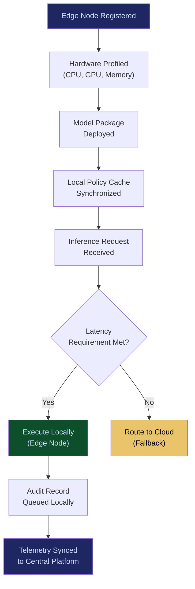

# Edge AI Control Grid

**Layer 1 -- Compute & Infrastructure**

---

## Purpose

The Edge AI Control Grid extends the FrankMax compute fabric to the network edge -- factory floors, hospital wards, retail locations, field offices, and any environment where latency or data sovereignty requirements make cloud-only execution untenable. It manages the deployment, monitoring, and governance of AI workloads running on edge hardware while maintaining the same audit, compliance, and policy enforcement guarantees as cloud-resident systems.

Without this grid, enterprises face a binary choice: run AI in the cloud and accept latency penalties, or run AI at the edge and lose governance visibility. The Edge AI Control Grid eliminates that trade-off. Every edge node is a governed, auditable, policy-compliant extension of the central platform. Telemetry from edge nodes feeds the [Failure Pattern Library](/platform/core-systems/failure-pattern-library) and [Enterprise Mortality Tables](/platform/core-systems/enterprise-mortality-tables), turning distributed execution into centralized intelligence.

---

## Architecture

Layer 1 provides the raw compute and infrastructure primitives. The Edge AI Control Grid sits alongside the [Multi-Model Orchestration Engine](/platform/core-systems/multi-model-orchestration-engine), [AI Cost Optimization Engine](/platform/core-systems/ai-cost-optimization-engine), and [Sovereign AI Pods](/platform/core-systems/sovereign-ai-pods). While the Orchestration Engine routes between models and the Cost Engine optimizes spend, the Edge Grid extends execution to locations where cloud round-trips are unacceptable. Sovereign AI Pods provide tenant-isolated compute; the Edge Grid provides location-isolated compute.

---

## Core Capabilities

- **Edge Node Provisioning** -- Automated deployment of AI runtimes to heterogeneous edge hardware (NVIDIA Jetson, Intel NUC, ARM-based appliances) with zero-touch configuration.
- **Federated Model Distribution** -- Push model updates to edge fleets with staged rollouts, canary deployments, and automatic rollback on performance degradation.
- **Offline Resilience** -- Edge nodes continue operating during network partitions, queuing audit records and telemetry for sync when connectivity is restored.
- **Latency-Aware Routing** -- Workloads are routed to the nearest capable edge node or to cloud based on real-time latency measurements and policy thresholds.
- **Edge Governance Enforcement** -- Policy evaluation runs locally on the edge node, enforcing the same governance rules as the [Governed AI Execution Engine](/platform/core-systems/governed-ai-execution-engine) without a cloud round-trip.
- **Resource Monitoring and Throttling** -- Real-time monitoring of CPU, GPU, memory, and storage on every edge node with automatic workload throttling when resources are constrained.
- **Secure Enclave Execution** -- Sensitive workloads execute inside hardware-backed secure enclaves (Intel SGX, ARM TrustZone) to protect model weights and inference data at the edge.

---

## BPMN Workflow

---

## Integration Points

| System | Integration | Data Flow |
|---|---|---|
| [Multi-Model Orchestration Engine](/platform/core-systems/multi-model-orchestration-engine) | Model Routing | Orchestration engine delegates edge-eligible workloads to the grid |
| [Sovereign AI Pods](/platform/core-systems/sovereign-ai-pods) | Isolation | Edge pods inherit tenant isolation policies from Sovereign AI Pods |
| [Governed AI Execution Engine](/platform/core-systems/governed-ai-execution-engine) | Policy | Edge nodes enforce governance policies cached from the execution engine |
| [AI Audit & Verification Infrastructure](/platform/core-systems/ai-audit-verification-infrastructure) | Audit | Edge audit records sync to the immutable ledger on reconnection |
| [Failure Pattern Library](/platform/core-systems/failure-pattern-library) | Telemetry | Edge failure events feed the library for pattern recognition |
| [Kill-Switch Infrastructure](/platform/core-systems/kill-switch-infrastructure) | Safety | Kill-switch commands propagate to edge nodes with sub-second delivery |

---

## Data Model

- **EdgeNode** -- Hardware identity, location, capability profile, health status, last sync timestamp.
- **EdgeDeployment** -- Model version, policy cache version, deployment timestamp, rollback target.
- **EdgeAuditQueue** -- Locally queued audit records awaiting sync, ordered by timestamp with integrity hashes.
- **EdgeTelemetryEvent** -- Latency measurements, resource utilization snapshots, inference counts, error rates.

---

## Deployment Model

Hybrid. The control plane runs in the cloud (or on-premises data center) and manages the edge fleet. Edge nodes run a lightweight runtime agent that handles local inference, policy evaluation, and audit queuing. Communication between control plane and edge nodes uses mutual TLS with certificate pinning. Edge nodes are designed to operate independently for up to 72 hours during network partitions.

---

## Revenue Contribution

Per-edge-node licensing ($49--$199/node/month depending on capability tier). Edge deployments drive volume through the [AI Cost Optimization Engine](/platform/core-systems/ai-cost-optimization-engine) as enterprises optimize cloud-vs-edge placement. Every edge node generates telemetry that compounds the Kitchen moat -- failure patterns, latency distributions, and hardware reliability data that no competitor can replicate without equivalent deployment scale.
