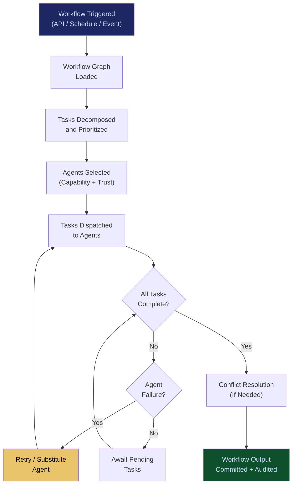

# Enterprise Agent Orchestration OS

**Layer 2 -- Cognition & Agent**

---

## Purpose

The Enterprise Agent Orchestration OS is the operating system for multi-agent workflows. While the [Agent Runtime & Identity Kernel](/platform/core-systems/agent-runtime-identity-kernel) manages individual agent identity and lifecycle, the Orchestration OS manages how agents work together -- coordinating task decomposition, inter-agent handoffs, parallel execution, conflict resolution, and workflow-level governance across dozens or hundreds of agents operating simultaneously.

Enterprise workflows are not single-agent problems. A claims processing pipeline might involve an intake agent, a fraud detection agent, a medical coding agent, a regulatory compliance agent, and an approval agent. The Orchestration OS defines the workflow graph, routes tasks between agents, handles failures and retries, and ensures the entire pipeline produces a governed, auditable outcome. Every orchestration event generates telemetry that feeds the [Failure Pattern Library](/platform/core-systems/failure-pattern-library) and [Enterprise Mortality Tables](/platform/core-systems/enterprise-mortality-tables).

---

## Architecture

Layer 2 handles cognition and agent management. The Orchestration OS sits above the [Agent Runtime & Identity Kernel](/platform/core-systems/agent-runtime-identity-kernel) (which manages individual agents) and below the [Verticalized Autonomous Operator Stack](/platform/core-systems/verticalized-autonomous-operator-stack) (which provides industry-specific workflow templates). It consumes identity and permission data from the kernel and exposes workflow primitives to the operator stack.

---

## Core Capabilities

- **Workflow Graph Definition** -- Visual and code-based workflow definition supporting sequential, parallel, conditional, and loop execution patterns across agent teams.
- **Dynamic Task Routing** -- Tasks are routed to the best available agent based on capability, trust score, current load, and cost optimization signals from the [AI Cost Optimization Engine](/platform/core-systems/ai-cost-optimization-engine).
- **Conflict Resolution** -- When multiple agents produce conflicting outputs, the OS applies configurable resolution strategies: majority vote, highest-trust-score wins, human escalation, or domain-specific tiebreakers.
- **Workflow-Level Governance** -- Governance policies are enforced at the workflow level, not just the individual agent level. A workflow can require that all agents in the pipeline complete successfully before the outcome is committed.
- **Failure Recovery and Retry** -- Automatic retry with exponential backoff, agent substitution on persistent failure, and graceful degradation when non-critical agents are unavailable.
- **Workflow Versioning** -- Every workflow definition change is versioned. Running workflows complete on the version they started with; new invocations use the latest version.
- **Real-Time Workflow Observability** -- Live visualization of workflow execution showing agent states, task progress, bottlenecks, and estimated completion times.

---

## BPMN Workflow

---

## Integration Points

| System | Integration | Data Flow |
|---|---|---|
| [Agent Runtime & Identity Kernel](/platform/core-systems/agent-runtime-identity-kernel) | Identity | Agent identity and permissions consumed for task assignment |
| [Verticalized Autonomous Operator Stack](/platform/core-systems/verticalized-autonomous-operator-stack) | Templates | Industry-specific workflow templates built on orchestration primitives |
| [Governed AI Execution Engine](/platform/core-systems/governed-ai-execution-engine) | Governance | Workflow-level governance policies enforced through the execution engine |
| [AI Cost Optimization Engine](/platform/core-systems/ai-cost-optimization-engine) | Cost | Agent selection incorporates cost optimization signals |
| [AI Audit & Verification Infrastructure](/platform/core-systems/ai-audit-verification-infrastructure) | Audit | Every workflow execution and inter-agent handoff is logged |
| [Failure Pattern Library](/platform/core-systems/failure-pattern-library) | Intelligence | Workflow failure patterns feed the library; library data informs retry strategies |

---

## Data Model

- **Workflow** -- Workflow ID, version, graph definition (DAG), owner, creation timestamp, status.
- **WorkflowExecution** -- Execution ID, workflow version, trigger source, start time, end time, status, output reference.
- **TaskAssignment** -- Task ID, execution ID, assigned agent ID, input payload, output payload, status, duration.
- **ConflictResolution** -- Execution ID, conflicting outputs, resolution strategy applied, final output selected.

---

## Deployment Model

Cloud-native, horizontally scalable. The orchestration control plane runs as a stateless service with workflow state externalized to a durable store (PostgreSQL + Redis). Workflow graph evaluation is event-driven -- each agent completion triggers the next step without polling. Supports multi-region deployment for low-latency orchestration of geographically distributed agent teams.

---

## Revenue Contribution

Per-workflow-execution pricing ($0.10--$2.00 per execution depending on complexity and agent count) plus monthly platform fee ($999--$9,999/month for the orchestration OS license). Orchestration creates natural upsell: enterprises that start with 2-agent workflows expand to 10-20 agent workflows within 6 months, increasing per-execution revenue and driving demand for the [200+ Specialized Agent Library](/platform/core-systems/200-specialized-agent-library). Workflow telemetry compounds the Kitchen moat.
