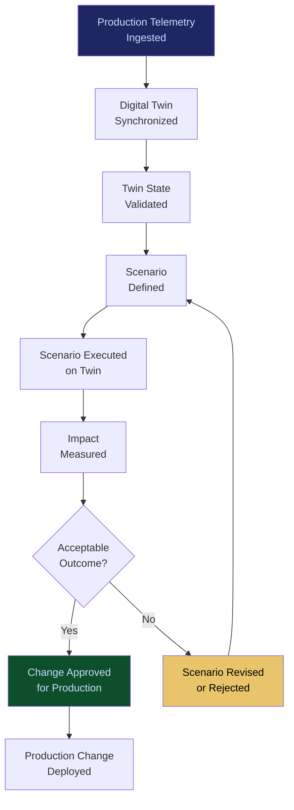

# Enterprise Digital Twin Platform

**Layer 7 -- Simulation & Digital Twin**

---

## Purpose

The Enterprise Digital Twin Platform creates a virtual, data-driven replica of an organization's operations, processes, decision flows, and AI deployments. The digital twin is not a static model -- it is a living simulation that updates continuously from operational telemetry, enabling executives and operators to observe, analyze, and predict the behavior of their enterprise in real time without affecting production systems.

The digital twin answers the question enterprises cannot ask of their live systems: "What happens if...?" What happens if we change this governance policy? What happens if we deploy 50 more agents? What happens if our primary model provider has an outage? What happens if regulators impose new requirements? The twin runs these scenarios using real organizational data, real AI agent configurations, and real governance policies. Every simulation generates telemetry that feeds the [Failure Pattern Library](/platform/core-systems/failure-pattern-library) and [Enterprise Mortality Tables](/platform/core-systems/enterprise-mortality-tables), making the twin both a consumer and a producer of platform intelligence.

---

## Architecture

Layer 7 handles simulation and digital twin capabilities. The Enterprise Digital Twin Platform sits alongside the [Policy Simulation Engine](/platform/core-systems/policy-simulation-engine) (policy-specific simulation), the [Synthetic Enterprise Platform](/platform/core-systems/synthetic-enterprise-platform) (synthetic data generation), and the [Wargaming & Scenario Modeler](/platform/core-systems/wargaming-scenario-modeler) (adversarial scenario testing). The digital twin consumes data from all lower layers to construct and maintain the organizational replica.

---

## Core Capabilities

- **Continuous State Synchronization** -- The digital twin synchronizes with production systems in near-real-time, reflecting current agent states, workflow statuses, resource utilization, and governance configurations.
- **Multi-Dimensional Modeling** -- Models operations across dimensions: process flow, resource allocation, cost structure, risk exposure, compliance posture, and agent behavior.
- **Scenario Execution** -- Runs what-if scenarios against the twin without affecting production, with full instrumentation to measure the impact of proposed changes.
- **Predictive Analytics** -- Uses historical twin data to predict future states: capacity needs, compliance gaps, cost trajectories, and failure probabilities.
- **Visual Operations Center** -- Real-time 3D or schematic visualization of the digital twin showing operational status, anomalies, and scenario results.
- **Change Impact Analysis** -- Before deploying changes to production, the twin models the impact on all affected systems, workflows, and agents.

---

## BPMN Workflow

---

## Integration Points

| System | Integration | Data Flow |
|---|---|---|
| [Enterprise Agent Orchestration OS](/platform/core-systems/enterprise-agent-orchestration-os) | State | Agent workflow states synchronized to the twin |
| [Enterprise Memory Graph](/platform/core-systems/enterprise-memory-graph) | Data | Organizational knowledge feeds twin construction |
| [Policy Simulation Engine](/platform/core-systems/policy-simulation-engine) | Simulation | Policy simulations run against the twin's operational model |
| [Wargaming & Scenario Modeler](/platform/core-systems/wargaming-scenario-modeler) | Scenarios | Wargaming scenarios execute against the twin |
| [AI Audit & Verification Infrastructure](/platform/core-systems/ai-audit-verification-infrastructure) | Audit | Twin simulations and scenario results logged for governance |
| [Failure Pattern Library](/platform/core-systems/failure-pattern-library) | Intelligence | Simulated failures feed pattern library; known patterns inform twin models |

---

## Data Model

- **DigitalTwin** -- Twin ID, organization ID, last sync timestamp, model version, state snapshot reference, configuration.
- **TwinState** -- State ID, twin ID, dimension (process/resource/cost/risk/compliance), current values, timestamp.
- **Scenario** -- Scenario ID, twin ID, description, parameters (changes to model), execution status, results summary.
- **ChangeImpactReport** -- Report ID, scenario ID, affected systems, impact metrics, risk assessment, recommendation.

---

## Deployment Model

Cloud-native, compute-intensive. Digital twins require significant compute for state synchronization and scenario execution. Deployed within the tenant's [Sovereign AI Pod](/platform/core-systems/sovereign-ai-pods) to ensure data isolation. Synchronization runs continuously with configurable latency (near-real-time for critical operations, hourly for non-critical). Scenario execution scales elastically, spinning up compute for complex simulations and releasing it afterward.

---

## Revenue Contribution

Premium platform subscription ($9,999--$49,999/month per digital twin instance). The Enterprise Digital Twin is the highest-value Layer 7 offering because it directly enables executive decision-making with quantified risk. Enterprises that use the twin for pre-deployment change validation reduce production incidents by 40-60%, creating measurable ROI. Twin usage data compounds the Kitchen moat -- simulation results across tenants reveal which organizational configurations produce the best outcomes, intelligence that only FrankMax can accumulate.
