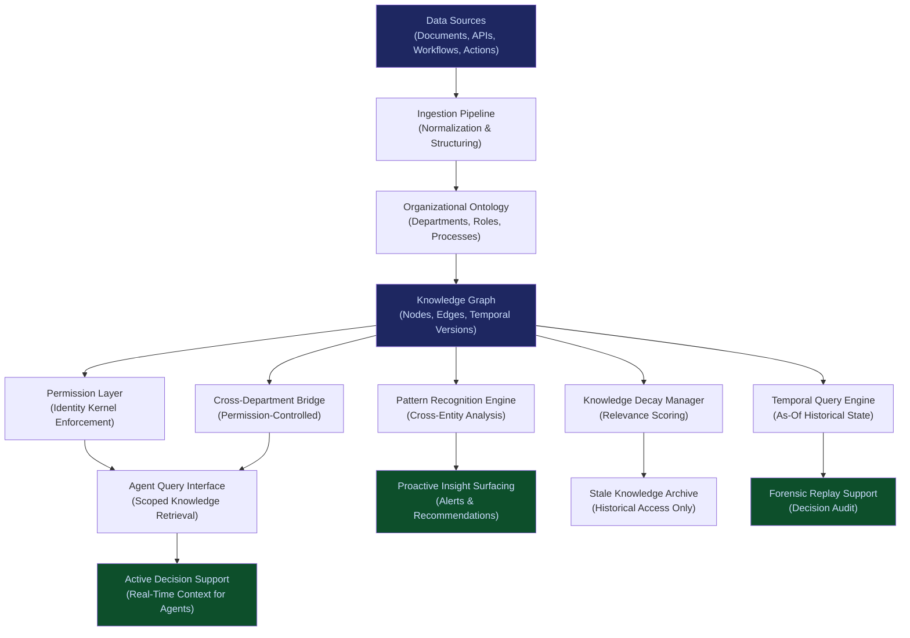

# Enterprise Memory Graph

**Layer 3 -- Memory & Data Control** | Build Complexity: 8/10 | Time to Revenue: 6--12 months

---

## Strategic Position

The Enterprise Memory Graph is the organizational knowledge layer that deepens with every interaction. It is not a database, a data lake, or a vector store. It is a **persistent, structured memory** across all agents, workflows, and departments -- the system that ensures the organization's AI never forgets what it learned and never repeats what it already solved.

Memory is the data gravity moat. Every interaction, decision, and outcome recorded in the graph increases its value and makes it harder to leave. After 12 months of operation, the Enterprise Memory Graph contains institutional knowledge that cannot be recreated -- it is the cumulative intelligence of every AI-assisted decision the organization has made.

Whoever owns memory owns continuity. When leadership changes, when teams turn over, when vendors are replaced, the memory graph persists. It is the institutional brain that outlives any individual.

| Attribute | Detail |
|---|---|
| **Revenue Model** | Storage subscription + query volume fees |
| **Buyer** | CIOs, Chief Data Officers, VP of AI/ML |
| **Build Complexity** | 8/10 |
| **Time to Revenue** | 6--12 months |
| **Gross Margin** | 70--80% |
| **Capital Intensity** | Medium |
| **Regulatory Risk** | Medium |
| **Strategic Value** | Data gravity moat; strongest lock-in mechanism in the stack |

---

## What It Does

The Enterprise Memory Graph captures, structures, and serves three categories of organizational knowledge:

1. **Explicit Knowledge**: Documented decisions, policies, procedures, and outcomes. Information that exists in documents but is currently inaccessible to AI agents without manual retrieval.

2. **Operational Knowledge**: Patterns learned from execution -- which approaches worked, which failed, which vendors performed, which processes produced exceptions. Knowledge that currently lives in individuals' heads and disappears when they leave.

3. **Relational Knowledge**: The connections between entities -- people, departments, customers, vendors, contracts, regulations, and systems. Understanding not just what things are, but how they relate and influence each other.

Every query an agent makes to the memory graph is scoped by the agent's identity and permissions (enforced by the [Agent Runtime & Identity Kernel](/platform/core-systems/agent-runtime-identity-kernel)). The graph does not expose information beyond an agent's authorization boundary.

---

## Core Features

### 1. Continuous Knowledge Ingestion
Every governed action, decision, and outcome produces knowledge that is automatically structured and indexed in the graph. The ingestion pipeline normalizes unstructured data (documents, emails, meeting transcripts), semi-structured data (forms, reports, spreadsheets), and structured data (database records, API responses) into a unified graph schema.

### 2. Organizational Ontology
The graph is structured around an ontology specific to the organization: its departments, roles, processes, products, customers, vendors, and regulatory obligations. The ontology is seeded during onboarding and evolves continuously as the organization changes.

### 3. Temporal Versioning
Every node and edge in the graph is versioned with temporal metadata. The graph can be queried as-of any historical point: "What did we know about Vendor X on March 14, 2025?" This supports forensic replay, decision auditing, and institutional memory preservation.

### 4. Permission-Scoped Queries
All queries are evaluated against the requesting agent's permission scope (enforced by the [Agent Runtime & Identity Kernel](/platform/core-systems/agent-runtime-identity-kernel)). A finance agent queries finance-scoped memory. An HR agent queries HR-scoped memory. Cross-scope queries require explicit authorization and produce an audit trail.

### 5. Pattern Recognition & Insight Surfacing
The graph identifies patterns across the organization's operational history: recurring failure modes, seasonal demand shifts, vendor performance trends, process bottlenecks. These patterns are surfaced proactively to relevant agents and operators rather than waiting for someone to ask the right question.

### 6. Knowledge Decay Management
Not all knowledge retains value. The graph implements decay functions that reduce the relevance score of stale knowledge (outdated vendor assessments, superseded policies, expired contracts) without deleting it. Stale knowledge is available for historical queries but deprioritized in active decision support.

### 7. Cross-Department Knowledge Bridging
When an agent in Department A generates knowledge relevant to Department B (within permission boundaries), the graph creates a bridge that surfaces the connection. Example: a procurement agent's vendor risk assessment is surfaced to a compliance agent reviewing the same vendor's regulatory standing.

### 8. Knowledge Export & Portability Controls
Organizations own their data. The memory graph supports structured export in standard formats (RDF, JSON-LD, CSV). However, the graph's value is not in the raw data -- it is in the structure, relationships, temporal versioning, and pattern intelligence that are native to the platform.

---

## Memory Graph Architecture

---

## Revenue Model

**Primary: Storage Subscription**

| Tier | Monthly Fee | Storage | Included Queries |
|---|---|---|---|
| Standard | $2,499/month | Up to 10M nodes | 500,000 queries/month |
| Professional | $7,499/month | Up to 100M nodes | 5,000,000 queries/month |
| Enterprise | $19,999/month | Up to 1B nodes | Unlimited queries |
| Platform | Custom | Unlimited | Unlimited + dedicated infrastructure |

**Secondary: Query Volume Overage**

| Query Volume Above Tier | Fee Per Query |
|---|---|
| Standard overage | $0.002/query |
| Professional overage | $0.001/query |
| Enterprise | Included |

**Tertiary: Premium Services**

| Service | Fee |
|---|---|
| Custom ontology design | $10,000--$50,000 (one-time) |
| Historical data migration | $5,000--$25,000 (one-time) |
| Pattern recognition consulting | $2,500/month |
| Knowledge architecture review | $15,000 (quarterly) |

**Revenue trajectory**: Memory graph revenue follows a compound growth curve. As the graph ingests more data, query volume increases because agents find more value in richer context. As query volume increases, subscription tier upgrades are triggered. As subscription tiers increase, switching cost makes churn nearly impossible.

---

## Integration Points

| System | Integration Type | Data Flow |
|---|---|---|
| [Agent Runtime & Identity Kernel](/platform/core-systems/agent-runtime-identity-kernel) | Permission Enforcement | Agent identity determines query scope and write permissions |
| [Governed AI Execution Engine](/platform/core-systems/governed-ai-execution-engine) | Knowledge Source | Governed action outcomes are ingested as operational knowledge |
| [AI Audit & Verification Infrastructure](/platform/core-systems/ai-audit-verification-infrastructure) | Temporal Context | Temporal versioning supports forensic replay and decision auditing |
| [Multi-Model Orchestration Engine](/platform/core-systems/multi-model-orchestration-engine) | Context Provider | Historical interaction patterns inform task classification and model selection |
| [Failure Pattern Library](/platform/core-systems/failure-pattern-library) | Failure Context | Failure patterns are a specialized subset of the memory graph optimized for risk scoring |
| [Autonomous Data Ingestion Engine](/platform/core-systems/autonomous-data-ingestion-engine) | Data Pipeline | The ingestion engine normalizes raw data before it enters the memory graph |
| [AI Cost Optimization Engine](/platform/core-systems/ai-cost-optimization-engine) | Usage Context | Historical usage patterns improve cost optimization recommendations |

---

## The Data Gravity Moat

Data gravity is the principle that data attracts services, applications, and more data. The Enterprise Memory Graph creates data gravity through three mechanisms:

1. **Knowledge compounds daily.** Every governed action produces knowledge. Every agent query that retrieves useful context validates the graph's value. The graph becomes more useful every day it operates, which drives more usage, which generates more knowledge.

2. **Institutional memory is irreplaceable.** An organization's 18-month memory graph contains knowledge that no competitor can recreate: which vendor negotiations succeeded, which process changes reduced errors, which customer interactions led to renewals. This knowledge exists nowhere else.

3. **Relationships are the moat.** The raw data in the graph can be exported. The relationships -- the connections between entities, the temporal patterns, the cross-department insights -- are platform-native. Exporting nodes without edges strips the graph of its intelligence.

---

## Build Considerations

| Consideration | Detail |
|---|---|
| **Graph Database** | Purpose-built graph storage optimized for temporal versioning and permission-scoped queries. Not a general-purpose graph database with bolted-on features. |
| **Ingestion Throughput** | Must process 10,000+ events per second during peak governance engine activity. Buffered ingestion with guaranteed delivery. |
| **Query Latency** | Agent-facing queries must return within 200ms for real-time decision support. Historical and forensic queries within 5 seconds. |
| **Data Sovereignty** | Graph data must reside in the customer's jurisdiction. Multi-region deployment with jurisdiction-aware partitioning. |
| **Ontology Evolution** | The organizational ontology must evolve without breaking existing queries or invalidating historical data. Schema-on-read with backward-compatible versioning. |
