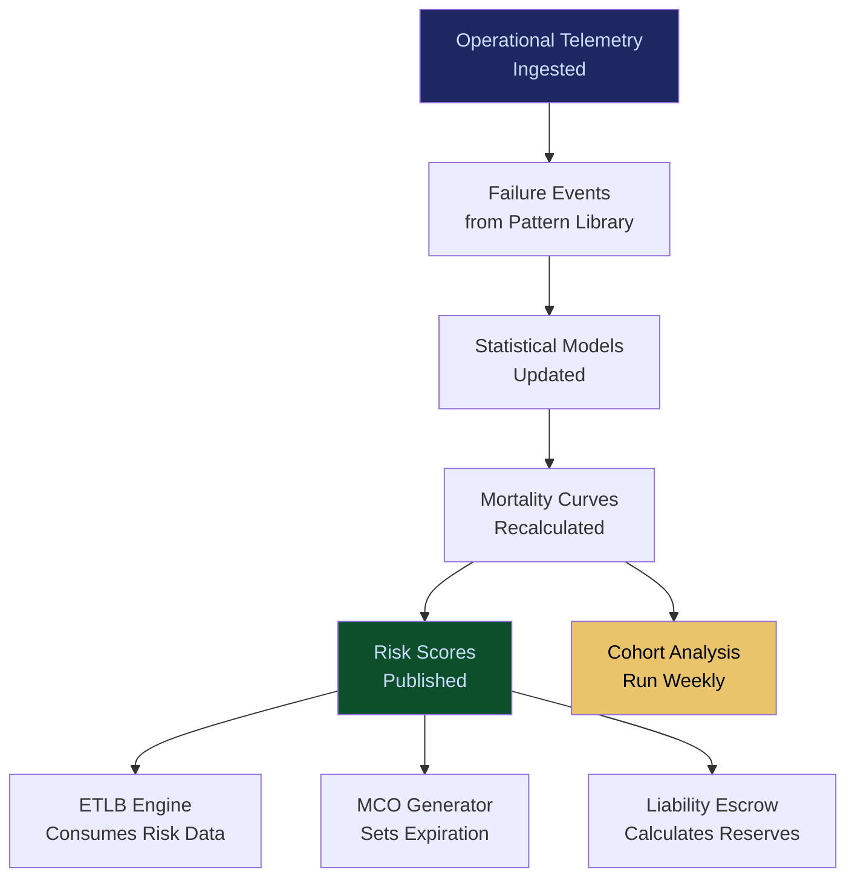

# Enterprise Mortality Tables

**Layer 3 -- Memory & Data Control**

---

## Purpose

Enterprise Mortality Tables are the actuarial science of AI operations. Just as insurance mortality tables predict human lifespan based on demographic and health factors, Enterprise Mortality Tables predict the operational lifespan, failure probability, and degradation trajectory of AI models, agents, workflows, and data pipelines. They answer questions like: "What is the probability that this GPT-4o deployment degrades below acceptable accuracy within 90 days?" or "What is the expected operational lifespan of a claims processing agent in the healthcare vertical?"

These tables are the quantitative foundation for AI risk pricing, SLA construction, and insurance underwriting. The [ETLB Engine](/platform/core-systems/etlb-engine) uses mortality data to bind liability at execution time. The [Liability Escrow Infrastructure](/platform/core-systems/liability-escrow-infrastructure) uses mortality data to calculate escrow reserves. The [MCO Generator & Validator](/platform/core-systems/mco-generator-validator) uses mortality data to set expiration parameters on Mortality Compliance Objects. Without mortality tables, AI risk pricing is guesswork. With them, it is actuarial science. The tables compound daily as every deployment across every tenant contributes observational data.

---

## Architecture

Layer 3 manages memory and data control. Enterprise Mortality Tables sit alongside the [Enterprise Memory Graph](/platform/core-systems/enterprise-memory-graph), the [Autonomous Data Ingestion Engine](/platform/core-systems/autonomous-data-ingestion-engine), and the [Failure Pattern Library](/platform/core-systems/failure-pattern-library). The tables consume failure data from the library and operational telemetry from across the platform, and expose actuarial risk assessments to Layer 4 (governance), Layer 5 (economic), and Layer 6 (trust) systems.

---

## Core Capabilities

- **Model Mortality Curves** -- Survival analysis curves for every model (GPT-4o, Claude, Llama, Gemini, etc.) by use case, data domain, and deployment environment.
- **Agent Lifespan Prediction** -- Statistical prediction of agent operational lifespan based on task complexity, data quality, model backing, and environmental factors.
- **Degradation Trajectory Modeling** -- Time-series models that predict when accuracy, latency, or reliability will cross SLA thresholds.
- **Sector-Specific Risk Tables** -- Mortality tables segmented by NAICS code, reflecting the fact that a model in healthcare degrades differently than the same model in financial services.
- **Cohort Analysis** -- Agents and models deployed in the same time period, vertical, or configuration cohort are analyzed together to detect systemic risk trends.
- **Confidence Intervals** -- All predictions carry explicit confidence intervals that widen for new deployments (limited data) and narrow for mature deployments (rich data).

---

## BPMN Workflow

---

## Integration Points

| System | Integration | Data Flow |
|---|---|---|
| [Failure Pattern Library](/platform/core-systems/failure-pattern-library) | Upstream | Failure events are the primary input to mortality calculations |
| [ETLB Engine](/platform/core-systems/etlb-engine) | Risk | Mortality data determines liability binding parameters |
| [MCO Generator & Validator](/platform/core-systems/mco-generator-validator) | Expiration | Mortality predictions set MCO expiration timelines |
| [Liability Escrow Infrastructure](/platform/core-systems/liability-escrow-infrastructure) | Reserves | Mortality risk scores determine escrow reserve requirements |
| [Alignment Scoring & Certification](/platform/core-systems/alignment-scoring-certification) | Trust | Mortality data influences alignment score calculations |
| [AI Audit & Verification Infrastructure](/platform/core-systems/ai-audit-verification-infrastructure) | Audit | Mortality table updates and risk score changes are logged immutably |

---

## Data Model

- **MortalityCurve** -- Curve ID, subject type (model/agent/workflow), subject identifier, survival probabilities by time period, confidence intervals, last recalculated.
- **DegradationTrajectory** -- Subject ID, metric type (accuracy/latency/reliability), current value, projected values at 30/60/90/180 days, SLA threshold.
- **RiskCohort** -- Cohort ID, member subject IDs, deployment period, vertical, shared configuration attributes, aggregate survival statistics.
- **MortalityTableVersion** -- Version ID, calculation timestamp, input data range, model count, statistical methodology.

---

## Deployment Model

Cloud-native, centralized. Mortality calculations run as batch jobs on a daily cadence for full recalculation and as streaming updates for critical failure events that materially change survival probabilities. Mortality data is stored in a time-series database optimized for range queries. Historical tables are versioned and immutable -- when a table is recalculated, the previous version is retained for audit and trend analysis.

---

## Revenue Contribution

Enterprise Mortality Tables enable premium pricing across multiple revenue streams. They are sold directly as a data product to insurers and reinsurers underwriting AI risk ($25,000--$100,000/year for actuarial data access). They enable risk-based pricing on the [ETLB Engine](/platform/core-systems/etlb-engine) and [Liability Escrow Infrastructure](/platform/core-systems/liability-escrow-infrastructure). They are a core Kitchen moat asset -- every deployment adds observational data that makes mortality predictions more accurate, creating a data advantage that compounds with time and scale.
