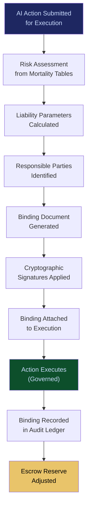

# ETLB Engine

**Layer 4 -- Execution & Governance**

---

## Purpose

The ETLB (Execution-Time Liability Binding) Engine binds legal and financial liability to AI actions at the exact moment they execute -- not before, not after, but during. Traditional liability frameworks assign responsibility in contracts signed months before execution or in lawsuits filed months after. ETLB closes that gap by creating a cryptographically signed liability binding for every governed AI action, specifying who is liable, for what, under which conditions, and up to what amount, at execution time.

ETLB is one of the three core protocols (alongside ORF and MCO) that define the FrankMax governance architecture. It transforms AI liability from an ambiguous contractual concept into a precise, auditable, enforceable technical artifact. The engine consumes risk data from the [Enterprise Mortality Tables](/platform/core-systems/enterprise-mortality-tables), enforces bindings through the [Governed AI Execution Engine](/platform/core-systems/governed-ai-execution-engine), and records every binding in the [AI Audit & Verification Infrastructure](/platform/core-systems/ai-audit-verification-infrastructure). Liability bindings feed the [Liability Escrow Infrastructure](/platform/core-systems/liability-escrow-infrastructure) for financial reserve management.

---

## Architecture

Layer 4 handles execution and governance. The ETLB Engine sits alongside the [Governed AI Execution Engine](/platform/core-systems/governed-ai-execution-engine) (policy enforcement), the [MCO Generator & Validator](/platform/core-systems/mco-generator-validator) (mortality compliance), the [PIAR](/platform/core-systems/pre-incident-accountability-review-piar) (pre-incident review), the [Decision Defensibility Structuring](/platform/core-systems/decision-defensibility-structuring) (evidence packaging), and the [Kill-Switch Infrastructure](/platform/core-systems/kill-switch-infrastructure) (emergency halt). ETLB is the liability layer within the governance stack.

---

## Core Capabilities

- **Real-Time Liability Binding** -- For every governed AI action, the engine generates a liability binding document specifying the responsible party, scope, conditions, and financial cap in under 50ms.
- **Risk-Based Liability Calibration** -- Liability parameters are calibrated using [Enterprise Mortality Tables](/platform/core-systems/enterprise-mortality-tables) risk data -- higher-risk actions carry higher liability caps and stricter conditions.
- **Multi-Party Liability Allocation** -- Liability can be split across multiple parties (model provider, deploying enterprise, operating agent, human supervisor) with defined proportions.
- **Conditional Liability Triggers** -- Liability activates only when specified conditions are met (e.g., financial loss exceeds threshold, regulatory violation confirmed, patient harm documented).
- **Cryptographic Binding Integrity** -- Each binding is cryptographically signed by all liable parties and tamper-evident through hash chaining.
- **Liability Binding Lifecycle** -- Bindings are created, activated, modified (by authorized amendment), settled, or voided with full audit trail for each state transition.

---

## BPMN Workflow

---

## Integration Points

| System | Integration | Data Flow |
|---|---|---|
| [Governed AI Execution Engine](/platform/core-systems/governed-ai-execution-engine) | Execution | Liability bindings are attached to every governed action |
| [Enterprise Mortality Tables](/platform/core-systems/enterprise-mortality-tables) | Risk | Mortality data calibrates liability parameters |
| [AI Audit & Verification Infrastructure](/platform/core-systems/ai-audit-verification-infrastructure) | Audit | Every binding lifecycle event is recorded immutably |
| [Liability Escrow Infrastructure](/platform/core-systems/liability-escrow-infrastructure) | Financial | Bindings trigger escrow reserve calculations |
| [MCO Generator & Validator](/platform/core-systems/mco-generator-validator) | Compliance | MCO expiration events can trigger liability binding amendments |
| [Decision Defensibility Structuring](/platform/core-systems/decision-defensibility-structuring) | Evidence | Liability bindings are included in defensibility packages |
| [Kill-Switch Infrastructure](/platform/core-systems/kill-switch-infrastructure) | Emergency | Kill-switch activation triggers immediate liability binding review |

---

## Data Model

- **LiabilityBinding** -- Binding ID, action ID, liable parties (array), liability scope, financial cap, conditions, status, cryptographic signature chain.
- **LiableParty** -- Party ID, party type (provider/enterprise/agent/supervisor), liability proportion, acknowledgment timestamp.
- **BindingAmendment** -- Amendment ID, binding ID, change description, authorized by, amendment timestamp.
- **BindingSettlement** -- Binding ID, settlement type (fulfilled/voided/claimed), settlement amount, settlement timestamp.

---

## Deployment Model

Cloud-native, latency-critical. The ETLB Engine runs as a low-latency service co-located with the [Governed AI Execution Engine](/platform/core-systems/governed-ai-execution-engine) to minimize binding generation overhead. Binding documents are stored in an append-only ledger with geographic replication for durability. The engine must maintain sub-50ms binding generation to avoid blocking AI execution. Multi-region deployment ensures jurisdiction-appropriate liability binding for global enterprises.

---

## Revenue Contribution

Per-binding transaction fee ($0.05--$0.50 per binding depending on liability complexity) plus premium governance subscription tier. ETLB is a Fries-layer revenue driver -- high-margin governance revenue (70-95% margin) that attaches to the Burger-layer AI model access. Enterprises that adopt ETLB cannot easily abandon it because their liability records, binding history, and regulatory evidence are anchored in the platform. ETLB telemetry compounds the Kitchen moat as binding data feeds back into [Enterprise Mortality Tables](/platform/core-systems/enterprise-mortality-tables) for improved risk calibration.
