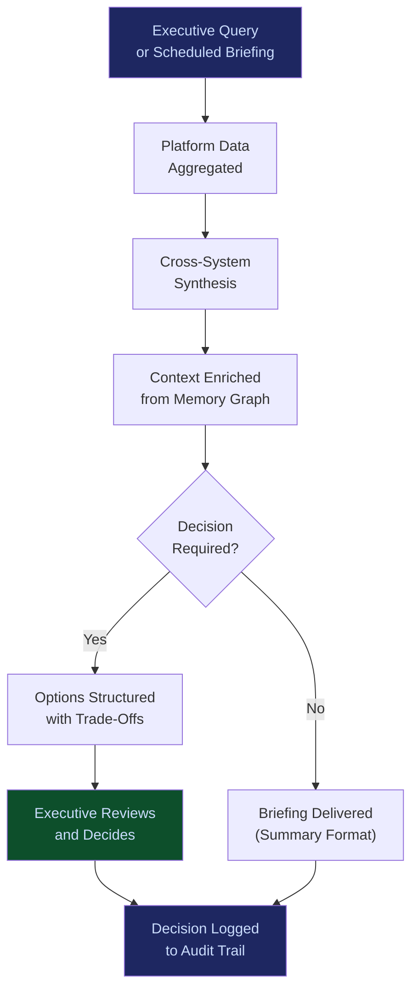

# Executive AI Co-Pilot

**Layer 2 -- Cognition & Agent**

---

## Purpose

The Executive AI Co-Pilot is the human-AI interface for C-suite and senior leadership. It synthesizes outputs from across the entire platform -- agent workflows, audit data, cost optimization signals, risk assessments, failure patterns -- into executive-ready briefings, decision recommendations, and scenario analyses. The Co-Pilot does not replace executive judgment; it eliminates the information bottleneck between AI operations and executive decision-making.

Executives do not interact with individual agents or raw workflow outputs. They interact with the Co-Pilot, which translates platform intelligence into the language of business outcomes: revenue impact, risk exposure, competitive positioning, regulatory compliance status, and resource allocation recommendations. Every Co-Pilot interaction generates telemetry that feeds the [Failure Pattern Library](/platform/core-systems/failure-pattern-library) and [Enterprise Mortality Tables](/platform/core-systems/enterprise-mortality-tables), creating a feedback loop between executive decisions and platform intelligence.

---

## Architecture

Layer 2 handles cognition and agent management. The Executive AI Co-Pilot is a specialized agent that sits at the top of the human interaction hierarchy. It consumes data from the [Enterprise Agent Orchestration OS](/platform/core-systems/enterprise-agent-orchestration-os) (workflow status), the [Enterprise Memory Graph](/platform/core-systems/enterprise-memory-graph) (institutional knowledge), and the [AI Audit & Verification Infrastructure](/platform/core-systems/ai-audit-verification-infrastructure) (compliance status). Its identity and permissions are managed by the [Agent Runtime & Identity Kernel](/platform/core-systems/agent-runtime-identity-kernel).

---

## Core Capabilities

- **Executive Briefing Generation** -- Automated daily, weekly, and on-demand briefings synthesizing AI operations, cost savings, risk events, and compliance status into 2-page executive summaries.
- **Decision Recommendation Engine** -- Presents structured decision options with quantified trade-offs (cost, risk, timeline, regulatory impact) sourced from platform telemetry and simulation outputs.
- **Natural Language Query Interface** -- Executives ask questions in plain language ("What is our AI spend trending toward this quarter?") and receive data-backed answers with source citations.
- **Scenario What-If Analysis** -- Integrates with the [Policy Simulation Engine](/platform/core-systems/policy-simulation-engine) to model the impact of proposed decisions before they are executed.
- **Escalation Triage** -- Prioritizes and summarizes escalations from governed workflows, presenting only the decisions that require executive attention with full context.
- **Board-Ready Report Generation** -- Produces governance reports, risk summaries, and ROI analyses formatted for board presentation.

---

## BPMN Workflow

---

## Integration Points

| System | Integration | Data Flow |
|---|---|---|
| [Enterprise Agent Orchestration OS](/platform/core-systems/enterprise-agent-orchestration-os) | Status | Workflow execution summaries and performance metrics consumed |
| [Enterprise Memory Graph](/platform/core-systems/enterprise-memory-graph) | Context | Institutional knowledge enriches briefings and recommendations |
| [AI Cost Optimization Engine](/platform/core-systems/ai-cost-optimization-engine) | Financial | Cost savings data and spend projections feed executive dashboards |
| [AI Audit & Verification Infrastructure](/platform/core-systems/ai-audit-verification-infrastructure) | Compliance | Compliance status and audit findings included in briefings |
| [Policy Simulation Engine](/platform/core-systems/policy-simulation-engine) | Simulation | What-if scenarios run through the simulation engine on demand |
| [Failure Pattern Library](/platform/core-systems/failure-pattern-library) | Risk | Emerging failure patterns surfaced as risk alerts to executives |

---

## Data Model

- **Briefing** -- Briefing ID, executive recipient, type (daily/weekly/ad-hoc), generated timestamp, content sections, data sources referenced.
- **DecisionRecommendation** -- Recommendation ID, options array, trade-off matrix, executive action taken, decision timestamp.
- **ExecutiveQuery** -- Query ID, natural language input, structured response, data sources, response latency.
- **EscalationDigest** -- Digest ID, escalation count, priority ranking, resolution status, executive response.

---

## Deployment Model

Cloud-native SaaS with mobile and desktop interfaces. The Co-Pilot runs within the executive's [Sovereign AI Pod](/platform/core-systems/sovereign-ai-pods) to ensure data isolation. Briefings and recommendations are generated server-side and delivered through secure channels (encrypted email, mobile push, executive dashboard). Offline-capable mobile app caches the latest briefing for air-travel and low-connectivity scenarios.

---

## Revenue Contribution

Per-seat executive license ($4,999--$14,999/month per executive seat). The Co-Pilot is the highest-value user-facing component because it sells to the budget holder directly. An executive who relies on the Co-Pilot for daily decision-making becomes the internal champion for platform renewal. Co-Pilot usage telemetry reveals which platform capabilities executives value most, informing product prioritization. Decision data compounds the Kitchen moat -- the Co-Pilot becomes more useful as it accumulates organizational decision history.
