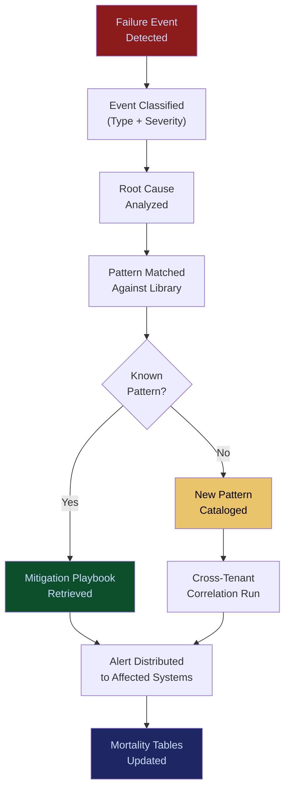

# Failure Pattern Library

**Layer 3 -- Memory & Data Control**

---

## Purpose

The Failure Pattern Library is the institutional memory of every AI failure, near-miss, degradation, and anomaly observed across the entire FrankMax platform. It catalogs failure modes -- model hallucinations, data quality collapses, agent conflicts, governance bypasses, latency spikes, cost overruns -- into structured, searchable, reusable patterns that prevent the same failure from recurring across any tenant deployment.

This is the core of the Kitchen moat. Every failure observed anywhere in the platform makes every deployment smarter. A hallucination pattern detected in a healthcare deployment prevents the same hallucination in a financial services deployment before it occurs. The library compounds daily -- it cannot be replicated without equivalent deployment scale and duration. Competitors starting from zero will always be 12-24 months behind in failure intelligence. The library feeds the [Enterprise Mortality Tables](/platform/core-systems/enterprise-mortality-tables), the [Governed AI Execution Engine](/platform/core-systems/governed-ai-execution-engine), and every other system that needs to assess or mitigate risk.

---

## Architecture

Layer 3 manages memory and data control. The Failure Pattern Library sits alongside the [Enterprise Memory Graph](/platform/core-systems/enterprise-memory-graph) (institutional knowledge), the [Autonomous Data Ingestion Engine](/platform/core-systems/autonomous-data-ingestion-engine) (data intake), and the [Enterprise Mortality Tables](/platform/core-systems/enterprise-mortality-tables) (actuarial risk). Every system in the platform contributes failure telemetry to the library, and every system consumes failure intelligence from it.

---

## Core Capabilities

- **Automated Failure Classification** -- Incoming failure events are automatically classified by type (hallucination, drift, timeout, policy violation, data corruption), severity, affected domain, and root cause category.
- **Cross-Tenant Pattern Matching** -- Failure patterns are anonymized and matched across tenants to identify systemic risks that no single deployment would detect alone.
- **Predictive Failure Alerts** -- When conditions matching a known failure pattern are detected in a running workflow, the library issues a pre-emptive alert before the failure manifests.
- **Root Cause Taxonomy** -- A structured taxonomy of root causes (model limitation, data quality, configuration error, resource exhaustion, adversarial input) with mitigation playbooks for each.
- **Failure Frequency and Impact Scoring** -- Each pattern is scored by frequency (how often it occurs) and impact (cost, compliance risk, operational disruption) to prioritize mitigation efforts.
- **Industry-Specific Failure Profiles** -- Failure patterns are tagged by NAICS sector, enabling vertical-specific risk assessments and operator stack improvements.
- **Regulatory Failure Mapping** -- Patterns that could trigger regulatory violations are mapped to specific regulatory requirements, enabling proactive compliance management.

---

## BPMN Workflow

---

## Integration Points

| System | Integration | Data Flow |
|---|---|---|
| [Enterprise Mortality Tables](/platform/core-systems/enterprise-mortality-tables) | Downstream | Failure patterns feed actuarial risk calculations |
| [Governed AI Execution Engine](/platform/core-systems/governed-ai-execution-engine) | Risk | Failure intelligence informs pre-execution risk assessment |
| [Agent Runtime & Identity Kernel](/platform/core-systems/agent-runtime-identity-kernel) | Trust | Agent failure history influences trust scoring |
| [AI Audit & Verification Infrastructure](/platform/core-systems/ai-audit-verification-infrastructure) | Audit | Failure events and pattern matches are logged immutably |
| [Verticalized Autonomous Operator Stack](/platform/core-systems/verticalized-autonomous-operator-stack) | Improvement | Vertical failure profiles drive operator stack updates |
| [Kill-Switch Infrastructure](/platform/core-systems/kill-switch-infrastructure) | Safety | Critical failure patterns can trigger automatic kill-switch activation |
| [PIAR](/platform/core-systems/pre-incident-accountability-review-piar) | Prevention | Failure patterns inform pre-incident accountability reviews |

---

## Data Model

- **FailurePattern** -- Pattern ID, classification (type, severity, domain), root cause, frequency score, impact score, mitigation playbook reference.
- **FailureEvent** -- Event ID, source system, tenant (anonymized for cross-tenant use), timestamp, raw telemetry, matched pattern ID.
- **MitigationPlaybook** -- Playbook ID, pattern ID, steps, automated vs. manual, success rate, last updated.
- **IndustryFailureProfile** -- NAICS code, top failure patterns, aggregate frequency, aggregate impact, trend direction.

---

## Deployment Model

Cloud-native, centralized. The library runs as a shared service with strict anonymization boundaries -- tenant-specific failure data is anonymized before cross-tenant pattern matching. The pattern matching engine uses streaming processing for real-time classification and batch processing for deep cross-tenant correlation. Cold storage for historical patterns with hot cache for active patterns referenced in real-time risk assessment.

---

## Revenue Contribution

The Failure Pattern Library does not generate direct subscription revenue. It is the primary Kitchen moat: the compounding asset that makes every other system more valuable over time. It enables premium pricing on the [Governed AI Execution Engine](/platform/core-systems/governed-ai-execution-engine) (because governance backed by failure intelligence is worth more), the [Verticalized Autonomous Operator Stack](/platform/core-systems/verticalized-autonomous-operator-stack) (because operators informed by cross-tenant failure data are more accurate), and the [PIAR](/platform/core-systems/pre-incident-accountability-review-piar) (because pre-incident reviews backed by real failure data are defensible). Without the library, the platform is a commodity. With it, the platform is irreplaceable.
