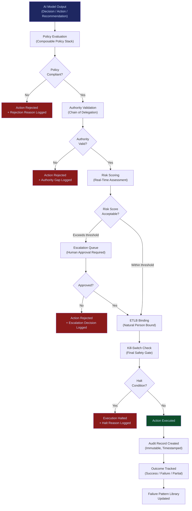

# Governed AI Execution Engine

**Layer 4 -- Execution & Governance** | Build Complexity: 6/10 | Time to Revenue: 2--4 months

---

## Strategic Position

The Governed AI Execution Engine is the **#1 priority infrastructure system** in the FrankMax platform. It is the choke point through which every AI action must pass before it touches the real world. No model output reaches a customer, a contract, a citizen, or a regulated process without clearing governance checks enforced by this engine.

This is not a wrapper or a logging layer. It is the **policy-bound action engine** -- the system that binds AI cognition to organizational authority, regulatory constraints, and audit requirements at execution time.

Everything routes through this. Control the execution layer and you control the ecosystem.

| Attribute | Detail |
|---|---|
| **Revenue Model** | Workflow volume pricing (per governed action) |
| **Buyer** | COOs, CROs, Heads of AI/Digital Transformation |
| **Build Complexity** | 6/10 |
| **Time to Revenue** | 2--4 months |
| **Gross Margin** | 75--85% |
| **Capital Intensity** | Low |
| **Day-1 Viability** | Immediate (once built) |
| **Strategic Value** | Revenue day one; all traffic flows through this system |

---

## What It Does

The Governed AI Execution Engine sits between AI model output and real-world action. Every AI-generated decision, recommendation, or automated action must pass through a governance gate before execution. The engine enforces:

- **Authority validation** -- Does the requesting agent or user have permission to execute this action?
- **Policy compliance** -- Does this action comply with organizational policies, regulatory requirements, and contractual constraints?
- **Liability binding** -- Is a natural person bound as the liability bearer for this action via [ETLB](/protocols/etlb)?
- **Audit trail creation** -- Is this action recorded with sufficient fidelity for post-incident forensic replay?
- **Escalation routing** -- Does this action exceed automated authority thresholds and require human approval?
- **Kill-switch enforcement** -- Should this action be halted based on real-time risk scoring?

---

## Core Features

### 1. Policy Enforcement Gateway
Every AI action is evaluated against a composable policy stack before execution. Policies are defined per entity, per jurisdiction, per workflow, and per risk tier. Policies are versioned, auditable, and tamper-evident.

### 2. Authority Validation Layer
Maps every action to the organizational authority chain. Validates that the requesting agent has been granted execution authority by a natural person with the organizational standing to delegate it. Rejects actions where the authority chain is broken or ambiguous.

### 3. Real-Time Liability Binding (ETLB Integration)
At the moment of execution, the engine invokes the [ETLB protocol](/protocols/etlb) to cryptographically bind a natural person as the liability bearer. No action executes without a bound responsible party.

### 4. Escalation & Approval Workflows
Actions that exceed automated authority thresholds are routed to human approvers. The engine manages approval queues, timeout policies, delegation rules, and escalation chains. If no approver acts within the defined window, the action is either auto-rejected or escalated to the next authority tier.

### 5. Audit Trail Generator
Every governed action produces an immutable audit record containing: the action requested, the policy evaluation result, the authority chain traversed, the liability binding, the approval path (if escalated), the execution outcome, and a timestamp with cryptographic proof of ordering.

### 6. Risk-Scored Execution
Each action receives a real-time risk score based on the action type, the data sensitivity, the regulatory jurisdiction, the historical failure patterns from the [Failure Pattern Library](/platform/core-systems/failure-pattern-library), and the agent's trust score. High-risk actions receive additional scrutiny, lower execution speed limits, or mandatory human review.

### 7. Kill-Switch Integration
The engine integrates with the [Kill-Switch Infrastructure](/platform/core-systems/kill-switch-infrastructure) to halt execution immediately when risk thresholds are breached, anomalous patterns are detected, or an authorized operator triggers a manual halt.

### 8. Multi-Jurisdiction Policy Resolution
For organizations operating across borders, the engine resolves conflicting jurisdictional requirements. When an action triggers policies in multiple jurisdictions, the engine applies the most restrictive applicable policy and logs the resolution logic for audit purposes.

---

## Execution Flow

---

## Revenue Model

| Tier | Monthly Volume | Price Per Governed Action | Monthly Revenue |
|---|---|---|---|
| Starter | Up to 10,000 actions | $0.05 | Up to $500 |
| Professional | 10,001--100,000 actions | $0.03 | $300--$3,000 |
| Enterprise | 100,001--1,000,000 actions | $0.015 | $1,500--$15,000 |
| Platform | 1,000,000+ actions | Custom | $15,000+ |

**Revenue compounds with adoption**: As organizations route more AI workflows through the engine, governed action volume grows. Each new workflow increases switching cost because the organization's policy stack, authority chains, and audit history are embedded in the engine.

**Upsell surface**: Organizations that start with the execution engine naturally adopt:
- [AI Audit & Verification Infrastructure](/platform/core-systems/ai-audit-verification-infrastructure) for deeper compliance reporting
- [ETLB Engine](/platform/core-systems/etlb-engine) for advanced liability binding
- [Kill-Switch Infrastructure](/platform/core-systems/kill-switch-infrastructure) for safety enforcement
- [Failure Pattern Library](/platform/core-systems/failure-pattern-library) for risk scoring intelligence

---

## Integration Points

| System | Integration Type | Data Flow |
|---|---|---|
| [Multi-Model Orchestration Engine](/platform/core-systems/multi-model-orchestration-engine) | Upstream | Model outputs flow into the governance gateway for policy evaluation before execution |
| [Agent Runtime & Identity Kernel](/platform/core-systems/agent-runtime-identity-kernel) | Identity | Agent identity and permissions are validated against the authority chain |
| [AI Audit & Verification Infrastructure](/platform/core-systems/ai-audit-verification-infrastructure) | Downstream | Every governed action produces an audit record consumed by the verification layer |
| [ETLB Engine](/platform/core-systems/etlb-engine) | Binding | Liability binding is invoked at execution time for every action |
| [Enterprise Memory Graph](/platform/core-systems/enterprise-memory-graph) | Context | Historical decisions and organizational context inform policy evaluation |
| [Kill-Switch Infrastructure](/platform/core-systems/kill-switch-infrastructure) | Safety | Real-time halt signals override execution at the final gate |
| [Failure Pattern Library](/platform/core-systems/failure-pattern-library) | Intelligence | Historical failure patterns feed the risk scoring engine |
| [PIAR](/platform/core-systems/pre-incident-accountability-review-piar) | Upstream | PIAR findings define governance policies enforced by this engine |
| [ORF Protocol](/protocols/orf) | Protocol | Every executed action creates an obligation tracked through ORF |

---

## Why This Is Priority #1

1. **Choke point economics.** Every AI action in the ecosystem passes through this engine. Volume-based pricing means revenue scales with platform adoption without additional sales effort.
2. **Regulatory inevitability.** Regulators are moving toward requiring governed execution for AI in regulated industries. This engine is the compliance infrastructure enterprises will need.
3. **Switching cost compounding.** Every policy, authority chain, and audit record embedded in the engine increases the cost of migration. After 12 months of governed execution, switching is operationally impractical.
4. **Upsell foundation.** The execution engine is the natural entry point for Audit Infrastructure, ETLB, Kill-Switch, and Failure Pattern Library subscriptions.
5. **Data flywheel.** Every governed action produces data that feeds the Failure Pattern Library, which improves risk scoring, which makes the execution engine more valuable, which attracts more traffic.

---

## Build Considerations

| Consideration | Detail |
|---|---|
| **Latency** | Governance checks must add less than 50ms to execution time for most actions. Policy evaluation is pre-compiled; only edge cases require runtime resolution. |
| **Availability** | 99.95% uptime minimum. If the governance engine is down, no AI actions execute. Failover and degraded-mode policies must be defined. |
| **Policy Language** | Composable policy DSL that non-engineers (compliance officers, legal counsel) can author with guided tooling. |
| **Multi-Tenancy** | Full tenant isolation. One customer's policies never leak into another's evaluation context. |
| **Audit Integrity** | Append-only audit log with cryptographic chaining. No record can be modified or deleted after creation. |
