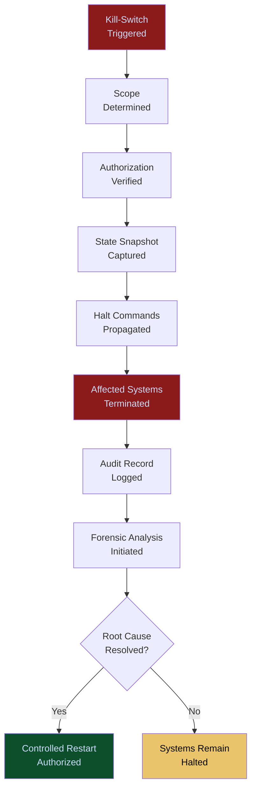

# Kill-Switch Infrastructure

**Layer 4 -- Execution & Governance**

---

## Purpose

The Kill-Switch Infrastructure provides immediate, reliable, and auditable termination of AI operations at any scope -- a single agent, a workflow, a tenant's entire AI estate, or platform-wide. It is the safety mechanism of last resort. When an AI system behaves in a way that threatens financial, legal, operational, or reputational harm, the kill-switch halts execution within seconds, preserves state for forensic analysis, and logs the event immutably.

Kill-switches are not theoretical. Regulators, insurers, and enterprise risk committees require demonstrable evidence that AI can be stopped. The EU AI Act mandates human override capability for high-risk systems. Insurance underwriters require proof of halt mechanisms before issuing AI liability coverage. The Kill-Switch Infrastructure provides that proof as a technical capability, not a policy document. Every activation generates telemetry that feeds the [Failure Pattern Library](/platform/core-systems/failure-pattern-library) and [Enterprise Mortality Tables](/platform/core-systems/enterprise-mortality-tables).

---

## Architecture

Layer 4 handles execution and governance. The Kill-Switch Infrastructure is the emergency halt mechanism across the entire governance stack. It can be triggered manually (by authorized humans), automatically (by the [Governed AI Execution Engine](/platform/core-systems/governed-ai-execution-engine) when risk thresholds are exceeded), or programmatically (by the [MCO Generator & Validator](/platform/core-systems/mco-generator-validator) on MCO expiration). It operates independently of the systems it halts, ensuring that a failure in the governed execution engine does not prevent the kill-switch from functioning.

---

## Core Capabilities

- **Sub-Second Halt Propagation** -- Kill-switch commands propagate to all affected systems within 500ms, including edge nodes via the [Edge AI Control Grid](/platform/core-systems/edge-ai-control-grid).
- **Scoped Termination** -- Granular scope control: halt a single agent, a workflow, a department's agents, a tenant's entire AI estate, or all platform operations.
- **State Preservation** -- On activation, the system captures a complete state snapshot of all affected operations before termination, enabling forensic analysis and controlled restart.
- **Independent Operation** -- The kill-switch runs on infrastructure physically and logically separated from the systems it controls, ensuring it cannot be disabled by the failure it is meant to stop.
- **Multi-Authority Activation** -- Configurable activation authority: single authorized operator for low-risk scopes, dual authorization for tenant-wide halts, and platform-level activation requiring executive approval.
- **Automatic Triggers** -- Pre-configured conditions that trigger automatic activation: risk score exceeding threshold, MCO expiration without re-validation, anomaly detection, or financial loss exceeding cap.
- **Controlled Restart Protocol** -- After activation, restart requires explicit authorization, root cause analysis, and remediation confirmation before operations resume.

---

## BPMN Workflow

---

## Integration Points

| System | Integration | Data Flow |
|---|---|---|
| [Governed AI Execution Engine](/platform/core-systems/governed-ai-execution-engine) | Trigger | Risk threshold violations trigger automatic kill-switch activation |
| [Agent Runtime & Identity Kernel](/platform/core-systems/agent-runtime-identity-kernel) | Halt | Kill-switch commands suspend agents through the kernel |
| [Edge AI Control Grid](/platform/core-systems/edge-ai-control-grid) | Propagation | Kill-switch commands reach edge nodes for distributed halts |
| [MCO Generator & Validator](/platform/core-systems/mco-generator-validator) | Expiration | MCO expiration without re-validation triggers kill-switch |
| [AI Audit & Verification Infrastructure](/platform/core-systems/ai-audit-verification-infrastructure) | Audit | Every activation, scope, and restart is logged immutably |
| [Failure Pattern Library](/platform/core-systems/failure-pattern-library) | Intelligence | Kill-switch activations are cataloged as critical failure events |
| [ETLB Engine](/platform/core-systems/etlb-engine) | Liability | Activation triggers liability binding review for affected actions |

---

## Data Model

- **KillSwitchEvent** -- Event ID, trigger source (manual/automatic/programmatic), scope, authorized by, activation timestamp, state snapshot reference.
- **HaltPropagation** -- Event ID, target system, target scope, propagation latency (ms), confirmation received, timestamp.
- **RestartAuthorization** -- Event ID, root cause analysis reference, remediation confirmation, authorized by, restart timestamp.
- **AutomaticTriggerRule** -- Rule ID, condition type, threshold, scope, activation authority required, enabled status.

---

## Deployment Model

Physically and logically independent infrastructure. The kill-switch control plane runs on dedicated compute instances in a separate availability zone from the platform systems it controls. Communication uses out-of-band channels (separate network paths) to ensure kill-switch commands are delivered even during platform-level failures. The system is designed for 99.999% availability -- if the kill-switch is unavailable, the platform enters a fail-safe mode where new AI actions are blocked until kill-switch connectivity is restored.

---

## Revenue Contribution

Bundled into governance subscription tiers. Kill-Switch Infrastructure is not a direct revenue driver but is a sales enabler -- enterprises in regulated industries will not purchase the platform without demonstrable halt capability. Insurance underwriters require kill-switch documentation before issuing AI liability coverage. Every kill-switch activation generates high-value telemetry for the [Failure Pattern Library](/platform/core-systems/failure-pattern-library), making it a Kitchen moat contributor. The controlled restart protocol drives consulting revenue ($5,000--$25,000 per incident analysis engagement).
