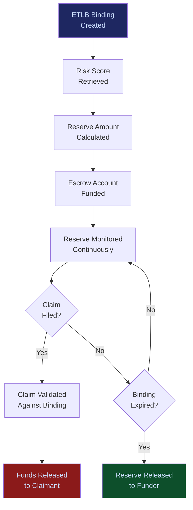

# Liability Escrow Infrastructure

**Layer 5 -- Economic & Transaction**

---

## Purpose

The Liability Escrow Infrastructure manages financial reserves set aside to cover potential losses from AI-assisted decisions. When the [ETLB Engine](/platform/core-systems/etlb-engine) binds liability to an AI action, the escrow infrastructure ensures that corresponding financial reserves exist to cover that liability if a claim materializes. It is the financial safety net that makes AI liability binding credible -- liability without reserves is a promise; liability with reserves is a guarantee.

Escrow reserves are calculated using risk data from the [Enterprise Mortality Tables](/platform/core-systems/enterprise-mortality-tables), adjusted for the specific action's risk profile, and held in segregated accounts until the liability binding is settled (either by expiration without claim or by claim payment). The infrastructure provides the financial discipline that insurers, regulators, and enterprise risk committees require before they will approve AI deployments for high-value decisions. Every escrow transaction generates telemetry that feeds the [Failure Pattern Library](/platform/core-systems/failure-pattern-library) and [Enterprise Mortality Tables](/platform/core-systems/enterprise-mortality-tables).

---

## Architecture

Layer 5 handles economic and transaction systems. The Liability Escrow Infrastructure sits alongside the [AI Contract & Transaction Protocol](/platform/core-systems/ai-contract-transaction-protocol) (commerce), the [Agent Marketplace](/platform/core-systems/agent-marketplace) (distribution), the [Decision Latency Arbitrage Network](/platform/core-systems/decision-latency-arbitrage-network) (value capture), and the [Autonomous Budget Optimization](/platform/core-systems/autonomous-budget-optimization) (spend management). It is tightly coupled with Layer 4's [ETLB Engine](/platform/core-systems/etlb-engine), which triggers escrow reserve creation.

---

## Core Capabilities

- **Automated Reserve Calculation** -- Escrow reserves are calculated automatically based on [Enterprise Mortality Tables](/platform/core-systems/enterprise-mortality-tables) risk scores, liability binding parameters, and historical claim data.
- **Segregated Escrow Accounts** -- Each liability binding has a corresponding segregated escrow account that cannot be accessed for other purposes until the binding is settled.
- **Real-Time Reserve Monitoring** -- Continuous monitoring of total escrow reserves against aggregate liability exposure, with alerts when reserve ratios fall below required thresholds.
- **Claim Processing** -- When a liability event occurs, the escrow infrastructure processes the claim against the corresponding reserve, releasing funds to the injured party.
- **Reserve Release** -- When a liability binding expires without a claim, the corresponding escrow reserve is released back to the funding party.
- **Multi-Party Escrow** -- Supports escrow arrangements involving multiple liable parties, with proportional reserve contributions matching liability allocation.
- **Regulatory Reporting** -- Generates reserve adequacy reports for insurance regulators and enterprise risk committees.

---

## BPMN Workflow

---

## Integration Points

| System | Integration | Data Flow |
|---|---|---|
| [ETLB Engine](/platform/core-systems/etlb-engine) | Trigger | Liability bindings trigger escrow reserve creation |
| [Enterprise Mortality Tables](/platform/core-systems/enterprise-mortality-tables) | Risk | Mortality data determines reserve calculation parameters |
| [AI Contract & Transaction Protocol](/platform/core-systems/ai-contract-transaction-protocol) | Financial | Escrow funding and release flow through the transaction protocol |
| [AI Audit & Verification Infrastructure](/platform/core-systems/ai-audit-verification-infrastructure) | Audit | Every escrow transaction is logged immutably |
| [Autonomous Budget Optimization](/platform/core-systems/autonomous-budget-optimization) | Budget | Escrow reserves are tracked as part of AI budget allocation |
| [Decision Defensibility Structuring](/platform/core-systems/decision-defensibility-structuring) | Evidence | Escrow existence is documented in defensibility packages |

---

## Data Model

- **EscrowAccount** -- Account ID, binding ID, funded amount, current balance, funding party (array), status (active/claimed/released), currency.
- **ReserveCalculation** -- Calculation ID, binding ID, risk score, mortality data reference, reserve formula, calculated amount, timestamp.
- **EscrowClaim** -- Claim ID, account ID, claimant, claim amount, claim basis, validation status, payout amount, payout timestamp.
- **ReserveAdequacy** -- Report ID, total reserves, total liability exposure, reserve ratio, adequacy status, reporting period.

---

## Deployment Model

Cloud-native with financial-grade security. Escrow accounts are managed through integration with licensed financial custodians (not held directly by FrankMax). The infrastructure operates as an orchestration layer between liable parties, custodians, and claimants. All financial transactions are encrypted, audited, and comply with financial services regulations. Multi-region deployment ensures escrow operations continue during regional outages. Disaster recovery ensures zero data loss for escrow records.

---

## Revenue Contribution

Escrow management fee (0.5-2% annually on escrowed funds) plus claim processing fee ($500--$5,000 per claim). The Liability Escrow Infrastructure is a Fries-layer revenue driver that attaches to every ETLB binding. As enterprises scale AI deployments, their aggregate liability exposure grows, and escrow reserves grow proportionally. The infrastructure creates deep financial lock-in -- migrating escrow accounts mid-liability-period is operationally and legally complex. Escrow and claims data compound the Kitchen moat by providing actuarial data that improves [Enterprise Mortality Tables](/platform/core-systems/enterprise-mortality-tables) predictions.
