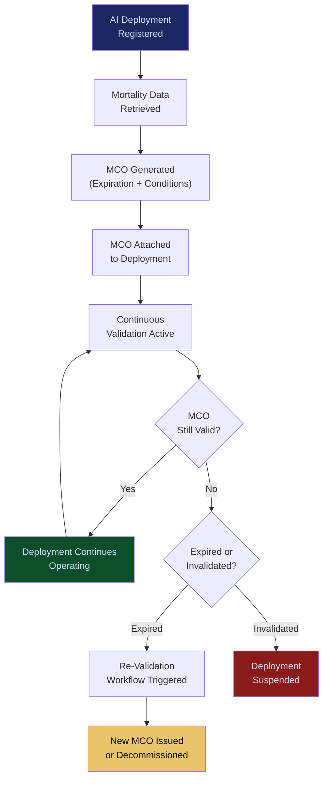

# MCO Generator & Validator

**Layer 4 -- Execution & Governance**

---

## Purpose

The MCO (Mortality Compliance Object) Generator and Validator creates and manages the compliance artifacts that encode the operational lifespan, degradation thresholds, and mandatory review points for AI deployments. An MCO is a machine-readable document that states: "This AI deployment is certified compliant until a specific date or condition, after which it must be re-validated, updated, or decommissioned." MCOs prevent stale AI from operating past its safe operational window.

MCOs are the third core protocol (alongside ORF and ETLB) in the FrankMax governance architecture. They solve the problem of AI compliance decay -- the reality that a model validated today may drift, degrade, or become non-compliant tomorrow due to data distribution shifts, regulatory changes, or underlying model updates. The Generator creates MCOs using data from the [Enterprise Mortality Tables](/platform/core-systems/enterprise-mortality-tables). The Validator continuously checks whether active MCOs remain valid, triggering re-validation workflows or automatic decommissioning when an MCO expires or its conditions are violated.

---

## Architecture

Layer 4 handles execution and governance. The MCO Generator and Validator sits alongside the [ETLB Engine](/platform/core-systems/etlb-engine) (liability binding), the [Governed AI Execution Engine](/platform/core-systems/governed-ai-execution-engine) (policy enforcement), the [PIAR](/platform/core-systems/pre-incident-accountability-review-piar) (pre-incident review), and the [Kill-Switch Infrastructure](/platform/core-systems/kill-switch-infrastructure) (emergency halt). MCOs are the temporal governance mechanism -- they enforce that governance is not a one-time event but a continuous obligation.

---

## Core Capabilities

- **Automated MCO Generation** -- For every new AI deployment, the generator creates an MCO with expiration date, compliance conditions, degradation thresholds, and mandatory review checkpoints based on [Enterprise Mortality Tables](/platform/core-systems/enterprise-mortality-tables) data.
- **Continuous Validation** -- The validator runs continuous checks against active MCOs, comparing real-time performance metrics to the thresholds encoded in the MCO.
- **Expiration Management** -- MCOs approaching expiration trigger automated re-validation workflows. Expired MCOs with no re-validation result in automatic suspension of the associated AI deployment.
- **Conditional Invalidation** -- MCOs can be invalidated mid-lifecycle by specific events: model provider updates, regulatory changes, critical failure patterns detected, or manual override by authorized governance officers.
- **MCO Inheritance** -- When an AI deployment is versioned (model upgrade, configuration change), the new version inherits the parent MCO's remaining validity or requires a new MCO based on the scope of changes.
- **Regulatory MCO Templates** -- Pre-built MCO templates aligned to specific regulatory frameworks (EU AI Act, FDA SaMD, HIPAA) with framework-specific conditions and review cadences.

---

## BPMN Workflow

---

## Integration Points

| System | Integration | Data Flow |
|---|---|---|
| [Enterprise Mortality Tables](/platform/core-systems/enterprise-mortality-tables) | Risk | Mortality data determines MCO expiration timelines and degradation thresholds |
| [Governed AI Execution Engine](/platform/core-systems/governed-ai-execution-engine) | Enforcement | Execution engine checks MCO validity before allowing AI actions |
| [AI Audit & Verification Infrastructure](/platform/core-systems/ai-audit-verification-infrastructure) | Audit | MCO lifecycle events (creation, validation, expiration, invalidation) logged immutably |
| [ETLB Engine](/platform/core-systems/etlb-engine) | Liability | MCO expiration can trigger liability binding amendments |
| [Kill-Switch Infrastructure](/platform/core-systems/kill-switch-infrastructure) | Safety | MCO invalidation can trigger kill-switch for critical deployments |
| [Failure Pattern Library](/platform/core-systems/failure-pattern-library) | Intelligence | New failure patterns can trigger MCO re-validation across affected deployments |

---

## Data Model

- **MCO** -- MCO ID, deployment ID, expiration timestamp, compliance conditions (array), degradation thresholds, review checkpoints, status, issuing authority.
- **MCOValidationEvent** -- Event ID, MCO ID, validation type (scheduled/triggered), result (valid/warning/invalid), metrics snapshot, timestamp.
- **MCOTemplate** -- Template ID, regulatory framework, conditions, default expiration period, review cadence.
- **MCOLineage** -- Parent MCO ID, child MCO ID, inheritance type (full/partial/new), change justification.

---

## Deployment Model

Cloud-native. The generator runs as an on-demand service invoked during AI deployment registration. The validator runs as a continuous background service, checking MCO validity on a configurable cadence (default: hourly for high-risk deployments, daily for standard deployments). MCO documents are stored in the same append-only ledger as audit records, ensuring immutability and tamper evidence. Multi-region deployment ensures MCO validation continues even during regional outages.

---

## Revenue Contribution

MCO management is bundled into the governance subscription tier ($1,499--$14,999/month). MCOs drive recurring revenue through mandatory re-validation cycles -- every MCO expiration triggers a re-validation event that requires platform engagement. Regulated industries with shorter MCO lifespans (90-day cycles for FDA SaMD, 180-day cycles for EU AI Act high-risk systems) generate higher re-validation frequency and deeper platform dependency. MCO data feeds the Kitchen moat: expiration and invalidation patterns improve [Enterprise Mortality Tables](/platform/core-systems/enterprise-mortality-tables) predictions for future deployments.
