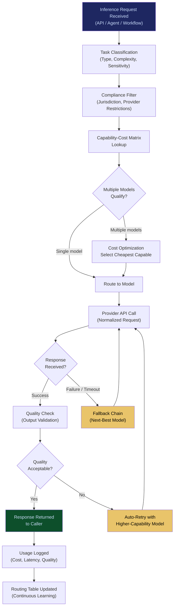

# Multi-Model Orchestration Engine

**Layer 1 -- Compute & Infrastructure** | Build Complexity: 7/10 | Time to Revenue: 3--6 months

---

## Strategic Position

The Multi-Model Orchestration Engine is the foundational routing layer of the FrankMax platform. All AI traffic flows through it. Every inference request -- whether it originates from an enterprise workflow, an autonomous agent, or a marketplace offering -- is routed to the cheapest capable model for the task. The engine abstracts provider dependency, enforces cost discipline, and creates the traffic volume that every other system in the stack monetizes.

This is the **"burger"** in the Burger/Fries/Kitchen framework: the loss-leader that attracts volume, which the governance and compliance layers (the "fries") monetize at 70--95% margins.

| Attribute | Detail |
|---|---|
| **Revenue Model** | Platform fee per orchestrated call |
| **Buyer** | CIOs, CTOs, VP Engineering |
| **Build Complexity** | 7/10 |
| **Time to Revenue** | 3--6 months |
| **Gross Margin** | 15--30% on compute pass-through; 65--75% on orchestration fee |
| **Capital Intensity** | Low--Medium |
| **Strategic Value** | Core routing -- all traffic flows through; provider-agnostic positioning |

---

## What It Does

The orchestration engine receives every AI inference request, evaluates it against a capability-cost matrix, and routes it to the optimal model. "Optimal" is defined by three factors: **capability** (can the model perform this task at the required quality?), **cost** (which capable model is cheapest for this specific request?), and **compliance** (does the routing comply with the organization's data residency, provider preference, and regulatory constraints?).

Supported providers include Claude (Anthropic), GPT (OpenAI), Gemini (Google), Llama (Meta), Mistral, and any model accessible via standard API. The engine is provider-agnostic by design -- when a new model enters the market, it is benchmarked and added to the routing table without customer-facing changes.

---

## Core Features

### 1. Intelligent Model Routing
Every request is classified by task type (generation, analysis, extraction, summarization, code, reasoning, multimodal) and matched against a continuously updated capability-cost matrix. The engine selects the model that meets the quality threshold at the lowest cost. Routing decisions are logged and auditable.

### 2. Cost Arbitrage Engine
Real-time price comparison across providers. The engine tracks per-token pricing, volume discounts, spot pricing, and promotional rates across all supported providers. When prices shift, routing tables update automatically. Enterprises see cost reductions without changing a single workflow.

### 3. Compliance-Aware Routing
Some data cannot leave a jurisdiction. Some organizations prohibit specific providers. Some industries require models hosted on sovereign infrastructure. The orchestration engine enforces these constraints as routing rules, ensuring that compliance is structural rather than procedural.

### 4. Automatic Fallback & Retry
When a provider experiences an outage, rate limit, or degraded performance, the engine automatically reroutes to the next-best capable model. Fallback chains are configurable per workflow. Customers experience uninterrupted service regardless of any single provider's reliability.

### 5. Quality Monitoring & Model Benchmarking
Continuous evaluation of model outputs against quality baselines. When a model's performance degrades on a specific task type, the routing table is updated to preference alternatives. Benchmarking data feeds the [AI Cost Optimization Engine](/platform/core-systems/ai-cost-optimization-engine) for customer-facing savings reports.

### 6. Request Batching & Latency Optimization
For non-time-critical workloads, the engine batches requests to take advantage of bulk pricing. For latency-sensitive workloads, it routes to the fastest capable model regardless of cost. Customers configure latency-cost tradeoff preferences per workflow.

### 7. Provider-Agnostic API Abstraction
A single API surface for all models. Customers write to one interface; the engine handles provider-specific authentication, request formatting, response normalization, and error handling. Switching providers requires zero code changes.

### 8. Usage Analytics & Forecasting
Detailed usage dashboards showing cost per workflow, model utilization, quality scores, and projected spend. Forecasting models predict future costs based on growth trends, enabling proactive budget management.

---

## Orchestration Flow

---

## Revenue Model

The orchestration engine generates revenue from two streams:

**Stream 1: Compute Pass-Through Margin (15--30%)**

Enterprises pay FrankMax for AI inference. FrankMax pays providers at negotiated rates. The spread is the margin. This is the "burger" -- low margin, high volume, attracts traffic.

**Stream 2: Orchestration Platform Fee (65--75% margin)**

A per-call orchestration fee covers routing intelligence, compliance enforcement, fallback management, and analytics. This fee is independent of the underlying model cost.

| Tier | Monthly Call Volume | Orchestration Fee | Estimated Monthly Revenue |
|---|---|---|---|
| Growth | Up to 50,000 calls | $0.002/call | Up to $100 |
| Professional | 50,001--500,000 calls | $0.0015/call | $75--$750 |
| Enterprise | 500,001--5,000,000 calls | $0.001/call | $500--$5,000 |
| Platform | 5,000,000+ calls | Custom | $5,000+ |

**The real revenue is downstream.** The orchestration engine's primary economic function is to create the traffic volume that governance layers monetize. Every orchestrated call that passes through the [Governed AI Execution Engine](/platform/core-systems/governed-ai-execution-engine) generates a governed action fee. Every action that produces an audit record generates [Audit Infrastructure](/platform/core-systems/ai-audit-verification-infrastructure) subscription value.

---

## Integration Points

| System | Integration Type | Data Flow |
|---|---|---|
| [Governed AI Execution Engine](/platform/core-systems/governed-ai-execution-engine) | Downstream | Model outputs are routed through governance checks before execution |
| [AI Cost Optimization Engine](/platform/core-systems/ai-cost-optimization-engine) | Sibling | Cost data from the orchestration engine feeds optimization recommendations |
| [Agent Runtime & Identity Kernel](/platform/core-systems/agent-runtime-identity-kernel) | Upstream | Agent identity determines routing permissions and provider access |
| [Enterprise Memory Graph](/platform/core-systems/enterprise-memory-graph) | Context | Historical interaction data informs task classification and model selection |
| [AI Audit & Verification Infrastructure](/platform/core-systems/ai-audit-verification-infrastructure) | Downstream | Routing decisions and model outputs are logged for compliance verification |
| [Failure Pattern Library](/platform/core-systems/failure-pattern-library) | Intelligence | Model failure patterns inform routing table updates and fallback chain ordering |

---

## The Burger Economics

The orchestration engine operates on thin margins by design. The strategic logic:

1. **Price AI at 80% below direct provider pricing** (enabled by volume negotiation, intelligent routing, and cost arbitrage)
2. **Attract enterprises that are overpaying for AI** (every enterprise running multi-model stacks is overpaying)
3. **Route all traffic through the governance layer** (the "fries" with 70--95% margin)
4. **Compound the data flywheel** (every call improves routing intelligence, failure patterns, and cost optimization -- the "kitchen")

Below 40% governance attachment rate, the economics collapse to commodity API resale. Above 40%, the governance layers subsidize aggressive pricing on compute, which attracts more volume, which generates more governance revenue.

---

## Build Considerations

| Consideration | Detail |
|---|---|
| **Provider Agreements** | Volume pricing agreements with Anthropic, OpenAI, Google, Meta (via hosting partners), and Mistral. Negotiation leverage increases with traffic volume. |
| **Latency Budget** | Routing overhead must be under 20ms. Task classification uses a lightweight local model, not a round-trip to a frontier model. |
| **Capability Matrix Maintenance** | Continuous benchmarking against standardized task suites. New model versions are evaluated within 48 hours of release. |
| **Multi-Region Deployment** | Edge routing nodes in major regions (US, EU, APAC) to minimize latency and enforce data residency. |
| **Rate Limit Management** | Per-provider rate limit tracking with predictive exhaustion warnings. Proactive rerouting before limits are hit. |
