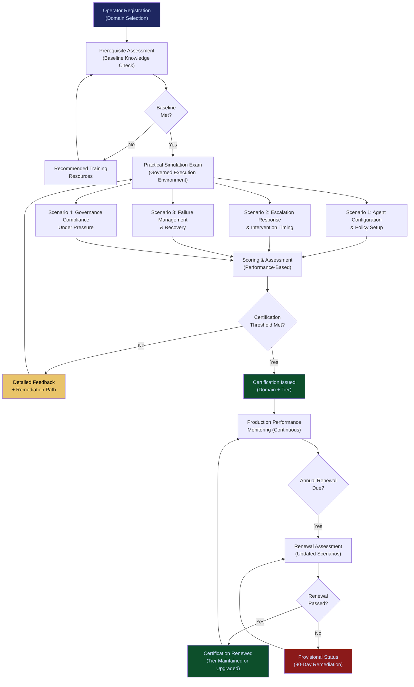

# Operator Certification System

**Layer 6 -- Trust & Certification** | Build Complexity: 4/10 | Time to Revenue: 1--3 months

---

## Strategic Position

The Operator Certification System creates the **talent marketplace** for human-AI collaboration. It is the system that answers the question enterprises increasingly ask: "How do we know this person can actually work with AI effectively and safely?"

Resumes do not measure AI collaboration competency. Interviews cannot simulate governed execution environments. University degrees have not caught up with the operational reality of AI-augmented work. The Operator Certification System fills this gap with verified, performance-based credentials backed by production data.

The system creates a two-sided market: certified operators gain premium positioning and compensation; enterprises gain confidence that the humans overseeing AI systems are qualified to do so. FrankMax earns from both sides -- exam fees from operators, verification fees from enterprises.

| Attribute | Detail |
|---|---|
| **Revenue Model** | Exam fee + annual renewal |
| **Buyer** | Individual operators (certification); enterprises (verification) |
| **Build Complexity** | 4/10 |
| **Time to Revenue** | 1--3 months |
| **Gross Margin** | 90%+ |
| **Capital Intensity** | Low |
| **Strategic Value** | Creates talent marketplace; recurring revenue through renewal cycles |

---

## What It Does

The Operator Certification System evaluates, certifies, and tracks human operators across three dimensions:

1. **Competency**: Can the operator effectively configure, oversee, and collaborate with AI agents in their domain? Assessed through practical simulations, not multiple-choice exams.

2. **Governance Compliance**: Does the operator understand and follow governed execution protocols? Can they identify when an AI action requires escalation, intervention, or halt? Assessed through scenario-based testing using real failure patterns from the [Failure Pattern Library](/platform/core-systems/failure-pattern-library).

3. **Performance**: How does the operator perform in production? Certification is not a one-time gate -- it is a continuous assessment informed by actual operational data from the [Governed AI Execution Engine](/platform/core-systems/governed-ai-execution-engine) and the [Agent Runtime & Identity Kernel](/platform/core-systems/agent-runtime-identity-kernel).

---

## Core Features

### 1. Domain-Specific Certification Tracks
Certification is not generic. Operators are certified for specific domains: financial services AI operations, healthcare AI oversight, legal AI governance, manufacturing AI management, government AI compliance. Each track has domain-specific scenarios, regulatory requirements, and competency thresholds.

### 2. Practical Simulation Exams
Exams are conducted in simulated governed execution environments. Operators must configure agents, evaluate policy compliance, respond to escalations, manage failure scenarios, and make governance decisions under time pressure. Simulations use anonymized patterns from the [Failure Pattern Library](/platform/core-systems/failure-pattern-library) -- real scenarios, not textbook exercises.

### 3. Continuous Performance Monitoring
Certified operators who work within the FrankMax ecosystem accumulate performance data: escalation accuracy, intervention timing, governance compliance rate, and outcome quality. This data feeds a continuous assessment that can upgrade or downgrade certification levels between formal renewal cycles.

### 4. Certification Tiers
Three tiers reflecting increasing competency and responsibility:
- **Certified Operator**: Can oversee AI agents in standard workflows with governance guardrails
- **Senior Operator**: Can configure governance policies, manage complex multi-agent workflows, and handle high-risk scenarios
- **Master Operator**: Can design governance architectures, train other operators, and serve as the organization's AI governance authority

### 5. Enterprise Verification Portal
Enterprises can verify an operator's certification status, tier, domain specializations, and performance history (with the operator's consent). The verification portal replaces reference checks for AI-related roles with verified, data-backed competency assessments.

### 6. Renewal & Continuing Education
Certifications expire annually. Renewal requires completing updated scenario assessments that reflect new regulatory requirements, new failure patterns, and new platform capabilities. Operators who fail renewal are downgraded to provisional status with a 90-day remediation window.

### 7. Certification Analytics for Enterprises
Enterprises with multiple certified operators receive aggregate analytics: certification coverage by department, competency gaps by domain, training recommendations, and benchmarking against industry averages.

### 8. Operator Talent Matching
Certified operators can opt into the talent network, where enterprises searching for AI-capable talent are matched with operators based on domain specialization, certification tier, performance data, and availability. FrankMax earns a placement fee for successful matches.

---

## Certification Flow

---

## Revenue Model

**Primary: Exam & Renewal Fees**

| Item | Fee | Frequency |
|---|---|---|
| Initial Certification Exam | $499--$999 per domain | One-time |
| Annual Renewal | $299--$499 per domain | Annual |
| Additional Domain Certification | $399--$799 per domain | One-time |
| Tier Upgrade Assessment | $299--$499 | Per upgrade attempt |

**Secondary: Enterprise Verification & Analytics**

| Service | Fee |
|---|---|
| Verification Portal Access | $199/month per enterprise |
| Certification Analytics Dashboard | $499/month (includes up to 50 operators) |
| Enterprise Certification Program (custom tracks) | $5,000--$25,000 setup + per-operator exam fees |
| Bulk Certification (10+ operators) | 20% discount on exam fees |

**Tertiary: Talent Matching**

| Service | Fee |
|---|---|
| Talent Network Listing (Operator) | Free |
| Placement Fee (Enterprise) | 10--15% of first-year compensation or $2,500--$10,000 flat fee |

**Revenue trajectory**: Certification revenue is inherently recurring through annual renewals. The operator base grows as the FrankMax ecosystem expands -- every enterprise deploying governed AI needs certified operators. At 1,000 certified operators renewing annually, the renewal stream alone generates $299K--$499K.

---

## Integration Points

| System | Integration Type | Data Flow |
|---|---|---|
| [Governed AI Execution Engine](/platform/core-systems/governed-ai-execution-engine) | Performance Data | Production governance decisions made by operators feed continuous performance assessment |
| [Agent Runtime & Identity Kernel](/platform/core-systems/agent-runtime-identity-kernel) | Authorization | Operator certification tier determines which agents and workflows they are authorized to oversee |
| [Failure Pattern Library](/platform/core-systems/failure-pattern-library) | Exam Content | Anonymized failure patterns are used to construct simulation scenarios |
| [AI Audit & Verification Infrastructure](/platform/core-systems/ai-audit-verification-infrastructure) | Compliance Record | Operator certification status is recorded as part of the audit trail for governed actions they oversee |
| [PIAR](/platform/core-systems/pre-incident-accountability-review-piar) | Competency Gaps | PIAR findings identify operator competency gaps that drive certification demand |
| [Skill Valuation & Credentialing](/platform/core-systems/skill-valuation-credentialing) | Credential Integration | Certification credentials feed into the broader skill valuation framework |
| [Reputation & Trust Graph](/platform/core-systems/reputation-trust-graph) | Trust Data | Operator performance data contributes to trust scores in the reputation graph |

---

## The Talent Marketplace Strategy

The Operator Certification System is not just a revenue stream. It is a **market-making mechanism** with compounding network effects:

1. **Supply side**: Operators invest in certification because it differentiates them in the job market. A FrankMax-certified operator commands premium compensation because the credential is backed by production performance data, not exam scores.

2. **Demand side**: Enterprises prefer certified operators because hiring risk is reduced. The certification provides something resumes and interviews cannot: verified, data-backed evidence that a candidate can work effectively within governed AI systems.

3. **Network effects**: As more operators certify, more enterprises trust the credential. As more enterprises require certification, more operators seek it. The credential becomes the industry standard not through mandate but through market preference.

4. **Data flywheel**: Every certified operator working in the ecosystem generates performance data that improves the certification program's scenario library, scoring models, and competency thresholds. The certification becomes more rigorous and more valuable over time.

---

## Build Considerations

| Consideration | Detail |
|---|---|
| **Simulation Environment** | Isolated sandbox environments that replicate governed execution workflows. Must support concurrent exam sessions without cross-contamination. |
| **Scenario Library** | Minimum 200 scenarios at launch, growing continuously from the Failure Pattern Library. Scenarios must be domain-specific and calibrated to certification tier. |
| **Anti-Cheating** | Proctored exams with randomized scenario sequences. No two operators receive identical exam configurations. |
| **Credential Verification** | Cryptographically verifiable credentials that enterprises can validate without contacting FrankMax. Revocation propagates within 24 hours. |
| **Regulatory Alignment** | Certification program designed to align with emerging AI operator competency standards (ISO/IEC, NIST). Early alignment positions FrankMax as the reference implementation when standards formalize. |
