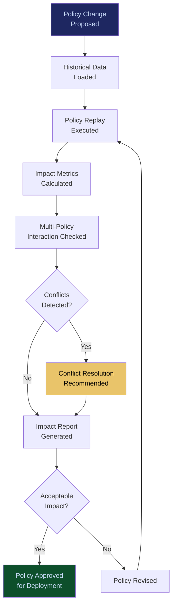

# Policy Simulation Engine

**Layer 7 -- Simulation & Digital Twin**

---

## Purpose

The Policy Simulation Engine models the impact of governance policy changes before they are deployed to production. It answers questions like: "If we lower the human approval threshold from $50,000 to $25,000, how many additional escalations will that generate?" or "If we add EU AI Act Article 14 requirements to our governance stack, which workflows will be affected?" Policy changes are tested against historical data and the [Enterprise Digital Twin](/platform/core-systems/enterprise-digital-twin-platform) to predict their operational, financial, and compliance impact.

Policy changes in AI governance are high-stakes decisions. A policy that is too strict paralyzes operations with unnecessary escalations. A policy that is too loose exposes the organization to regulatory and liability risk. The Policy Simulation Engine eliminates the guesswork by providing quantified impact analysis before any policy goes live. Every simulation generates telemetry that feeds the [Failure Pattern Library](/platform/core-systems/failure-pattern-library) and [Enterprise Mortality Tables](/platform/core-systems/enterprise-mortality-tables).

---

## Architecture

Layer 7 handles simulation and digital twin capabilities. The Policy Simulation Engine sits alongside the [Enterprise Digital Twin Platform](/platform/core-systems/enterprise-digital-twin-platform) (organizational replica), the [Synthetic Enterprise Platform](/platform/core-systems/synthetic-enterprise-platform) (synthetic data), and the [Wargaming & Scenario Modeler](/platform/core-systems/wargaming-scenario-modeler) (adversarial testing). It consumes policy definitions from the [Governed AI Execution Engine](/platform/core-systems/governed-ai-execution-engine) and historical execution data from the [AI Audit & Verification Infrastructure](/platform/core-systems/ai-audit-verification-infrastructure).

---

## Core Capabilities

- **Policy Replay** -- Replays historical AI actions through a proposed policy change to measure how outcomes would have differed (number of escalations, blocked actions, approved actions, risk scores).
- **Impact Quantification** -- Quantifies the operational impact of policy changes in concrete metrics: additional escalations per day, latency increase, cost change, compliance coverage change.
- **Multi-Policy Interaction Analysis** -- Models how a new policy interacts with existing policies, detecting conflicts, redundancies, and unintended gaps in coverage.
- **Regulatory Compliance Simulation** -- Simulates the adoption of new regulatory requirements (EU AI Act, NIST AI RMF updates) against existing operations to identify compliance gaps.
- **A/B Policy Testing** -- Runs two policy variants in parallel against the same dataset to compare their operational impact side by side.
- **Sensitivity Analysis** -- Tests how policy outcomes change as thresholds are varied, identifying optimal parameter values.

---

## BPMN Workflow

---

## Integration Points

| System | Integration | Data Flow |
|---|---|---|
| [Governed AI Execution Engine](/platform/core-systems/governed-ai-execution-engine) | Policy | Policy definitions consumed for simulation; approved policies deployed back |
| [Enterprise Digital Twin Platform](/platform/core-systems/enterprise-digital-twin-platform) | Twin | Policies simulated against the organizational digital twin |
| [AI Audit & Verification Infrastructure](/platform/core-systems/ai-audit-verification-infrastructure) | History | Historical execution data used for policy replay |
| [Executive AI Co-Pilot](/platform/core-systems/executive-ai-co-pilot) | Reporting | Simulation results summarized for executive decision-making |
| [Failure Pattern Library](/platform/core-systems/failure-pattern-library) | Intelligence | Simulated failure scenarios feed the pattern library |
| [Decision Defensibility Structuring](/platform/core-systems/decision-defensibility-structuring) | Evidence | Policy simulation results included in defensibility packages |

---

## Data Model

- **PolicySimulation** -- Simulation ID, policy definition (proposed), baseline policy (current), historical data range, execution status, results summary.
- **SimulationResult** -- Result ID, simulation ID, metric type (escalations/blocks/approvals/latency/cost), baseline value, simulated value, delta, percentage change.
- **PolicyConflict** -- Conflict ID, simulation ID, conflicting policies, conflict type (overlap/gap/contradiction), resolution recommendation.
- **SensitivityAnalysis** -- Analysis ID, simulation ID, parameter varied, value range tested, optimal value, sensitivity curve data.

---

## Deployment Model

Cloud-native, compute-elastic. Policy simulations are batch workloads that scale horizontally based on the volume of historical data being replayed. Simple simulations (single policy, 30-day replay) complete in minutes. Complex simulations (multi-policy, 12-month replay, sensitivity analysis) may run for hours. The engine runs within the tenant's [Sovereign AI Pod](/platform/core-systems/sovereign-ai-pods) to ensure policy and historical data isolation. Results are cached for rapid access by the [Executive AI Co-Pilot](/platform/core-systems/executive-ai-co-pilot).

---

## Revenue Contribution

Bundled into governance subscription tiers with per-simulation fees for compute-intensive analyses ($50--$500 per simulation depending on complexity and data volume). The Policy Simulation Engine drives governance subscription upsell -- enterprises that discover the cost of a bad policy change through simulation become committed governance platform users. Simulation data compounds the Kitchen moat by revealing which policy configurations produce optimal outcomes across industry verticals, a dataset that no competitor can replicate without equivalent deployment scale.
