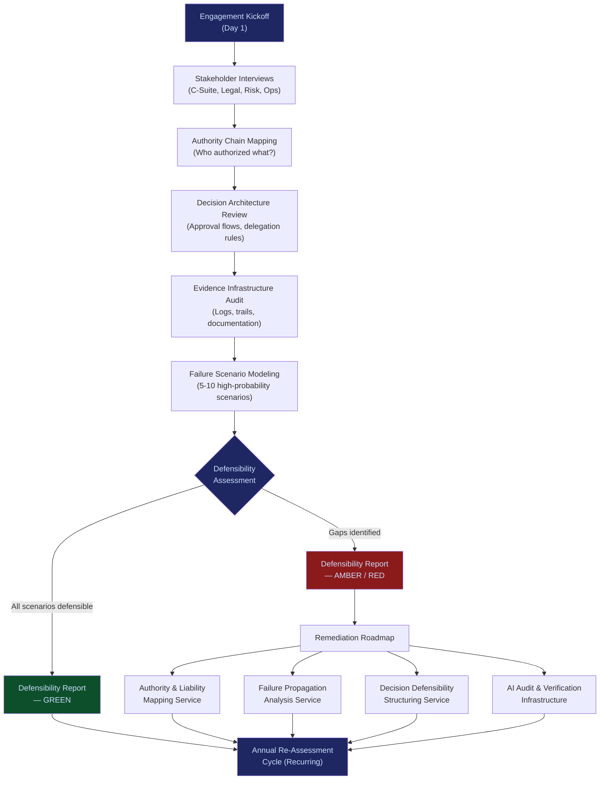

# Pre-Incident Accountability Review (PIAR)

**Layer 4 -- Execution & Governance** | Build Complexity: 3/10 | Time to Revenue: 0--30 days

---

## Strategic Position

PIAR is the fastest revenue system in the FrankMax ecosystem. It requires no code, no infrastructure, and no dependencies. A founder with domain knowledge and a laptop delivers it. Every other system in the platform benefits from PIAR running first, because every engagement surfaces the governance gaps that the rest of the stack remedies.

PIAR is the diagnostic. Everything else is the treatment.

| Attribute | Detail |
|---|---|
| **Revenue Model** | Engagement fee ($15,000--$75,000) |
| **Buyer** | Boards, General Counsel, Chief Risk Officers |
| **Build Complexity** | 3/10 -- Advisory service, no code required |
| **Time to Revenue** | 0--30 days |
| **Gross Margin** | 85--95% (labor-only delivery) |
| **Dependencies** | None |
| **Strategic Value** | Fastest revenue in the ecosystem; entry point for all downstream sales |

---

## What PIAR Does

PIAR answers one question: **"If this fails, can you survive investigation?"**

Every organization deploying AI systems carries latent accountability exposure. Automated decisions create evidence trails that are either complete or catastrophically incomplete. There is no middle ground. PIAR surfaces that exposure before regulators, litigants, or insurers do.

The output is not a risk register. It is a **defensibility report** -- a structured assessment of whether the organization's decision architecture, authority chains, and evidence infrastructure can survive adversarial scrutiny after an incident.

---

## Core Features

### 1. Authority Chain Mapping
Traces every decision authority in the organization: who can authorize what, under what constraints, and who inherits liability when authority is delegated. Exposes broken chains where accountability evaporates between roles.

### 2. Evidence Infrastructure Audit
Inventories the organization's audit logs, approval workflows, and documentation practices. Determines whether existing records would survive adversarial scrutiny -- or whether they would be dismissed as incomplete, fabricated, or retroactively assembled.

### 3. Failure Scenario Modeling
Models 5--10 high-probability failure scenarios specific to the organization's AI deployments. Traces each scenario through the decision chain to identify where accountability breaks down and who would bear liability.

### 4. Defensibility Scoring Matrix
Scores each failure scenario across three dimensions: evidence quality, authority clarity, and response readiness. Produces a color-coded defensibility map that the board can act on immediately.

### 5. Regulatory Exposure Assessment
Maps which jurisdictions can enforce what, against whom, under which conditions. Identifies the intersection of AI deployment geography and regulatory enforcement mechanisms.

### 6. Remediation Roadmap
Prioritized actions ranked by exposure severity and implementation cost. Each remediation item maps directly to a specific FrankMax platform capability, creating a natural upsell path.

### 7. Blast-Radius Analysis
For each modeled failure, quantifies the propagation path: which systems fail, which contracts trigger penalties, which regulators activate, which insurance policies are implicated.

### 8. Annual Re-Assessment Framework
Defines the cadence and scope for ongoing accountability reviews. Transforms a one-time engagement into a recurring governance relationship.

---

## PIAR Process Flow

---

## Revenue Model

| Engagement Size | Price Range | Typical Buyer | Scope |
|---|---|---|---|
| Single business unit, limited AI deployment | $15,000--$25,000 | Mid-market CFO | 5 scenarios, 1 jurisdiction |
| Multi-unit, moderate AI deployment | $25,000--$50,000 | Enterprise GC / CRO | 8 scenarios, 3 jurisdictions |
| Enterprise-wide, significant AI exposure | $50,000--$75,000 | Board Risk Committee | 10+ scenarios, all jurisdictions |

**Revenue trajectory:**

| Period | Revenue Target | Engagement Volume |
|---|---|---|
| Months 1--3 | $25K--$125K | 2--5 engagements |
| Months 4--6 | $50K--$250K | + Failure Propagation + Jurisdictional Exposure upsells |
| Months 7--12 | $100K--$500K | + Decision Defensibility + Institutional Memory subscriptions |
| Year 2+ | $250K--$1M+ | Annual renewal base + platform subscriptions |

---

## Buyer Triggers

| Signal | Buyer | Urgency |
|---|---|---|
| Board asks "are we covered?" after a competitor incident | General Counsel | Immediate |
| Insurer raises premiums or requests AI governance proof | CFO | 30 days |
| Regulator issues sector-specific AI guidance | CRO | 60 days |
| Failed audit reveals decision-trail gaps | Head of Internal Audit | Immediate |
| M&A due diligence uncovers governance gaps | CFO / Board | Deal-dependent |
| First AI-assisted decision is challenged in litigation | General Counsel | Immediate |

---

## The Inevitability Argument

Retrospective accountability is now harsher than prospective constraint. This condition has flipped permanently.

Regulators, courts, and insurers have shifted from "did you follow the rules?" to "can you prove you made defensible decisions?" The burden of proof moved from the accuser to the organization. AI accelerates this shift because automated decisions create evidence trails that are either complete or catastrophically incomplete.

Every organization will face a PIAR-equivalent review. The only question is whether it happens **before** an incident (at $15K--$75K, on the organization's terms) or **after** an incident (at $500K--$5M+, on the regulator's terms).

---

## Integration Points

| System | Relationship |
|---|---|
| [Governed AI Execution Engine](/platform/core-systems/governed-ai-execution-engine) | PIAR findings define the governance policies the execution engine enforces |
| [AI Audit & Verification Infrastructure](/platform/core-systems/ai-audit-verification-infrastructure) | PIAR identifies evidence gaps that the audit infrastructure fills |
| [Decision Defensibility Structuring](/platform/core-systems/decision-defensibility-structuring) | PIAR's remediation roadmap often leads directly to DDS engagements |
| [ETLB Engine](/platform/core-systems/etlb-engine) | PIAR exposes liability binding gaps that ETLB resolves at execution time |
| [Kill-Switch Infrastructure](/platform/core-systems/kill-switch-infrastructure) | PIAR models failure scenarios that inform kill-switch trigger conditions |
| [Operator Certification System](/platform/core-systems/operator-certification-system) | PIAR findings inform operator competency requirements |

---

## Why PIAR Is Priority #1

1. **No code required.** Pure advisory. Deliverable on day one with domain knowledge alone.
2. **Immediate revenue.** $15K--$75K per engagement on a 2--4 week cycle.
3. **Creates urgency for everything else.** Every PIAR engagement reveals gaps that require Authority Mapping, Failure Propagation, Decision Defensibility, and Audit Infrastructure to resolve.
4. **Positions FrankMax as the accountability authority.** The organization that identified the exposure becomes the natural vendor to remediate it.
5. **Generates platform adoption.** PIAR clients convert to Governed Execution Engine and Audit Infrastructure subscribers at 60%+ rates because the engagement proved the need.

---

## Deliverable: The Defensibility Report

| Section | Purpose |
|---|---|
| Executive Summary | One-page finding: defensible or not, with severity score |
| Authority Chain Map | Visual map of who authorized what, where chains are broken |
| Evidence Gap Analysis | What records exist, what is missing, what was fabricated after the fact |
| Failure Scenario Matrix | 5--10 modeled scenarios with defensibility scores |
| Regulatory Exposure Assessment | Which jurisdictions, which enforcement mechanisms, which penalties |
| Blast-Radius Propagation Map | How each failure cascades through contracts, regulators, and insurers |
| Remediation Roadmap | Prioritized actions ranked by exposure severity and implementation cost |
| Platform Recommendations | Specific FrankMax systems mapped to each identified gap |
