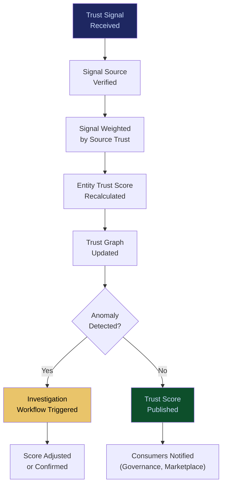

# Reputation & Trust Graph

**Layer 6 -- Trust & Certification**

---

## Purpose

The Reputation & Trust Graph is a network-based trust model that aggregates trust signals from across the platform -- agent trust scores from the [Agent Runtime & Identity Kernel](/platform/core-systems/agent-runtime-identity-kernel), alignment certifications from [Alignment Scoring & Certification](/platform/core-systems/alignment-scoring-certification), operator credentials from [Skill Valuation & Credentialing](/platform/core-systems/skill-valuation-credentialing), marketplace ratings, and operational performance data -- into a unified, queryable graph that represents the trust relationships between all entities in the ecosystem.

Trust is the currency of autonomous AI operations. When an agent needs to decide whether to accept output from another agent, trust scores determine the decision. When a buyer evaluates a marketplace offering, the seller's trust graph position influences the purchase. When a governance engine evaluates whether to escalate a decision, the acting agent's trust history informs the threshold. The trust graph makes these signals explicit, auditable, and machine-readable. It compounds over time -- entities that demonstrate consistent reliability accumulate trust that cannot be transferred or faked. Every trust signal generates telemetry that feeds the [Failure Pattern Library](/platform/core-systems/failure-pattern-library) and [Enterprise Mortality Tables](/platform/core-systems/enterprise-mortality-tables).

---

## Architecture

Layer 6 handles trust and certification. The Reputation & Trust Graph is the aggregation layer that unifies trust signals from the [Alignment Scoring & Certification](/platform/core-systems/alignment-scoring-certification), [Skill Valuation & Credentialing](/platform/core-systems/skill-valuation-credentialing), and [Operator Certification System](/platform/core-systems/operator-certification-system). It exposes trust data to Layer 2 (agent orchestration decisions), Layer 4 (governance escalation thresholds), and Layer 5 (marketplace trust signals).

---

## Core Capabilities

- **Multi-Entity Trust Modeling** -- Trust scores for agents, operators, organizations, models, workflows, and marketplace sellers, each with domain-specific trust dimensions.
- **Trust Score Composition** -- Composite trust scores computed from multiple input signals (operational history, alignment certification, credential status, peer ratings, failure frequency) with configurable weighting.
- **Trust Decay and Recovery** -- Trust scores decay over inactivity periods and recover through demonstrated positive performance, preventing stale trust from persisting.
- **Trust Transitivity** -- Limited trust transitivity: an agent trusted by a highly trusted organization inherits partial trust, but only up to a configurable ceiling.
- **Anomaly Detection** -- Sudden trust score changes trigger investigation workflows to detect gaming, collusion, or system errors.
- **Trust Visualization** -- Interactive graph visualization showing trust relationships, score distributions, and trust flow between entities.

---

## BPMN Workflow

---

## Integration Points

| System | Integration | Data Flow |
|---|---|---|
| [Agent Runtime & Identity Kernel](/platform/core-systems/agent-runtime-identity-kernel) | Trust | Agent trust scores are a primary graph input |
| [Alignment Scoring & Certification](/platform/core-systems/alignment-scoring-certification) | Certification | Alignment certifications feed trust score composition |
| [Skill Valuation & Credentialing](/platform/core-systems/skill-valuation-credentialing) | Credentials | Operator credential status contributes to organizational trust |
| [Agent Marketplace](/platform/core-systems/agent-marketplace) | Commerce | Seller trust scores displayed in marketplace listings |
| [Governed AI Execution Engine](/platform/core-systems/governed-ai-execution-engine) | Governance | Trust scores influence governance escalation thresholds |
| [Enterprise Agent Orchestration OS](/platform/core-systems/enterprise-agent-orchestration-os) | Routing | Agent trust scores influence task routing decisions |

---

## Data Model

- **TrustEntity** -- Entity ID, entity type (agent/operator/organization/model/seller), composite trust score, dimension scores (array), last updated.
- **TrustSignal** -- Signal ID, source entity, target entity, signal type, signal value, weight, timestamp.
- **TrustEdge** -- Edge ID, source entity ID, target entity ID, relationship type, trust transitivity factor.
- **TrustAnomaly** -- Anomaly ID, entity ID, previous score, anomalous score, detection method, investigation status, resolution.

---

## Deployment Model

Cloud-native. The trust graph is stored in a graph database (Neo4j or equivalent) optimized for relationship queries and traversal. Trust score recalculation runs as a streaming computation for real-time signal processing and as batch computation for full graph recalibration (daily). The graph API supports sub-100ms trust score lookups for real-time governance decisions. Multi-tenant isolation ensures trust graph data for one organization is not visible to another, while anonymized cross-tenant patterns feed platform-wide trust calibration.

---

## Revenue Contribution

Trust graph access is bundled into platform subscriptions. Premium trust analytics (trust trend reports, competitive trust benchmarking, trust-based risk assessment) sold as add-on data products ($2,500--$10,000/year). The trust graph creates deep platform lock-in -- an entity's trust score represents accumulated operational history that cannot be migrated. Marketplace sellers with high trust scores have a direct financial incentive to remain on the platform. Trust data compounds the Kitchen moat as the graph grows richer and more accurate with every interaction.
