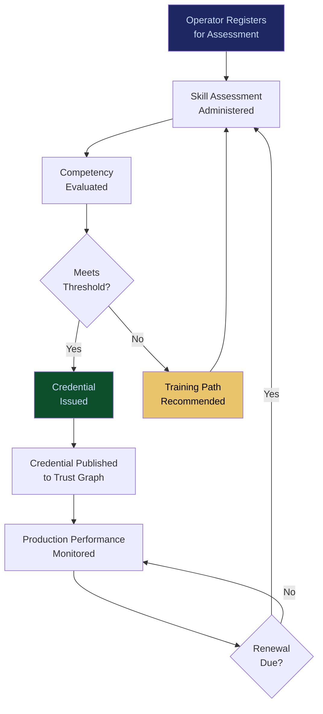

# Skill Valuation & Credentialing

**Layer 6 -- Trust & Certification**

---

## Purpose

Skill Valuation & Credentialing assesses, quantifies, and certifies the capabilities of human operators, AI engineers, governance officers, and data scientists who interact with the FrankMax platform. It answers the question: "Is this person qualified to operate, configure, supervise, or override this AI system?" The system produces verifiable credentials that map human skills to specific platform capabilities and regulatory requirements.

As AI systems become more capable and autonomous, the competence of the humans supervising them becomes the critical variable. A misconfigured governance policy, an improper human override, or an unqualified operator making a risk decision can create liability that no technical safeguard can prevent. Skill Valuation & Credentialing ensures that every human in the AI operations chain is verified, credentialed, and matched to their competency level. Credentials are consumed by the [Agent Runtime & Identity Kernel](/platform/core-systems/agent-runtime-identity-kernel) for permission assignment and by the [Operator Certification System](/platform/core-systems/operator-certification-system) for organizational qualification.

---

## Architecture

Layer 6 handles trust and certification. Skill Valuation & Credentialing sits alongside the [Alignment Scoring & Certification](/platform/core-systems/alignment-scoring-certification) (AI alignment), the [Reputation & Trust Graph](/platform/core-systems/reputation-trust-graph) (trust network), and the [Operator Certification System](/platform/core-systems/operator-certification-system) (organizational certification). It produces human capability assessments that feed into Layer 4 governance decisions and Layer 2 agent supervision configurations.

---

## Core Capabilities

- **Skill Assessment Framework** -- Structured assessments covering AI operations, governance configuration, risk management, model evaluation, data quality management, and regulatory compliance.
- **Competency-Based Credentialing** -- Credentials are issued based on demonstrated competency (practical assessments, not just exams), with specific credentials mapping to specific platform capabilities.
- **Credential Lifecycle Management** -- Credentials have defined validity periods (typically 12-24 months), requiring renewal through re-assessment to account for platform evolution and regulatory changes.
- **Skill Gap Analysis** -- Identifies gaps between an organization's current operator skill levels and the requirements of their AI deployments, with training recommendations.
- **Regulatory Credential Mapping** -- Maps credentials to regulatory requirements (EU AI Act human oversight requirements, FDA SaMD operator qualifications, HIPAA security officer competencies).
- **Continuous Competency Monitoring** -- Tracks operator performance in production to validate that credential holders maintain competency through actual usage.

---

## BPMN Workflow

---

## Integration Points

| System | Integration | Data Flow |
|---|---|---|
| [Agent Runtime & Identity Kernel](/platform/core-systems/agent-runtime-identity-kernel) | Permissions | Operator credentials determine what platform capabilities they can access |
| [Operator Certification System](/platform/core-systems/operator-certification-system) | Certification | Individual credentials aggregate into organizational operator certification |
| [Reputation & Trust Graph](/platform/core-systems/reputation-trust-graph) | Trust | Credential status feeds into the trust graph for operators |
| [Governed AI Execution Engine](/platform/core-systems/governed-ai-execution-engine) | Governance | Governance policies reference operator credential requirements for overrides |
| [AI Audit & Verification Infrastructure](/platform/core-systems/ai-audit-verification-infrastructure) | Audit | Credential issuance, renewal, and revocation logged immutably |
| [Decision Defensibility Structuring](/platform/core-systems/decision-defensibility-structuring) | Evidence | Operator credentials included in defensibility packages for human override decisions |

---

## Data Model

- **Credential** -- Credential ID, operator ID, skill domain, competency level, issued date, expiry date, status (active/expired/revoked), assessment reference.
- **SkillAssessment** -- Assessment ID, operator ID, skill domain, questions/tasks administered, scores, pass/fail, assessment timestamp.
- **SkillGapReport** -- Report ID, organization ID, deployment requirements, current capability, gaps identified, training recommendations.
- **CompetencyMonitor** -- Operator ID, credential ID, production actions tracked, competency indicators, last evaluated.

---

## Deployment Model

Cloud-native SaaS. Skill assessments are delivered through a web-based platform with proctoring capabilities for high-stakes credentials. Credential verification is available via API for programmatic checks during governance policy evaluation. Credential records are stored immutably and are portable -- an operator's credentials are valid across any FrankMax tenant. The system integrates with enterprise identity providers (Okta, Azure AD) for operator identity verification.

---

## Revenue Contribution

Per-assessment fee ($199--$999 per skill assessment) plus annual credential maintenance fee ($99--$499 per credential per year). Organizational skill gap analysis sold as a consulting engagement ($5,000--$25,000). Revenue scales with enterprise AI team size -- as organizations grow their AI operations teams, credential volume grows proportionally. Credentials create platform lock-in because they are specific to FrankMax capabilities and not transferable to competitor platforms. Competency data compounds the Kitchen moat by revealing which skills predict operational success across tenants.
