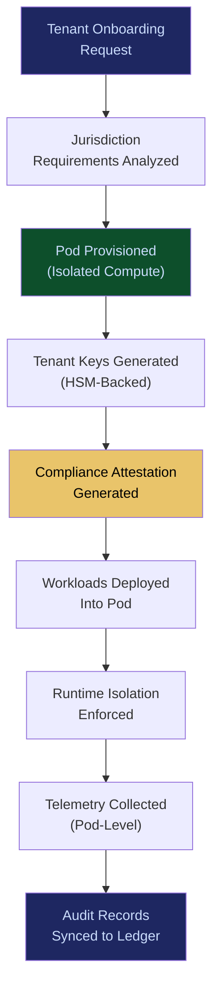

# Sovereign AI Pods

**Layer 1 -- Compute & Infrastructure**

---

## Purpose

Sovereign AI Pods provide tenant-isolated, jurisdiction-compliant compute environments where enterprise AI workloads execute without data commingling, cross-tenant inference leakage, or regulatory boundary violations. Each pod is a self-contained execution environment with dedicated compute, memory, storage, and network isolation -- a private room in a shared building.

Enterprises in regulated industries (financial services, healthcare, defense, government) cannot run AI workloads on shared infrastructure without demonstrating isolation to auditors and regulators. Sovereign AI Pods provide that demonstration as a technical guarantee, not a contractual promise. Data residency requirements (GDPR, data localization laws in 40+ jurisdictions) are enforced at the infrastructure layer, making compliance automatic rather than manual. Every pod generates telemetry that feeds the [Failure Pattern Library](/platform/core-systems/failure-pattern-library) and [Enterprise Mortality Tables](/platform/core-systems/enterprise-mortality-tables).

---

## Architecture

Layer 1 provides compute primitives. Sovereign AI Pods sit alongside the [Multi-Model Orchestration Engine](/platform/core-systems/multi-model-orchestration-engine), [AI Cost Optimization Engine](/platform/core-systems/ai-cost-optimization-engine), and [Edge AI Control Grid](/platform/core-systems/edge-ai-control-grid). While the Orchestration Engine routes between models and the Cost Engine optimizes spend, Sovereign AI Pods guarantee that workloads execute within defined isolation boundaries. The pods are the trust anchor for multi-tenant deployments.

---

## Core Capabilities

- **Hardware-Level Isolation** -- Each pod runs on dedicated compute with no shared memory, no shared CPU cores, and no shared network interfaces between tenants.
- **Jurisdiction Pinning** -- Pods are pinned to specific geographic regions, ensuring data never leaves the jurisdiction required by regulation or contract.
- **Cryptographic Tenant Separation** -- All data at rest and in transit within a pod is encrypted with tenant-specific keys managed through a dedicated HSM partition.
- **Compliance Attestation** -- Pods generate machine-readable attestation reports proving isolation, jurisdiction compliance, and encryption status on demand.
- **Dynamic Scaling Within Boundaries** -- Pods scale compute up and down within their isolation boundary without breaking tenant separation guarantees.
- **Pod-to-Pod Federation** -- Authorized cross-tenant communication through governed, audited channels when multi-entity collaboration is required.
- **Immutable Pod Audit Trail** -- Every pod lifecycle event (creation, scaling, migration, termination) is logged to the [AI Audit & Verification Infrastructure](/platform/core-systems/ai-audit-verification-infrastructure).

---

## BPMN Workflow

---

## Integration Points

| System | Integration | Data Flow |
|---|---|---|
| [Multi-Model Orchestration Engine](/platform/core-systems/multi-model-orchestration-engine) | Compute | Orchestration engine deploys models into the appropriate tenant pod |
| [AI Cost Optimization Engine](/platform/core-systems/ai-cost-optimization-engine) | Optimization | Cost engine right-sizes pod resources based on utilization telemetry |
| [Edge AI Control Grid](/platform/core-systems/edge-ai-control-grid) | Extension | Edge nodes inherit pod isolation policies for distributed workloads |
| [Agent Runtime & Identity Kernel](/platform/core-systems/agent-runtime-identity-kernel) | Identity | Agents are bound to specific pods based on tenant identity |
| [AI Audit & Verification Infrastructure](/platform/core-systems/ai-audit-verification-infrastructure) | Audit | Pod lifecycle and isolation events logged to immutable ledger |
| [Kill-Switch Infrastructure](/platform/core-systems/kill-switch-infrastructure) | Safety | Kill-switch can terminate an entire pod instantly |

---

## Data Model

- **Pod** -- Tenant ID, jurisdiction, compute allocation, encryption key reference, creation timestamp, status.
- **PodAttestation** -- Pod ID, attestation type, compliance framework, generated timestamp, cryptographic signature.
- **PodScaleEvent** -- Pod ID, previous allocation, new allocation, trigger reason, timestamp.
- **TenantKeyBinding** -- Tenant ID, HSM partition, key rotation schedule, last rotation timestamp.

---

## Deployment Model

Cloud-native with region-specific deployments. Pods are provisioned in AWS, Azure, or GCP regions matching the tenant's jurisdiction requirements. For defense and government clients, pods can be deployed on-premises or in air-gapped environments using the same orchestration layer. Pod infrastructure is managed as code with drift detection -- any unauthorized change to pod configuration triggers an alert and automatic remediation.

---

## Revenue Contribution

Premium infrastructure pricing ($2,000--$15,000/pod/month depending on compute allocation and jurisdiction). Sovereign AI Pods are the highest-margin Layer 1 offering because regulated enterprises pay a sovereignty premium. Compliance attestation reports are bundled with the pod subscription, creating an upsell path to the full [AI Audit & Verification Infrastructure](/platform/core-systems/ai-audit-verification-infrastructure). Pod telemetry feeds the Kitchen moat with jurisdiction-specific performance and reliability data.
