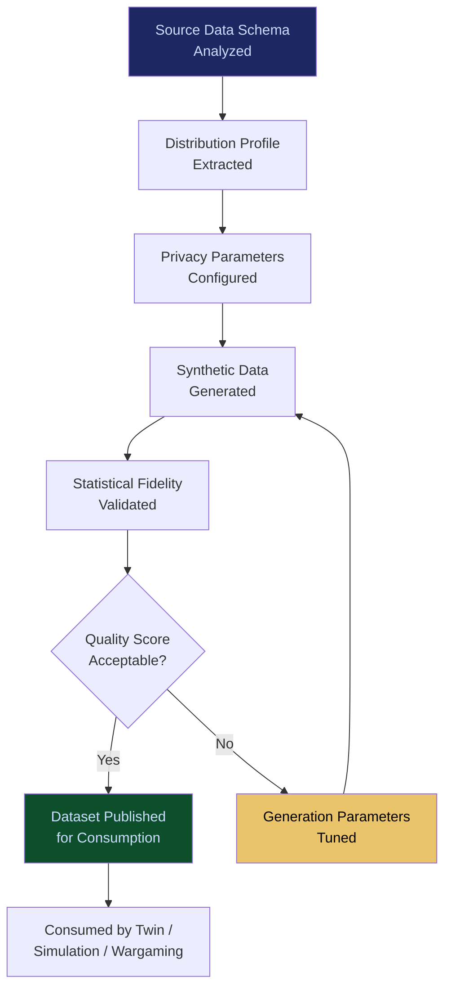

# Synthetic Enterprise Platform

**Layer 7 -- Simulation & Digital Twin**

---

## Purpose

The Synthetic Enterprise Platform generates realistic, privacy-safe synthetic data that mirrors an organization's actual data distributions, schemas, relationships, and edge cases. It solves the fundamental tension in AI development: you need real data to build and test AI systems, but real data carries privacy, regulatory, and security risks that make it dangerous to use in non-production environments. Synthetic data eliminates that risk while preserving the statistical properties that make the data useful.

The platform generates synthetic datasets for AI model training, agent testing, workflow validation, governance policy simulation, and compliance testing. It is tightly integrated with the [Enterprise Digital Twin Platform](/platform/core-systems/enterprise-digital-twin-platform) (which uses synthetic data when real data cannot be exposed), the [Policy Simulation Engine](/platform/core-systems/policy-simulation-engine) (which replays policies against synthetic datasets), and the [Wargaming & Scenario Modeler](/platform/core-systems/wargaming-scenario-modeler) (which uses synthetic data for adversarial testing). Every synthetic dataset generation event generates telemetry that feeds the [Failure Pattern Library](/platform/core-systems/failure-pattern-library).

---

## Architecture

Layer 7 handles simulation and digital twin capabilities. The Synthetic Enterprise Platform provides the data substrate for all Layer 7 simulation systems. It consumes schema and distribution information from the [Enterprise Memory Graph](/platform/core-systems/enterprise-memory-graph) and the [Autonomous Data Ingestion Engine](/platform/core-systems/autonomous-data-ingestion-engine), and produces synthetic datasets consumed by the twin, the policy engine, and the wargaming modeler.

---

## Core Capabilities

- **Statistical Distribution Preservation** -- Synthetic data mirrors the statistical distributions (means, variances, correlations, outlier frequencies) of production data, ensuring AI models trained on synthetic data perform equivalently on real data.
- **Schema-Aware Generation** -- Generates data that respects complex enterprise schemas including foreign key relationships, business rules, referential integrity, and domain constraints.
- **Edge Case Amplification** -- Allows intentional amplification of rare events and edge cases that are underrepresented in production data but critical for robust AI testing.
- **Privacy Guarantee** -- Formal differential privacy guarantees ensure no synthetic record can be traced back to any real individual or entity.
- **Domain-Specific Generators** -- Pre-built generators for healthcare (HL7 FHIR), financial services (FIX, SWIFT), insurance (ACORD), and 10+ additional domain-specific data formats.
- **Synthetic Data Quality Scoring** -- Each synthetic dataset receives a quality score measuring its statistical fidelity to the source distribution.

---

## BPMN Workflow

---

## Integration Points

| System | Integration | Data Flow |
|---|---|---|
| [Enterprise Digital Twin Platform](/platform/core-systems/enterprise-digital-twin-platform) | Data | Synthetic data used when real data cannot be exposed in twin simulations |
| [Policy Simulation Engine](/platform/core-systems/policy-simulation-engine) | Testing | Synthetic datasets used for policy replay and sensitivity analysis |
| [Wargaming & Scenario Modeler](/platform/core-systems/wargaming-scenario-modeler) | Scenarios | Synthetic data used for adversarial scenario construction |
| [Enterprise Memory Graph](/platform/core-systems/enterprise-memory-graph) | Schema | Source schemas and distributions extracted from the memory graph |
| [Autonomous Data Ingestion Engine](/platform/core-systems/autonomous-data-ingestion-engine) | Profiles | Data profiles from ingestion pipelines inform synthetic generation |
| [AI Audit & Verification Infrastructure](/platform/core-systems/ai-audit-verification-infrastructure) | Audit | Synthetic dataset generation events and privacy parameters logged |

---

## Data Model

- **SyntheticDataset** -- Dataset ID, source schema reference, generation parameters, privacy parameters, quality score, record count, generation timestamp.
- **DistributionProfile** -- Profile ID, source reference, column distributions (array), correlation matrix, outlier frequencies, profile timestamp.
- **PrivacyConfiguration** -- Config ID, differential privacy epsilon, k-anonymity threshold, suppression rules, applicable regulations.
- **QualityAssessment** -- Assessment ID, dataset ID, fidelity score, distribution divergence metrics, utility test results.

---

## Deployment Model

Cloud-native, compute-elastic. Synthetic data generation is a compute-intensive batch workload that scales horizontally. Generated datasets are stored within the tenant's [Sovereign AI Pod](/platform/core-systems/sovereign-ai-pods) with the same isolation guarantees as production data. Distribution profiles are extracted from production data within the tenant's security boundary and never leave it. The generation engine supports GPU acceleration for complex generative models (VAEs, GANs, diffusion models) used in high-fidelity synthesis.

---

## Revenue Contribution

Per-dataset generation fee ($500--$5,000 per synthetic dataset depending on complexity and record count) plus monthly subscription for continuous synthetic data pipelines ($1,999--$9,999/month). The Synthetic Enterprise Platform enables faster AI development cycles by removing the data access bottleneck, making it a productivity multiplier that justifies its cost. Synthetic data generation telemetry compounds the Kitchen moat -- cross-tenant insights about data distributions, edge case frequencies, and domain schema patterns create a knowledge advantage that improves generation quality over time.
