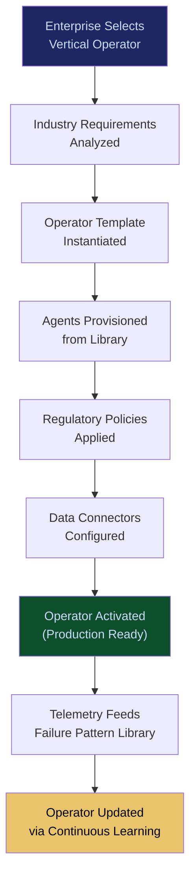

# Verticalized Autonomous Operator Stack

**Layer 2 -- Cognition & Agent**

---

## Purpose

The Verticalized Autonomous Operator Stack provides industry-specific, pre-built AI operator configurations that encode domain knowledge, regulatory requirements, and operational workflows for specific NAICS sectors. Instead of forcing enterprises to build AI workflows from scratch, the operator stack delivers ready-to-deploy operators for healthcare claims processing, financial risk assessment, insurance underwriting, legal document review, and 20+ additional verticals.

Each operator is a governed, auditable, domain-aware AI workflow that combines the right agents, models, policies, and data connectors for a specific use case. The stack sits on top of the [Enterprise Agent Orchestration OS](/platform/core-systems/enterprise-agent-orchestration-os) and draws agents from the [200+ Specialized Agent Library](/platform/core-systems/200-specialized-agent-library). Operators generate telemetry that feeds the [Failure Pattern Library](/platform/core-systems/failure-pattern-library) and [Enterprise Mortality Tables](/platform/core-systems/enterprise-mortality-tables), building vertical-specific intelligence that deepens with every deployment.

---

## Architecture

Layer 2 handles cognition and agent management. The Operator Stack is the highest abstraction in Layer 2, sitting above the [Enterprise Agent Orchestration OS](/platform/core-systems/enterprise-agent-orchestration-os) (workflow coordination), the [Agent Runtime & Identity Kernel](/platform/core-systems/agent-runtime-identity-kernel) (agent identity), and the [Executive AI Co-Pilot](/platform/core-systems/executive-ai-co-pilot) (human-AI interface). It consumes orchestration primitives and agent identities, and exposes turnkey operator solutions to enterprise buyers.

---

## Core Capabilities

- **Pre-Built Vertical Operators** -- 20+ NAICS-sector operators with domain-specific workflows, compliance rules, and data schemas pre-configured.
- **Regulatory Pre-Compliance** -- Each operator ships with the regulatory framework mappings relevant to its vertical (HIPAA for healthcare, SOX for finance, GDPR for EU operations).
- **Domain Ontology Integration** -- Operators use sector-specific ontologies for entity recognition, relationship mapping, and terminology normalization.
- **Customization Without Code** -- Configuration-driven customization allows enterprises to adjust thresholds, approval chains, and routing rules without modifying the underlying operator logic.
- **Continuous Vertical Learning** -- Operator performance data across all deployments feeds back into operator updates, improving accuracy and reducing false positives over time.
- **Multi-Operator Composition** -- Complex enterprises can compose multiple operators (e.g., healthcare + finance for hospital billing) into unified workflows.

---

## BPMN Workflow

---

## Integration Points

| System | Integration | Data Flow |
|---|---|---|
| [Enterprise Agent Orchestration OS](/platform/core-systems/enterprise-agent-orchestration-os) | Orchestration | Operators define multi-agent workflows executed by the orchestration OS |
| [200+ Specialized Agent Library](/platform/core-systems/200-specialized-agent-library) | Agents | Operators compose agents from the library for their workflows |
| [Agent Runtime & Identity Kernel](/platform/core-systems/agent-runtime-identity-kernel) | Identity | Operator agents receive governed identities from the kernel |
| [Governed AI Execution Engine](/platform/core-systems/governed-ai-execution-engine) | Governance | Operator actions execute through the governance layer |
| [Failure Pattern Library](/platform/core-systems/failure-pattern-library) | Intelligence | Vertical-specific failure patterns improve operator accuracy |
| [Enterprise Mortality Tables](/platform/core-systems/enterprise-mortality-tables) | Risk | Sector mortality data calibrates operator risk thresholds |

---

## Data Model

- **Operator** -- Operator ID, vertical (NAICS code), version, agent composition, regulatory framework mappings, status.
- **OperatorDeployment** -- Deployment ID, operator version, tenant ID, customization overrides, activation timestamp.
- **VerticalOntology** -- Sector code, entity types, relationship types, terminology mappings, version.
- **OperatorPerformance** -- Deployment ID, accuracy metrics, false positive rate, processing time, error rate, period.

---

## Deployment Model

Cloud-native SaaS. Operators are deployed as managed services within the tenant's [Sovereign AI Pod](/platform/core-systems/sovereign-ai-pods). Configuration and customization happen through a web interface or API. Operator updates are rolled out as new versions with opt-in adoption, allowing tenants to validate changes before upgrading. On-premises deployment available for regulated sectors requiring air-gapped operation.

---

## Revenue Contribution

Per-operator subscription ($2,499--$14,999/month per operator depending on vertical complexity). Operators are the highest-margin Layer 2 offering because domain knowledge is the scarcest input. Each deployment generates vertical-specific telemetry that compounds the Kitchen moat -- a healthcare operator deployed across 50 hospitals produces failure patterns and accuracy data that no competitor can replicate without equivalent deployment breadth. Natural upsell path to additional operators as enterprises expand AI across departments.
