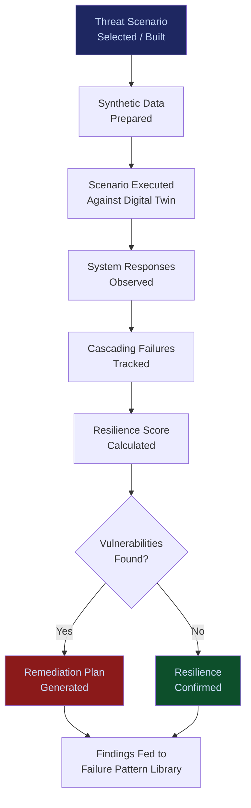

# Wargaming & Scenario Modeler

**Layer 7 -- Simulation & Digital Twin**

---

## Purpose

The Wargaming & Scenario Modeler stress-tests enterprise AI deployments against adversarial, catastrophic, and edge-case scenarios that are unlikely but devastating if they occur. It answers the question: "What is the worst that can happen, and are we prepared?" The modeler constructs realistic attack scenarios (adversarial prompt injection, coordinated model failure, data poisoning, regulatory shock, supply chain disruption) and executes them against the [Enterprise Digital Twin](/platform/core-systems/enterprise-digital-twin-platform) to measure organizational resilience.

This is not theoretical risk management. The modeler uses real threat intelligence, actual failure patterns from the [Failure Pattern Library](/platform/core-systems/failure-pattern-library), and calibrated probability distributions from the [Enterprise Mortality Tables](/platform/core-systems/enterprise-mortality-tables) to construct scenarios that reflect genuine risks. When a scenario reveals a vulnerability, the modeler produces a remediation plan with prioritized action items. Every wargaming exercise generates telemetry that feeds back into the [Failure Pattern Library](/platform/core-systems/failure-pattern-library) and [Enterprise Mortality Tables](/platform/core-systems/enterprise-mortality-tables), strengthening the platform's risk intelligence.

---

## Architecture

Layer 7 handles simulation and digital twin capabilities. The Wargaming & Scenario Modeler sits alongside the [Enterprise Digital Twin Platform](/platform/core-systems/enterprise-digital-twin-platform) (organizational replica), the [Policy Simulation Engine](/platform/core-systems/policy-simulation-engine) (policy testing), and the [Synthetic Enterprise Platform](/platform/core-systems/synthetic-enterprise-platform) (data generation). It consumes threat scenarios and executes them against the twin, using synthetic data from the Synthetic Enterprise Platform to avoid exposing production data to adversarial tests.

---

## Core Capabilities

- **Adversarial Scenario Library** -- Pre-built library of 100+ adversarial scenarios covering prompt injection, model jailbreaking, data poisoning, supply chain attacks, insider threats, and regulatory shocks.
- **Custom Scenario Construction** -- Drag-and-drop scenario builder for constructing organization-specific threat models based on industry, regulatory environment, and deployment configuration.
- **Red Team Automation** -- Automated red team exercises that probe AI deployments for vulnerabilities without requiring human red team expertise.
- **Cascading Failure Modeling** -- Models how a failure in one system propagates through interconnected systems, revealing single points of failure and blast radius.
- **Resilience Scoring** -- Each wargaming exercise produces a resilience score (0-100) measuring the organization's ability to detect, contain, and recover from the simulated event.
- **Remediation Prioritization** -- Vulnerabilities identified during wargaming are prioritized by exploitability, impact, and remediation cost.
- **Regulatory Stress Testing** -- Simulates regulatory enforcement actions (audits, investigations, fines) to test whether governance infrastructure produces the required evidence.

---

## BPMN Workflow

---

## Integration Points

| System | Integration | Data Flow |
|---|---|---|
| [Enterprise Digital Twin Platform](/platform/core-systems/enterprise-digital-twin-platform) | Execution | Scenarios execute against the organizational digital twin |
| [Synthetic Enterprise Platform](/platform/core-systems/synthetic-enterprise-platform) | Data | Synthetic data used in adversarial scenarios |
| [Failure Pattern Library](/platform/core-systems/failure-pattern-library) | Intelligence | Known failure patterns inform scenario construction; findings feed back |
| [Enterprise Mortality Tables](/platform/core-systems/enterprise-mortality-tables) | Risk | Mortality data calibrates scenario probability distributions |
| [Kill-Switch Infrastructure](/platform/core-systems/kill-switch-infrastructure) | Testing | Wargaming tests kill-switch response times and effectiveness |
| [AI Audit & Verification Infrastructure](/platform/core-systems/ai-audit-verification-infrastructure) | Audit | Wargaming exercises and findings logged for governance |

---

## Data Model

- **WargamingExercise** -- Exercise ID, scenario reference, twin instance, synthetic data reference, execution timestamp, resilience score, status.
- **ThreatScenario** -- Scenario ID, category (adversarial/catastrophic/regulatory/supply-chain), description, attack vectors, probability estimate, impact estimate.
- **Vulnerability** -- Vulnerability ID, exercise ID, system affected, exploitation method, impact severity, remediation recommendation, priority.
- **ResilienceReport** -- Report ID, exercise ID, detection time, containment time, recovery time, cascading failure depth, overall resilience score.

---

## Deployment Model

Cloud-native, compute-elastic. Wargaming exercises are scheduled or on-demand workloads that execute within the tenant's [Sovereign AI Pod](/platform/core-systems/sovereign-ai-pods). Adversarial scenarios run in full isolation from production systems to prevent accidental impact. The automated red team engine scales compute based on scenario complexity. Exercise results are stored in the immutable audit ledger for regulatory and governance review.

---

## Revenue Contribution

Per-exercise fee ($2,500--$15,000 per wargaming exercise) plus annual subscription for continuous automated red teaming ($24,999--$99,999/year). The Wargaming & Scenario Modeler is the highest-value risk management offering because it directly prevents catastrophic losses. Insurance underwriters may require periodic wargaming exercises as a condition of AI liability coverage, creating recurring, non-discretionary demand. Wargaming findings compound the Kitchen moat -- adversarial scenario results across tenants reveal systemic vulnerabilities that improve the entire platform's defensive posture.
