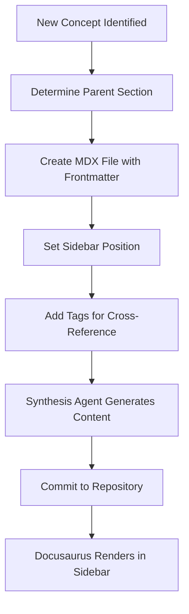

# Directory Structure

## Concept

The directory structure of the FrankMax documentation site is not an arbitrary organizational choice -- it is a semantic map of the marketplace's architecture. Every directory corresponds to a domain concept, every file to a documentable unit, and every nesting level to a scope relationship. The structure is designed so that a new contributor (human or AI agent) can infer the marketplace's architecture by reading the file tree alone, without opening any individual document.

This approach follows the principle that documentation structure should mirror product structure. When the product adds a new core system, a corresponding documentation directory is created. When a new audience segment is identified, a new audience page is added. The directory structure is the skeleton upon which the Documentation Synthesis Agent and the Market Positioning Agent hang their generated content. It is also the navigational structure that Docusaurus renders as the sidebar, meaning the file tree directly determines the user's browsing experience.

## Architecture

The documentation root is `/home/leo/Projects/Brainstorm/marketplace-docs/`. The `docs/` subdirectory contains all content organized into major sections. The `_recovery/` directory holds the agent recovery prompt. The `platform/` directory contains three subsections: `infrastructure-layers/` (19 civilizational kernel layers), `openclaw/` (8 runtime components), and `doc-as-code/` (this section). Additional top-level sections include audience-specific content for the 15 segments, core systems documentation for the 42 systems, and entity-specific pages for the 8 organizational entities.

## Features

- **Semantic Naming**: Directory and file names use kebab-case slugs that map directly to concept names
- **Sidebar Position Control**: Each file's `sidebar_position` frontmatter value determines its order within its directory
- **Category Metadata**: Each directory contains a `_category_.json` file that configures its sidebar label and position
- **Tag-Based Cross-Referencing**: Frontmatter tags enable content discovery across directory boundaries
- **Flat Within Sections**: Content within each section is flat (no deep nesting) to keep navigation simple
- **Predictable Paths**: Any documentation URL can be inferred from the concept name without consulting a sitemap
- **Recovery-First Design**: The `_recovery/` directory provides full context restoration for any agent

## BPMN Workflow

