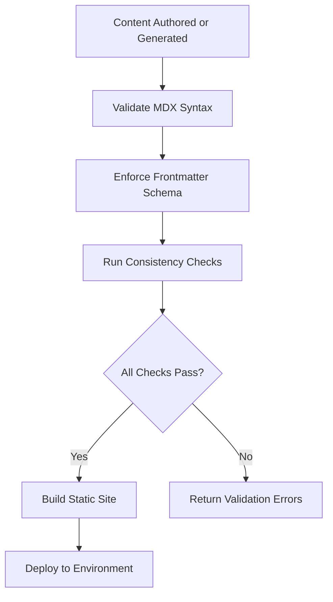

# DOC-AS-CODE Platform

## Concept

The DOC-AS-CODE Platform is the technical infrastructure that powers the FrankMax documentation site. It is built on Docusaurus v3 with TypeScript, chosen for its static site generation capabilities, MDX support (enabling React components within documentation), built-in versioning, full-text search, and extensive plugin ecosystem. The platform is not merely a documentation renderer -- it is a content management system optimized for the specific needs of a marketplace that must communicate 713 offerings to 15 audience segments across 20+ NAICS sectors.

The platform's distinguishing feature is its integration with the AI agent pipeline. While traditional Docusaurus sites are authored entirely by humans, the FrankMax platform receives content from two AI agents (Documentation Synthesis and Market Positioning) and renders it alongside human-authored strategic content. This hybrid authorship model requires additional infrastructure: content validation pipelines that ensure AI-generated content meets quality standards, metadata enforcement that guarantees every page carries correct frontmatter, and consistency checking that prevents contradictions between AI-generated and human-authored content.

## Architecture

The platform consists of four subsystems. The **Build System** uses Docusaurus v3 with custom plugins for audience-aware rendering and metadata validation. The **Content Pipeline** receives MDX files from both human authors and AI agents, validates them against schema rules, and stages them for build. The **Theme Layer** implements the Midnight Executive design (Navy #1E2761, Ice Blue #CADCFC) with responsive layouts optimized for the executive and technical audiences. The **Deployment Pipeline** runs on CI/CD, producing preview builds for pull requests and production builds on merge to main.

## Features

- **Docusaurus v3 with TypeScript**: Type-safe configuration, custom plugins, and React component support within MDX
- **Midnight Executive Theme**: Dark theme with Navy (#1E2761) and Ice Blue (#CADCFC) palette for professional presentation
- **MDX Support**: React components embedded within documentation for interactive diagrams, calculators, and data tables
- **Full-Text Search**: Client-side search across all 450-500 pages with relevance ranking
- **Metadata Validation Plugin**: Custom Docusaurus plugin that enforces frontmatter schema on every build
- **Audience-Aware Rendering**: Content components that adapt presentation based on the reader's identified segment
- **Build Performance**: Incremental builds complete in under 30 seconds for single-page changes

## BPMN Workflow

