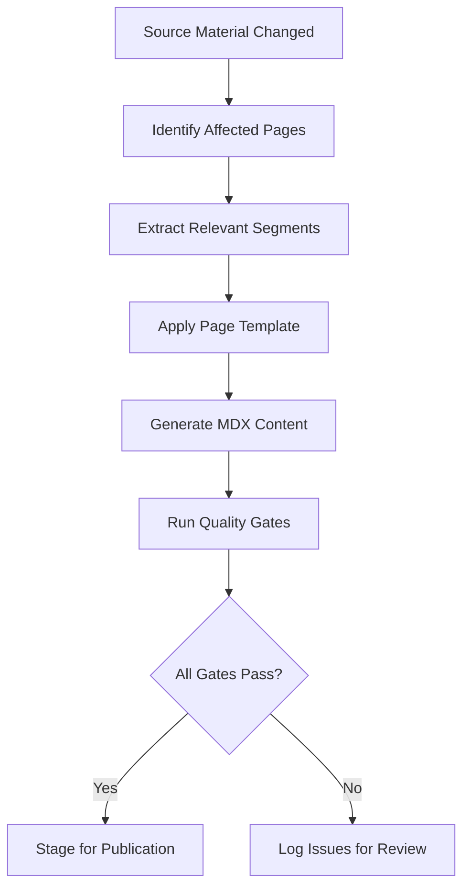

# Documentation Synthesis Agent

## Concept

The Documentation Synthesis Agent is an AI-powered content generation system that transforms the FrankMax strategic source material into structured, publication-ready documentation pages. It reads the 38 strategic source documents (535,856 lines), the Marketplace Opportunity Catalog (713 offerings), and the Master Execution Prompt, then produces MDX pages that conform to the documentation site's format specifications and quality standards. The agent does not invent content -- it synthesizes, structures, and translates existing strategic material into documentation form.

The agent addresses a scale problem that is otherwise unsolvable for a solo, bootstrapped founder: maintaining 450-500 pages of technical, strategic, and audience-specific documentation that stays consistent with evolving source material. Manual authorship at this scale would require a documentation team of 3-5 writers working full-time. The Synthesis Agent replaces this team by operating on demand, processing source material changes into documentation updates within minutes rather than weeks, and maintaining cross-page consistency that human teams struggle to achieve at scale.

## Architecture

The Synthesis Agent operates as a three-stage pipeline. The **Ingestion Stage** reads source documents, identifies changes since the last run, and extracts relevant content segments. The **Synthesis Stage** maps extracted segments to target documentation pages using a template library that encodes the format specifications for each page type (infrastructure layer, OpenClaw component, audience page, core system page). The **Validation Stage** checks generated content against quality gates: frontmatter completeness, section coverage, Mermaid diagram validity, internal link integrity, and consistency with previously published pages.

## Features

- **Change-Driven Generation**: Only regenerates pages affected by source material changes, minimizing unnecessary churn
- **Template Library**: Pre-built templates for every page type in the documentation site
- **Quality Gate Enforcement**: Generated content must pass validation before it is staged for publication
- **Source Traceability**: Every generated paragraph carries metadata linking it to its source document and section
- **Conflict Detection**: Identifies contradictions between source documents and flags them for human resolution
- **Batch and On-Demand Modes**: Can process all pages in batch or regenerate a single page on demand
- **Human Override Support**: Human-authored sections within generated pages are preserved across regeneration cycles

## BPMN Workflow

