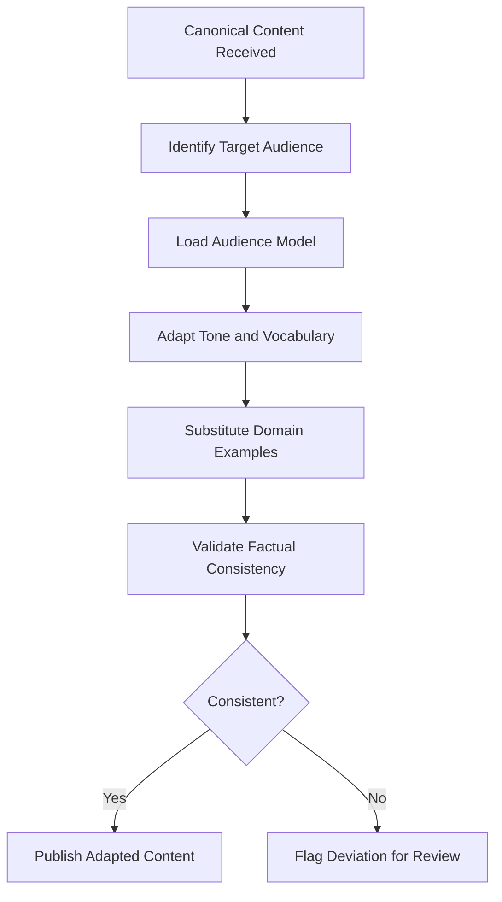

# Market Positioning Agent

## Concept

The Market Positioning Agent is an AI-powered content adaptation system that tailors the marketplace's value proposition for specific audience segments, NAICS sectors, and buyer personas. While the Documentation Synthesis Agent produces canonical content from source material, the Market Positioning Agent transforms that content into audience-specific presentations. A page about the ORF protocol reads differently for a Chief Compliance Officer (emphasis on regulatory defense), a CTO (emphasis on technical architecture), and a CFO (emphasis on cost avoidance and ROI).

The agent operationalizes the insight that the FrankMax Marketplace has a single product but 15 different buyers, each with distinct vocabulary, priorities, pain points, and decision criteria. A generic value proposition that tries to address all 15 audiences simultaneously addresses none of them effectively. The Market Positioning Agent solves this by maintaining 15 audience models -- structured representations of each segment's language, concerns, and evaluation criteria -- and using them to adapt content tone, emphasis, and supporting evidence for maximum relevance to each reader.

## Architecture

The Market Positioning Agent operates downstream of the Documentation Synthesis Agent. It receives canonical content pages and transforms them through three processing layers. The **Audience Model Layer** maintains structured profiles for all 15 audience segments, including preferred vocabulary, decision criteria, regulatory context, and pain point taxonomy. The **Adaptation Layer** rewrites content sections to match the target audience's model -- adjusting technical depth, emphasizing relevant benefits, and substituting domain-specific examples. The **Validation Layer** ensures adapted content remains factually consistent with the canonical source and does not introduce claims unsupported by the original material.

## Features

- **15 Audience Models**: Structured profiles for each marketplace audience segment with vocabulary and priority mappings
- **NAICS Sector Awareness**: Adapts industry-specific examples and regulatory references based on the reader's sector
- **Tone Calibration**: Adjusts technical depth and business language balance per audience (executive vs. technical vs. operational)
- **Evidence Substitution**: Replaces generic proof points with audience-relevant case studies, metrics, and regulatory references
- **Factual Consistency Check**: Ensures adapted content does not deviate from canonical source material
- **A/B Variant Generation**: Can produce multiple positioning variants for testing with different audience sub-segments
- **Competitive Differentiation**: Automatically incorporates positioning relative to competitors relevant to each audience

## BPMN Workflow

