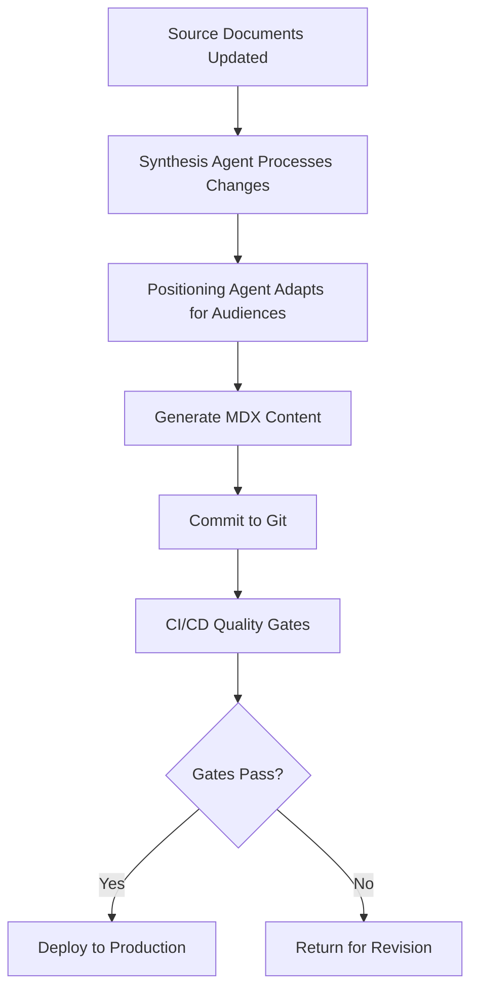

# Doc-as-Code Overview

## Concept

Doc-as-Code is the architectural philosophy that treats documentation as a first-class engineering artifact -- version-controlled, continuously deployed, programmatically generated, and subject to the same quality gates as production code. In the FrankMax Marketplace, documentation is not a post-hoc activity performed after the product ships. It is a core product component that generates revenue, compresses trust (Layer 8), provides narrative legitimacy (Layer 9), and produces legibility to power (Layer 15). The documentation site is the marketplace's public interface to all 15 audience segments.

The FrankMax Doc-as-Code system extends traditional documentation practices with two AI-powered agents: the Documentation Synthesis Agent, which generates and maintains content from the 38 source strategy documents and the marketplace opportunity catalog, and the Market Positioning Agent, which tailors content to specific audience segments and NAICS sectors. Together, these agents maintain approximately 450-500 pages of documentation that would be impossible for a solo founder to write and update manually. The documentation is simultaneously a product, a sales tool, and a compliance artifact.

## Architecture

The Doc-as-Code architecture consists of four layers. The **Source Layer** contains the 38 strategic documents (535,856 lines), the Marketplace Opportunity Catalog (713 offerings), and the Master Execution Prompt. The **Generation Layer** houses the Documentation Synthesis Agent and the Market Positioning Agent, which process source material into structured content. The **Rendering Layer** is powered by Docusaurus v3 with TypeScript, producing a static site with full-text search, dark theme (Midnight Executive), and responsive layout. The **Deployment Layer** handles CI/CD, preview environments, and production hosting.

## Features

- **AI-Assisted Content Generation**: Two specialized agents produce and maintain documentation from strategic source material
- **Version-Controlled Content**: Every documentation change is tracked in Git with full diff history
- **Automated Quality Gates**: Pull requests trigger build validation, link checking, and content consistency verification
- **Multi-Audience Rendering**: Content dynamically adapts presentation for 15 audience segments
- **Agent Recovery System**: The `_recovery/index.mdx` page enables any AI agent to achieve 100% project context in a single read
- **Continuous Deployment**: Documentation updates deploy automatically on merge, with preview environments for review
- **Structured Metadata**: Frontmatter tags enable cross-referencing, audience filtering, and content discovery

## BPMN Workflow

